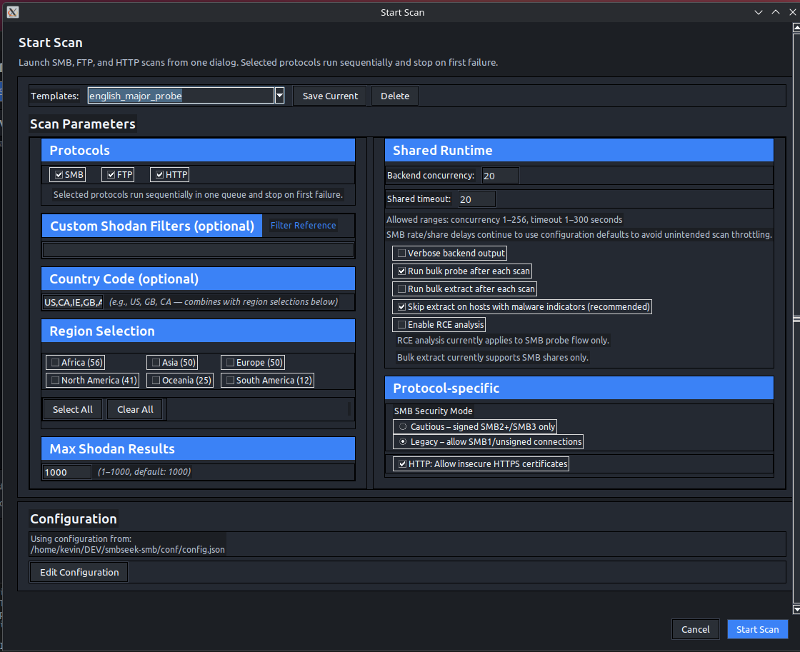
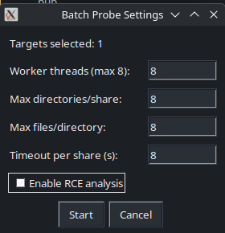
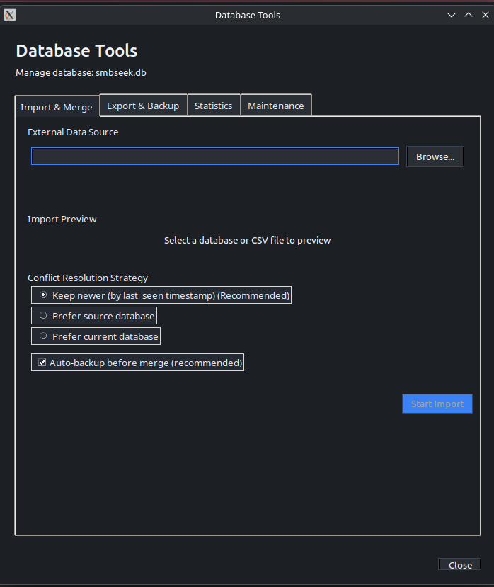
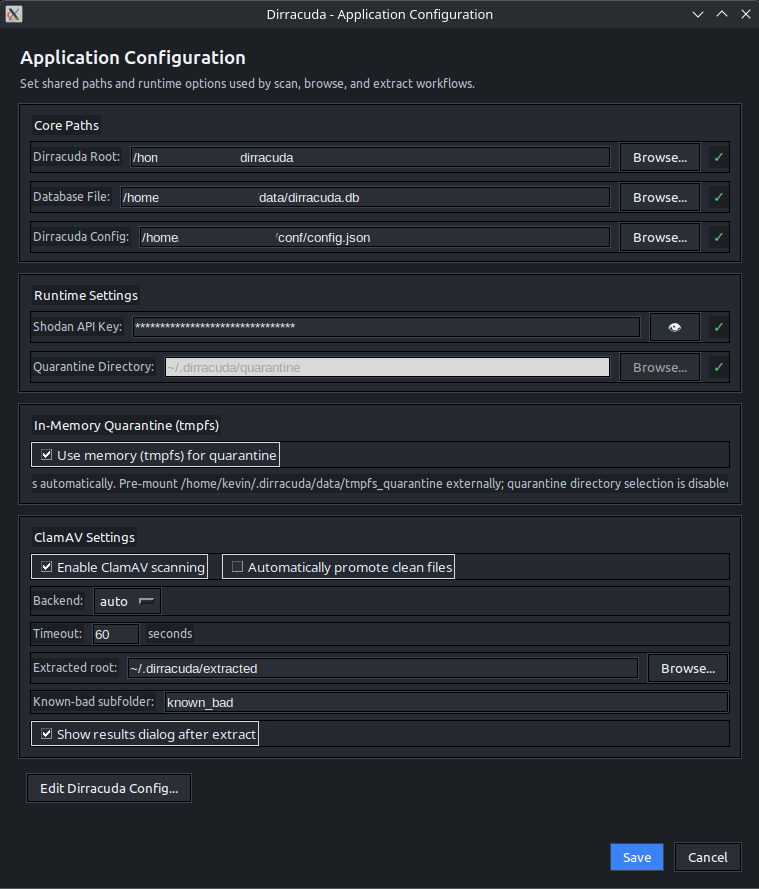

# Dirracuda

A GUI for finding and categorizing open directory listings across multiple protocols, then auditing what's reachable.

---


## Setup

You'll need Python 3.8+ (3.10+ recommended) and Tkinter:

```bash
# Ubuntu/Debian
sudo apt install python3-tk python3-venv

# Fedora/RHEL
sudo dnf install python3-tkinter python3-virtualenv

# Arch
sudo pacman -S tk python-virtualenv
```

Then:

```bash
git clone https://github.com/b3p3k0/dirracuda
```

Or for the latest development (experimental features and brand new bugs!) version:

```bash
git clone https://github.com/b3p3k0/dirracuda -b development --single-branch
```

Then:
```bash
cd dirracuda
python3 -m venv venv
source venv/bin/activate
pip install -r requirements.txt
cp conf/config.json.example conf/config.json
```

Edit `conf/config.json` (or launch a new scan from the dashboard) and add your Shodan API key (requires paid membership):

```json
{
  "shodan": {
    "api_key": "your_key_here"
  }
}
```

Launch the GUI from your venv:

```bash
./dirracuda
```

---

## Dependencies

### Python packages

| Package | Version | Purpose |
|---------|---------|---------|
| shodan | ≥1.25.0 | Shodan API client - discovers scan candidates by country and filter |
| smbprotocol | ≥1.10.0 | Pure-Python SMB2/3 transport for cautious-mode sessions |
| pyspnego | ≥0.8.0 | SPNEGO authentication support; required by smbprotocol |
| impacket | ≥0.11.0 | SMB1/2/3 transport for legacy compatibility, share enumeration, and browser operations |
| PyYAML | ≥6.0 | Loads RCE vulnerability signatures from `conf/signatures/rce_smb/*.yaml` |
| Pillow | ≥8.0.0 | Image rendering in the file viewer (PNG, JPEG, GIF, WebP, BMP, TIFF) |

### System tools

| Tool | Install | Purpose |
|------|---------|---------|
| tkinter | `apt install python3-tk` | GUI framework; required to run Dirracuda |
| ClamAV (`clamscan` / `clamdscan`) | `apt install clamav clamav-daemon` | Optional post-download malware scan step for bulk extract and browser downloads |
| tmpfs (Linux) | built into the Linux kernel (`mount -t tmpfs ...`) | Optional RAM-backed quarantine path at `~/.dirracuda/quarantine_tmpfs`; app falls back to disk quarantine if tmpfs is unavailable |

---

## Using Dirracuda

### Before You Start

You're connecting to machines you don't control. A few baseline precautions before you scan:

- **VPN** - don't scan from your real IP address
- **VM** - run Dirracuda inside a virtual machine, especially if you plan to browse or extract files; unknown hosts can serve malicious content
- **Network isolation** - keep the VM on an isolated network segment, not bridged directly to your LAN
- **Don't open extracted files on your host** - quarantine defaults to `~/.dirracuda/quarantine/` inside the VM for a reason; treat everything you pull as untrusted
- **Audit the source code** - I'm not a threat actor, but I could be. Don't just clone and run things from Github all willy-nilly
- **Don't run as root** - that's just silly!

### Dashboard


The main window. From here you can:

- Launch discovery from one **▶ Start Scan** button - pick one protocol or queue multiple protocols in sequence from the same dialog
- Access experimental features (SearXNG dorking and Reddit ingestion) via the `⚗ Experimental` button in the dashboard header (see [Experimental Features](#experimental-features))
- Open the Server List Browser to work with hosts you've found
- Manage your database (import, export, merge, maintenance)
- Edit configuration
- Toggle dark/light mode with the 🌙/☀️ button in the top-right

### Discovery



Triggered from **▶ Start Scan** with the protocol(s) selected. All three follow the same pipeline: Shodan query → reachability check → protocol-specific verification. Only hosts that pass get stored; failures are recorded with a reason code so you can see exactly where each candidate dropped out. Scan summary shows Shodan candidates vs. verified count. The same host registry handles all three protocols - the same IP can carry SMB, FTP, and multiple HTTP endpoint entries without collision.

**SMB** - default dork: `smb authentication: disabled product:"Samba"`. Applies two extra pre-connection filters: org filtering (drops excluded ISPs and hosting providers) and 30-day deduplication (CLI overrides: `--rescan-all`, `--rescan-failed`). Verification tries Anonymous, Guest/blank, and Guest/Guest in sequence; whichever succeeds is recorded alongside country and timestamp, so auth method drift shows up across rescans. Two security modes: **Cautious** (default) restricts to signed SMB2+/SMB3 and rejects SMB1; **Legacy** lifts those restrictions and tends to find more targets. 

**FTP** - default dork: `port:21 "230 Login successful"`. Verification includes anonymous login and root directory listing. Failure codes: `connect_fail`, `auth_fail`, `list_fail`, `timeout`.

**HTTP** - default dork: `http.title:"Index of /"`. Verification stays locked to the exact Shodan hit endpoint (same IP + same port), and tests HTTP and/or HTTPS on that port based on your config toggles.

**Post-scan bulk probe/extract scope** - when bulk probe or bulk extract is enabled from the scan flow, targets are limited to accessible hosts from the scan that just completed (same protocol). Manual probe actions launched from Server List continue to use your explicit row selection and are unchanged.

### Server List


 Shows discovered hosts with IP, country, auth method, and share counts as well as status indicators and a favorite/avoid list.

**Operations** (right-click a host or use the bottom-row buttons):

| Action | Description |
|--------|-------------|
| 📋 Copy IP | Copy selected server IP address to clipboard |
| 🔍 Probe Selected | Enumerate shares, detect ransomware indicators |
| 📦 Extract Selected | Collect files with hard limits on count, size, and time |
| 🔓 Pry Selected | Password audit against a specific user |
| 🗂️ Browse Selected | Read-only exploration of accessible shares |
| ⭐ Toggle Favorite | Mark/unmark selected servers as favorites |
| 🚫 Toggle Avoid | Mark/unmark selected servers to avoid |
| ⚠ Toggle Compromised | Mark/unmark selected servers as likely compromised |
| 🗑️ Delete Selected | Remove selected servers from the database |

Server List also includes an **Add Record** control (next to `Advanced`) for manually inserting one SMB/FTP/HTTP host row into the active database. Save keeps your current filters unchanged. If the newly added row does not appear, it is usually hidden by an active filter (most commonly `Shares > 0`). Inserted records can then be probed and investigated from the GUI.

### Probing Shares



Read-only directory enumeration that previews accessible shares without downloading files. Probing collects root files, subdirectories, and file listings for each accessible share (with configurable limits on depth and breadth).

**Ransomware detection:** Filenames are matched against 25+ known ransom-note patterns (WannaCry, Hive, STOP/Djvu, etc.). Matches flag the server with a red indicator in the list view.

**RCE vulnerability analysis:** **NOTE: this feature is still under development; don't trust results until verified with alternative measures.** Optionally scans for SMB vulnerabilities using passive heuristics. Covers 8 CVEs including EternalBlue (MS17-010), SMBGhost (CVE-2020-0796), ZeroLogon (CVE-2020-1472), and PrintNightmare (CVE-2021-34527). Returns a risk score (0-100) with verdicts: confirmed, likely, or not vulnerable. Signatures live in `conf/signatures/rce_smb/` as editable YAML files. 

Results are cached in `~/.dirracuda/probes/` and reloaded automatically. Configure probe limits in `conf/config.json` under `file_browser` settings.

### Browsing Shares


Read-only navigation available shares. Double-click directories to descend, files to preview.

The viewer auto-detects file types: text files display with an encoding selector (UTF-8, Latin-1, etc.), binary files switch to hex mode, and images (PNG, JPEG, GIF, WebP, BMP, TIFF) render with fit-to-window scaling.


Files over the specified maximum (default: 5 MB) trigger a warning-you can bump that limit in `conf/config.json` under `file_browser.viewer.max_view_size_mb`, or click "Ignore Once" to load anyway (hard cap: 1 GB).

Downloads are staged in quarantine (`~/.dirracuda/quarantine/`). When ClamAV is enabled, downloaded files are post-processed by verdict (clean files promoted to extracted, infected files moved to known-bad). The browser never writes to remote systems.

Download concurrency is configurable in the browser UI via the worker-count control (1–3 workers, default 2); the value is persisted in GUI settings under `file_browser.download_worker_count`. For SMB and FTP, a large-file threshold (persisted under `file_browser.download_large_file_mb`) routes files above that size to a dedicated worker. HTTP downloads use worker concurrency only - large-file routing is not active for HTTP in the current release. The large-file control is visible in the HTTP browser but disabled with an explanatory note.

#### Optional tmpfs quarantine (Linux)

Dirracuda can stage quarantine files in RAM-backed `tmpfs` instead of disk.

- Mountpoint is fixed to `~/.dirracuda/quarantine_tmpfs`
- Linux only (controls are disabled on non-Linux platforms)
- If mount/setup fails, Dirracuda falls back to the configured disk quarantine path and shows one warning per app session

To pre-mount at boot, add an `/etc/fstab` entry like the one below (replace `<USER>`), then run `sudo mount -a`.
Dirracuda will reuse this mount when tmpfs mode is enabled.

```fstab
tmpfs  /home/<USER>/.dirracuda/quarantine_tmpfs  tmpfs  noexec,nosuid,nodev,size=512M,noswap  0  0
```

Enable in **App Config**:

- Check `Use memory (tmpfs) for quarantine`
- Set `Max size (MB)` (default `512`)

Or set in `conf/config.json`:

```json
{
  "quarantine": {
    "use_tmpfs": true,
    "tmpfs_size_mb": 512
  }
}
```

Manual setup notes (Linux):

```bash
# Validate mount appears after starting Dirracuda with tmpfs enabled
mount | grep -F "$HOME/.dirracuda/quarantine_tmpfs"

# Inspect current tmpfs usage
df -h "$HOME/.dirracuda/quarantine_tmpfs"
```

### Extracting Files


Automated file collection with configurable limits:

- Max total size
- Max runtime
- Max directory depth
- File extension filtering

All extracted files land in quarantine. The defaults are conservative - check `conf/config.json` if you need to adjust them.

#### Optional ClamAV scanning (bulk extract + browser downloads)

ClamAV integration is optional and off by default.

When enabled, ClamAV post-processes files downloaded via:

- Bulk extract paths (`Dashboard` post-scan bulk extract and `Server List` batch extract)
- Browser/manual file downloads (SMB/FTP/HTTP browser windows)

Each file is scanned and then routed by verdict:

- **clean** → moved to `~/.dirracuda/extracted/<host>/<date>/<share>/...`
- **infected** → moved to `~/.dirracuda/quarantine/<known_bad_subdir>/<host>/<date>/<share>/...` (default subdir: `known_bad`)
- **scanner error/timeout/missing binary** → file stays in quarantine; extract continues (fail-open)

Configure it from **App Config → ClamAV Settings**:

- Enable/disable scanning
- Backend: `auto`, `clamdscan`, or `clamscan`
- Scanner timeout (seconds)
- Extracted root path
- Known-bad subfolder name
- Show/hide post-extract ClamAV results dialog

Notes:

- The results dialog supports **Mute until restart**.
- One completion popup is shown per session (ClamAV results dialog if shown, otherwise a single fallback completion popup).

### Pry (Password Audit)

Tests passwords from a wordlist against a single SMB host/share/user. Optionally tries username-as-password first.

To use it, download a wordlist (we recommend [SecLists](https://github.com/danielmiessler/SecLists)) and set the path in config:

```json
{
  "pry": {
    "wordlist_path": "/path/to/SecLists/Passwords/Leaked-Databases/rockyou.txt"
  }
}
```

Pry includes lockout detection and configurable delays between attempts. That said, **this feature exists mostly as a novelty/proof of concept** - dedicated tools like Hydra or CrackMapExec will serve you better for serious password auditing.

### DB Tools



Opened via **DB Tools** on the dashboard. Four tabs:

**Import & Merge** - supports two source types:
- External `.db` merge: merge by IP into current DB (includes shares, credentials, file manifests, vulnerabilities, failure logs).
- CSV host import: import protocol server rows only (SMB/FTP/HTTP registries), using the same conflict strategies.

Three conflict strategies are available in both paths: **Keep Newer** (default - picks whichever record has the more recent `last_seen`), **Keep Source**, and **Keep Current**. Auto-backup fires before import/merge unless you disable it.

**Export & Backup** - **Export** runs `VACUUM INTO` to produce a clean, defragmented copy at a path you choose. **Quick Backup** drops a timestamped copy (`dirracuda_backup_YYYYMMDD_HHMMSS.db`) next to the main database file.

**Statistics** - server and share counts, database size, date range, and a top-10 country breakdown. Read-only; won't lock the database.

**Maintenance** - Vacuum/optimize, integrity check, and age-based purge. The purge shows a full cascade preview before deleting - servers not seen within N days (default: 30) plus all associated shares, credentials, file manifests, vulnerabilities, and cached probe data.

### CSV Host Import Standard

CSV import is intentionally simple: **select -> preview -> write**. The app does lightweight validation and previews skips/warnings, but CSV quality is the operator's responsibility.

Required column:
- `ip_address`

Optional columns:
- `host_type` (`S`, `F`, `H`; aliases `SMB`, `FTP`, `HTTP`)
- `country`, `country_code`, `auth_method`, `first_seen`, `last_seen`, `scan_count`, `status`, `notes`, `shodan_data`
- `port`, `anon_accessible`, `banner` (FTP/HTTP rows)
- `scheme`, `title` (HTTP rows)

Behavior notes:
- One CSV row maps to one protocol host row.
- `S` rows write to `smb_servers`, `F` to `ftp_servers`, `H` to `http_servers`.
- If the current DB lacks a protocol table/columns (legacy DB shape), those protocol rows are skipped and shown in preview warnings.
- CSV import does not create share/file/vulnerability/failure records; it imports host registries only. Imported hosts can be probed from the Server List Browser to populate these fields.

---

## Configuration



App settings are stored in `conf/config.json`. The example file (`conf/config.json.example`) documents every option.

Key sections:

- `shodan.api_key` - required for discovery scans (SMB/FTP/HTTP)
- `pry.*` - wordlist path, delays, lockout behavior
- `file_collection.*` - extraction limits
- `clamav.*` - optional post-extract scan/routing behavior
- `file_browser.*` - browse mode limits (depth, entries, chunk size, quarantine root); download tuning - `download_worker_count` (1–3) and `download_large_file_mb` - is user-controlled in the browser UI and persisted in GUI settings, not read from this config file
- `connection.*` - timeouts and rate limiting
- `ftp.shodan.query_limits.max_results` - cap on Shodan FTP candidates per scan
- `ftp.verification.*` - per-step timeouts for FTP connect, auth, and listing (seconds)

Two additional files hold editable lists:

- `conf/exclusion_list.json` - Organizations to skip during Shodan queries (hosting providers, ISPs you don't care about etc.). Add entries to the `organizations` array.
- `conf/ransomware_indicators.json` - Filename patterns checked during probe. Matches flag a server as likely compromised.

These are separate so you can customize or share them without touching app settings.

The GUI includes a built-in config editor for common settings.

## Experimental Features

Experimental work is grouped under the permanent `⚗ Experimental` button in the dashboard header.

The dialog is modeless and tab-based. Current tabs:
- `SearXNG Dorking`
- `Reddit`

On first open, the dialog shows an experimental warning banner. If you check **Don't show this notice again**, Dirracuda writes `experimental.warning_dismissed=true` to `~/.dirracuda/gui_settings.json`.

### SearXNG Dorking

Runs dork queries against a self-hosted SearXNG instance, classifies candidate URLs as open directory listings, and stores results in a sidecar DB for review.

Access points:
- Dashboard → `⚗ Experimental` → `SearXNG Dorking` tab → `Test` (preflight check)
- Dashboard → `⚗ Experimental` → `SearXNG Dorking` tab → `Run` (execute dork search)
- Dashboard → `⚗ Experimental` → `SearXNG Dorking` tab → `Open Results DB` (browse and promote)

Tab inputs (all persisted across opens and restarts):
- **Instance URL** — URL of your SearXNG instance (default: `http://192.168.1.20:8090`)
- **Query** — dork query string (default: `site:* intitle:"index of /"`)
- **Max results** — upper cap on results fetched per run (default: 50, max: 500)

**Test Instance** runs a two-step preflight: reachability check against `/config`, then a JSON capability check against `/search?q=hello&format=json`. Both must return HTTP 200 with valid JSON. The status area shows a clear pass/fail with a reason code.

**Run** fetches results, deduplicates by normalized URL per run, and classifies each candidate using the existing HTTP verifier path. Results are written to `~/.dirracuda/se_dork.db`. The status area shows fetched and stored counts on completion.

Verdicts assigned per URL:
- `OPEN_INDEX` — HTTP 200 with confirmed open-directory index page
- `MAYBE` — HTTP 200 without index tag, or HTTP 3xx redirect
- `NOISE` — unsupported scheme, or HTTP 4xx/5xx
- `ERROR` — network or parse failure

**Open Results DB** opens the dork results browser. Columns: URL, Verdict, Reason, HTTP Status, Checked At. Row actions: Copy URL, Open in system browser, Add to dirracuda DB.

Promotion flow:
- `Add to dirracuda DB` from the row context menu promotes a result to the main HTTP host registry.
- If that action shows **Not available**, open the Server List once and reopen Results DB (the add-record callback comes from the live Server List window).

#### SearXNG setup: `format=json` and the 403 error

SearXNG disables non-HTML output formats by default. If `/search?format=json` returns `403`, enable JSON output in your SearXNG `settings.yml`:

```yaml
search:
  formats:
    - html
    - json
    - csv
    - rss
```

Restart SearXNG after changing `settings.yml`, then re-run **Test Instance** to confirm.

Validate the fix on the SearXNG host:

```bash
curl -sS -D - 'http://127.0.0.1:8090/search?q=hello&format=json' -o /tmp/sx.json | head -n 20
python3 - <<'PY'
import json
j=json.load(open('/tmp/sx.json'))
print('results_len=', len(j.get('results', [])))
PY
```

Expected: HTTP 200, `Content-Type: application/json`, non-empty `results` for broad queries.

SearXNG dork data does not write to main Dirracuda DB tables unless a host is manually promoted.

### Reddit Ingestion (redseek)

redseek ingests submissions from `r/opendirectories` into a sidecar DB (`~/.dirracuda/reddit_od.db`) for analyst review. It is separate from SMB/FTP/HTTP scanning and does not auto-probe or auto-extract anything.

Access points:
- Dashboard → `⚗ Experimental` → `Reddit` tab → `Open Reddit Grab` (ingest)
- Dashboard → `⚗ Experimental` → `Reddit` tab → `Open Reddit Post DB` (review/open actions)

Ingest modes in `Reddit Grab`:

| Mode | Endpoint | Required input | Notes |
|------|----------|----------------|-------|
| `feed` | `/r/opendirectories/{sort}.json` | none | Default mode |
| `search` | `/r/opendirectories/search.json` with `restrict_sr=1` | query | Subreddit-scoped keyword search |
| `user` | `/r/opendirectories/search.json` with `q=author:<user> subreddit:opendirectories`, `restrict_sr=1`, `type=link` | username | Service still runtime-checks subreddit and author before writes |

Sort options:
- `new`
- `top` with window `hour`, `day`, `week`, `month`, `year`, or `all`

Only submissions are ingested. Comments/replies are not ingested.

Dialog input persistence:
- Last-used `Reddit Grab` inputs persist across opens/restarts in `~/.dirracuda/gui_settings.json` under `reddit_grab.*` keys:
  - `mode`, `sort`, `top_window`, `query`, `username`, `max_posts`
  - `parse_body`, `include_nsfw`, `replace_cache`

Promotion flow:
- `Open Reddit Post DB` supports `Add to dirracuda DB` from the row context menu.
- If that action shows **Not available**, open the Server List once and reopen Reddit Post DB (the add-record callback comes from the live Server List window).

redseek data does not write to main Dirracuda DB tables unless a host is manually promoted.

Disclaimer:

> Dirracuda's Reddit ingestion feature uses publicly accessible JSON endpoints to retrieve posts from `r/opendirectories`.
> No authentication is required, and only publicly available data is accessed.
> This method is not part of Reddit's official API and may change or break at any time.
> Treat all ingested data as unverified and potentially unsafe.

Known limitations:
- Reddit JSON endpoints are unofficial and may change without notice
- Data availability is limited and not a complete historical archive
- Rate limiting may interrupt runs (HTTP 429 aborts the current run)
- Some posts contain no usable targets
- Data quality depends entirely on user-submitted content

## Advanced

### Templates

**Scan templates** save your unified scan configuration - protocol selection, country/region filters, Shodan filters, max results, shared concurrency/timeout, and SMB/HTTP protocol-specific toggles. Click "Save Current" in the Start Scan dialog. Templates live in `~/.dirracuda/templates/` as JSON files you can edit directly.

**Filter templates** save your server list filters - search text, date range, countries, checkboxes. Click "Save Filters" in the advanced filter panel. Stored in `~/.dirracuda/filter_templates/`.

Both auto-restore your last-used template on startup.

### CLI Usage

The CLI is useful for scripting and automation. The GUI uses the same backends.

```bash
# SMB discovery
./cli/smbseek.py --country US              # Discover US servers
./cli/smbseek.py --country US,GB,CA        # Multiple countries
./cli/smbseek.py --string "SIPR files"     # Search by keyword
./cli/smbseek.py --verbose                 # Detailed output

# FTP discovery
./cli/ftpseek.py --country US
./cli/ftpseek.py --country US,GB,CA
./cli/ftpseek.py --verbose

# HTTP discovery
./cli/httpseek.py --country US
./cli/httpseek.py --country US,GB,CA
./cli/httpseek.py --verbose
```

---

## Development

This started as a collection of crude bash and python scripts I've written over 30+ years of networking and security work - dorks, one-liners for poking at servers, that sort of thing. At some point it made sense to turn them into something with a GUI and a database, but the undertaking was far outside my skillset. I understand fundamentals of programming and logic but get lost in the sauce of syntax and structure.

Fortunately AI has gotten good enough to generate functional code with proper oversight. Claude and Codex were extensively used to bring everything together and grow this from a handful of rough scripts to a full workflow manager. You can review much of the architecture and planning docs in the development branch if you're curious.

---

## Legal & Ethics

**I am not a lawyer and this is not legal advice**

You should only scan networks you own or have explicit permission to test. Unauthorized access is illegal in most jurisdictions - full stop.

That said: security research matters. Curiosity about how systems work isn't malicious, and understanding vulnerabilities is how we fix them. This tool exists because improperly secured data is a real problem worth studying. Use it to learn, to audit, to improve defenses and responsibly disclose. Don't be a dick.

If you're unsure whether something is authorized, it probably isn't. When in doubt, get it in writing (or learn how to cover your trail).

---

## Acknowledgements

**Pry password logic** derived from [mmcbrute](https://github.com/giMini/mmcbrute) (BSD-3-Clause)

**Wordlists** from [SecLists](https://github.com/danielmiessler/SecLists) (MIT)

Licensed under GNU GPL v3. See `LICENSE.md` and `licenses/` for details.
