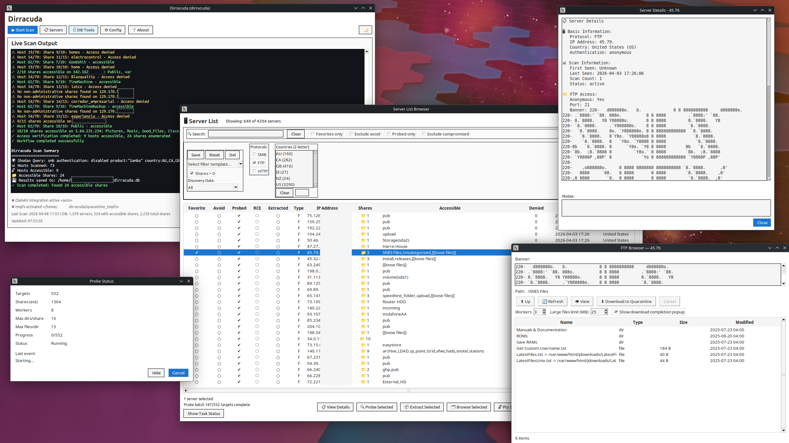
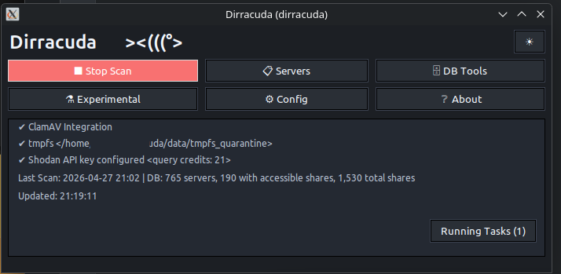
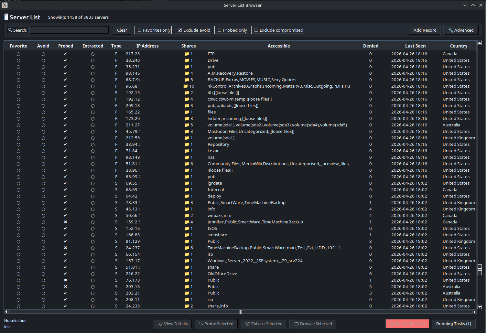

# SMBSeek

A GUI for finding exposed HTTP, FTP, and SMB directory listings, then auditing what's reachable.

---



## Setup

You'll need Python 3.8+ (3.10+ recommended), Tkinter, and smbclient:

```bash
# Ubuntu/Debian
sudo apt install python3-tk smbclient python3-venv

# Fedora/RHEL
sudo dnf install python3-tkinter samba-client python3-virtualenv

# Arch
sudo pacman -S tk smbclient python-virtualenv
```

Then:

```bash
git clone https://github.com/b3p3k0/smbseek
cd smbseek
python3 -m venv venv
source venv/bin/activate
pip install -r requirements.txt
cp conf/config.json.example conf/config.json
```

Optionally: 

```bash
cp smbseek.db.example smbseek.db
```

Edit `conf/config.json` and add your Shodan API key (requires paid membership):

```json
{
  "shodan": {
    "api_key": "your_key_here"
  }
}
```

Launch the GUI from your venv:

```bash
./xsmbseek
```

---

## Dependencies

### Python packages

| Package | Version | Purpose |
|---------|---------|---------|
| shodan | ≥1.25.0 | Shodan API client — discovers SMB/FTP/HTTP candidates by country and filter |
| smbprotocol | ≥1.10.0 | Pure-Python SMB2/3 implementation; fallback when `smbclient` is unavailable |
| pyspnego | ≥0.8.0 | SPNEGO authentication support; required by smbprotocol |
| impacket | ≥0.11.0 | SMB1/2/3 protocol library; powers the file browser and share navigation |
| PyYAML | ≥6.0 | Loads RCE vulnerability signatures from `signatures/rce_smb/*.yaml` |
| Pillow | ≥8.0.0 | Image rendering in the file viewer (PNG, JPEG, GIF, WebP, BMP, TIFF) |

### System tools

| Tool | Install | Purpose |
|------|---------|---------|
| tkinter | `apt install python3-tk` | GUI framework; required to run xSMBSeek |
| smbclient | `apt install smbclient` | Primary SMB share enumeration; smbprotocol used as fallback if missing |

---

## Using xSMBSeek

### Before You Start

You're connecting to machines you don't control. A few baseline precautions before you scan:

- **VPN** — don't scan from your real IP address
- **VM** — run xSMBSeek inside a virtual machine, especially if you plan to browse or extract files; unknown hosts can serve malicious content
- **Network isolation** — keep the VM on an isolated network segment, not bridged directly to your LAN
- **Don't open extracted files on your host** — quarantine defaults to `~/.smbseek/quarantine/` inside the VM for a reason; treat everything you pull as untrusted
- **Don't run as root** — that's dumb

### Dashboard



The main window. From here you can:

- Launch SMB/FTP/HTTP discovery from one **▶ Start Scan** button — pick one protocol or queue multiple protocols in sequence from the same dialog
- Open the Server List to work with hosts you've found
- Manage your database (import, export, merge, maintenance)
- Edit configuration
- Toggle **dark/light mode** with the 🌙/☀️ button in the top-right; your preference is saved automatically

### SMB Discovery

Triggered from **▶ Start Scan** with **SMB** selected. The scan runs as a `smbseek` subprocess and tests candidates concurrently across a configurable thread pool:

1. Shodan query for hosts with SMB auth disabled or running Samba, filtered by country and exclusion list
2. Organization filtering — hosts belonging to excluded ISPs or hosting providers are dropped before any connection attempt
3. Deduplication against the database — hosts scanned within the last 30 days are skipped by default (GUI uses this default behavior; CLI can override with `--rescan-all` or `--rescan-failed`)
4. TCP reachability check on port 445
5. Authentication test using three methods in sequence: Anonymous, Guest/blank, and Guest/Guest

Two security modes are available in the scan dialog (and via `--legacy` on the CLI): **Cautious** (default) restricts connections to signed SMB2+/SMB3 and rejects anything requiring unsigned sessions or SMB1; **Legacy** lifts those restrictions. Legacy tends to return more results — older hosts that have never been hardened or patched off SMB1 are exactly the ones worth finding.

Only hosts that authenticate are stored. The method that succeeded is recorded alongside country, timestamp, and scan count — so you can track whether a host drifts from anonymous to guest access across rescans. The scan summary reports Shodan candidates vs. verified count.

Results appear in the Server List.

### FTP Discovery

Triggered from **▶ Start Scan** with **FTP** selected. The scan runs as a separate `ftpseek` process and follows four verification steps for each candidate:

1. Shodan query for port 21 hosts showing a successful anonymous login banner
2. TCP reachability check on port 21
3. Anonymous login attempt
4. Root directory listing

Only hosts that pass all four steps are stored as verified. Failures are recorded with a reason code (`connect_fail`, `auth_fail`, `list_fail`, `timeout`) so you can see exactly where each candidate dropped out. The scan summary reports candidate count vs. verified count.

Results are stored in the same host registry. The same IP can have SMB, FTP, and HTTP entries without collision.

### HTTP Discovery

Triggered from **▶ Start Scan** with **HTTP** selected. Uses a Shodan query for `http.title:"Index of /"` to find hosts serving Apache/nginx directory listings, then verifies each candidate:

1. Shodan query for HTTP/HTTPS directory-index hosts
2. Reachability check and directory-index validation (HTTP and HTTPS ports)
3. Accessible listings stored as verified; failures recorded with a reason code

Results are stored in the same host registry as SMB and FTP records. The browser window lets you navigate directory listings, view text files and images (`.png`, `.jpg`, `.jpeg`, `.gif`, `.bmp`, `.webp`, `.tif`, `.tiff`), and download files to quarantine at `~/.smbseek/quarantine/<ip>/<YYYYMMDD>/http_root/`.

Known limits:
- No pre-flight file size guard (HTTP directory listings carry no size metadata; the viewer size cap still applies)
- Animated GIFs render first frame only (PIL limitation)
- HTTPS with mutual TLS not supported; insecure TLS allowed by default
- Browser indexes one level deep; files in nested subdirectories require manual navigation

### Server List


 Shows discovered hosts with IP, country, auth method, and share counts as well as status indicators and a favorite/avoid list.

**Operations** (right-click a host or use the bottom-row buttons):

| Action | Description |
|--------|-------------|
| 📋 Copy IP | Copy selected server IP address(es) to clipboard |
| 🔍 Probe Selected | Enumerate shares, detect ransomware indicators |
| 📦 Extract Selected | Collect files with hard limits on count, size, and time |
| 🔓 Pry Selected | Password audit against a specific user |
| 🗂️ Browse Selected | Read-only exploration of accessible shares |
| ⭐ Toggle Favorite | Mark/unmark selected servers as favorites |
| 🚫 Toggle Avoid | Mark/unmark selected servers to avoid |
| ⚠ Toggle Compromised | Mark/unmark selected servers as likely compromised |
| 🗑️ Delete Selected | Remove selected servers from the database |

### Probing Shares

Read-only directory enumeration that previews accessible shares without downloading files. Probing collects root files, subdirectories, and file listings for each accessible share (with configurable limits on depth and breadth).

**Ransomware detection:** Filenames are matched against 25+ known ransom-note patterns (WannaCry, Hive, STOP/Djvu, etc.). Matches flag the server with a red indicator in the list view.

**RCE vulnerability analysis:** Optionally scans for SMB vulnerabilities using passive heuristics. Covers 8 CVEs including EternalBlue (MS17-010), SMBGhost (CVE-2020-0796), ZeroLogon (CVE-2020-1472), and PrintNightmare (CVE-2021-34527). Returns a risk score (0-100) with verdicts: confirmed, likely, or not vulnerable. Signatures live in `signatures/rce_smb/` as editable YAML files. **NOTE: this feature is still under development; don't trust results until verified with alternative measures.**

Results are cached in `~/.smbseek/probes/` and reloaded automatically. Configure probe limits in `conf/config.json` under `file_browser` settings.

### Browsing Shares


Read-only navigation through SMB shares. Double-click directories to descend, files to preview. You can also select a file and click **View**.

The viewer auto-detects file types: text files display with an encoding selector (UTF-8, Latin-1, etc.), binary files switch to hex mode, and images (PNG, JPEG, GIF, WebP, BMP, TIFF) render with fit-to-window scaling.


Files over the specified maximum (default: 5 MB) trigger a warning—you can bump that limit in `conf/config.json` under `file_browser.viewer.max_view_size_mb`, or click "Ignore Once" to load anyway (hard cap: 1 GB).

Downloads land in quarantine (`~/.smbseek/quarantine/`). The browser never writes to remote systems.

### Extracting Files


Automated file collection with configurable limits:

- Max total size
- Max runtime
- Max directory depth

All extracted files land in quarantine. The defaults are conservative — check `conf/config.json` if you need to adjust them.

### Pry (Password Audit)

Tests passwords from a wordlist against a single host/share/user. Optionally tries username-as-password first.

To use it, download a wordlist (we recommend [SecLists](https://github.com/danielmiessler/SecLists)) and set the path in config:

```json
{
  "pry": {
    "wordlist_path": "/path/to/SecLists/Passwords/Leaked-Databases/rockyou.txt"
  }
}
```

Pry includes lockout detection and configurable delays between attempts. That said, **this feature exists mostly as a novelty/proof of concept** — dedicated tools like Hydra or CrackMapExec will serve you better for serious password auditing.

### DB Tools

Opened via **DB Tools** on the dashboard. Four tabs:

**Import & Merge** — supports two source types:
- External `.db` merge: merge by IP into current DB (includes shares, credentials, file manifests, vulnerabilities, failure logs).
- CSV host import: import protocol server rows only (SMB/FTP/HTTP registries), using the same conflict strategies.

Three conflict strategies are available in both paths: **Keep Newer** (default — picks whichever record has the more recent `last_seen`), **Keep Source**, and **Keep Current**. Auto-backup fires before import/merge unless you disable it.

**Export & Backup** — **Export** runs `VACUUM INTO` to produce a clean, defragmented copy at a path you choose. **Quick Backup** drops a timestamped copy (`smbseek_backup_YYYYMMDD_HHMMSS.db`) next to the main database file.

**Statistics** — server and share counts, database size, date range, and a top-10 country breakdown. Read-only; won't lock the database.

**Maintenance** — Vacuum/optimize, integrity check, and age-based purge. The purge shows a full cascade preview before deleting — servers not seen within N days (default: 30) plus all associated shares, credentials, file manifests, vulnerabilities, and cached probe data.

### CSV Host Import Standard

CSV import is intentionally simple: **select -> preview -> write**. The app does lightweight validation and previews skips/warnings, but CSV quality is the operator's responsibility.

Required column:
- `ip_address`

Optional columns:
- `host_type` (`S`, `F`, `H`; aliases `SMB`, `FTP`, `HTTP`; default is `S`)
- `country`, `country_code`, `auth_method`, `first_seen`, `last_seen`, `scan_count`, `status`, `notes`, `shodan_data`
- `port`, `anon_accessible`, `banner` (FTP/HTTP rows)
- `scheme`, `title` (HTTP rows)

Behavior notes:
- One CSV row maps to one protocol host row.
- `S` rows write to `smb_servers`, `F` to `ftp_servers`, `H` to `http_servers`.
- If the current DB lacks a protocol table/columns (legacy DB shape), those protocol rows are skipped and shown in preview warnings.
- CSV import does not create share/file/vulnerability/failure records; it imports host registries only.

---

## Configuration

App settings are stored in `conf/config.json`. The example file (`conf/config.json.example`) documents every option.

Key sections:

- `shodan.api_key` — required for discovery scans (SMB/FTP/HTTP)
- `pry.*` — wordlist path, delays, lockout behavior
- `file_collection.*` — extraction limits
- `file_browser.*` — browse mode limits
- `connection.*` — timeouts and rate limiting
- `ftp.shodan.query_limits.max_results` — cap on Shodan FTP candidates per scan
- `ftp.verification.*` — per-step timeouts for FTP connect, auth, and listing (seconds)

Two additional files hold editable lists:

- `conf/exclusion_list.json` — Organizations to skip during Shodan queries (hosting providers, ISPs you don't care about etc.). Add entries to the `organizations` array.
- `conf/ransomware_indicators.json` — Filename patterns checked during probe. Matches flag a server as likely compromised.

These are separate so you can customize or share them without touching app settings.

The GUI includes a built-in config editor for common settings.

## Advanced

### Templates

**Scan templates** save your unified scan configuration — protocol selection, country/region filters, Shodan filters, max results, shared concurrency/timeout, and SMB/HTTP protocol-specific toggles. Click "Save Current" in the Start Scan dialog. Templates live in `~/.smbseek/templates/` as JSON files you can edit directly.

**Filter templates** save your server list filters — search text, date range, countries, checkboxes. Click "Save Filters" in the advanced filter panel. Stored in `~/.smbseek/filter_templates/`.

Both auto-restore your last-used template on startup.

### CLI Usage

The CLI is useful for scripting and automation. The GUI uses the same backends.

```bash
# SMB discovery
./smbseek --country US              # Discover US servers
./smbseek --country US,GB,CA        # Multiple countries
./smbseek --string "SIPR files"     # Search by keyword
./smbseek --verbose                 # Detailed output

# FTP discovery
./ftpseek --country US
./ftpseek --country US,GB,CA
./ftpseek --verbose

# HTTP discovery
./httpseek --country US
./httpseek --country US,GB,CA
./httpseek --verbose
```

---

## Development

This started as a collection of crude bash scripts I've written over 30+ years of networking and security work — dorks, one-liners for poking at SMB shares, checking for open FTP, that sort of thing. At some point it made sense to turn them into something with a GUI and a database, but the undertaking was far outside my skillset. I understand programming and logic but get lost in the sauce of syntax and structure.

Part of the goal here is finding out how far AI-assisted development can actually go. The answer, in my experience, is pretty far. I bring domain knowledge, the spec, and the judgment call on what matters; the AI handles implementation, consistency, and the parts that would otherwise be tedious. 

It works well - I'd still be struggling to learn the basics of tkinter if I did this the old fashioned way. With a little patience and foundational knowledge, AI tools can help build complex and functional software.

---

## Legal & Ethics

You should only scan networks you own or have explicit permission to test. Unauthorized access is illegal in most jurisdictions—full stop.

That said: security research matters. Curiosity about how systems work isn't malicious, and understanding vulnerabilities is how we fix them. This tool exists because improperly secured data is a real problem worth studying. Use it to learn, to audit, to improve defenses and responsibly disclose. Don't use it to steal data or harm systems you have no business touching.

If you're unsure whether something is authorized, it probably isn't. When in doubt, get it in writing.

---

## Acknowledgements

**Pry password logic** derived from [mmcbrute](https://github.com/giMini/mmcbrute) (BSD-3-Clause)

**Wordlists** from [SecLists](https://github.com/danielmiessler/SecLists) (MIT)

Licensed under MIT. See `LICENSE` and `licenses/` for details.
