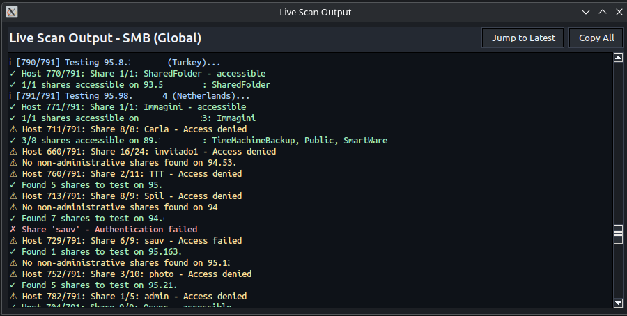
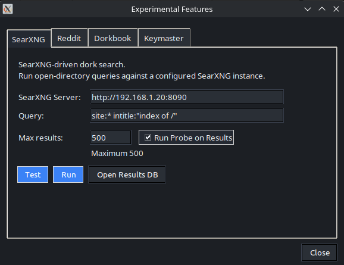
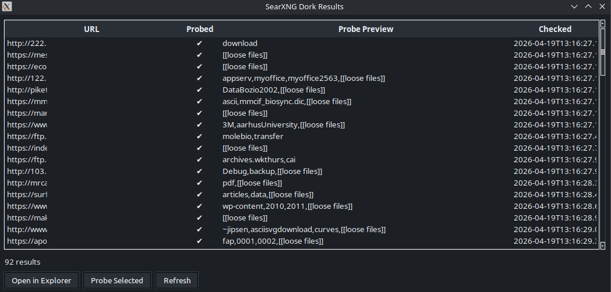
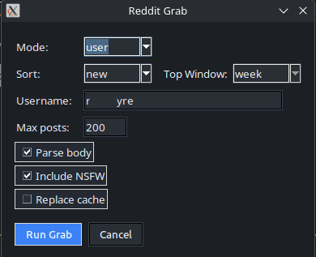
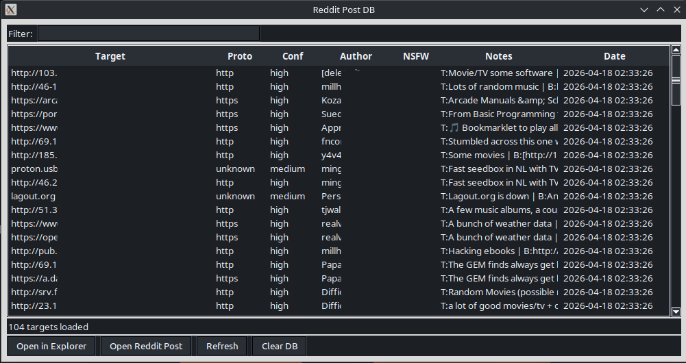
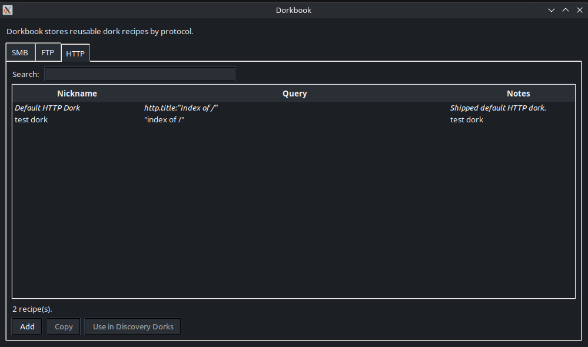
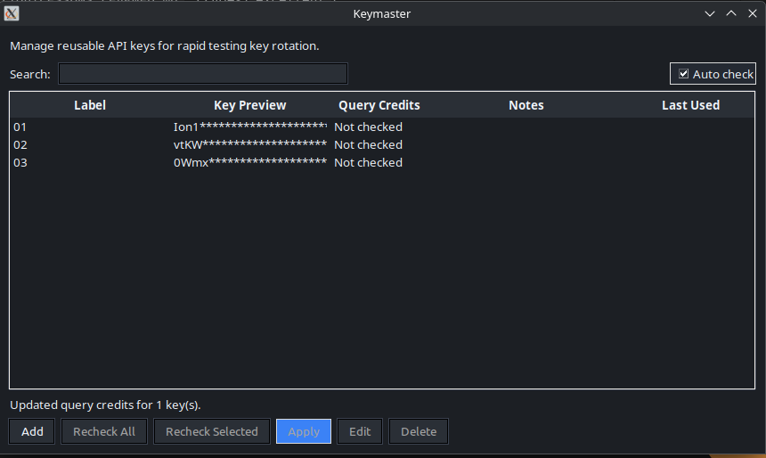

# Dirracuda

A GUI for finding and categorizing open directory listings across multiple protocols, then auditing what's reachable.

---


## Setup

```bash
git clone https://github.com/b3p3k0/dirracuda
cd dirracuda
```

Or for the latest development (experimental features and brand new bugs!) version:

```bash
git clone https://github.com/b3p3k0/dirracuda -b development --single-branch
cd dirracuda
```
Optionally, run the interactive installer (designed for Ubuntu 24.04 LTS+ )— it handles dependencies, venv, config, and optional extras:

```bash
bash install.sh
```

**Manual setup** (other distros, or if you prefer to do it yourself):

You'll need Python 3.8+ (3.10+ recommended) and Tkinter:

```bash
# Ubuntu/Debian
sudo apt install python3-tk python3-venv

# Fedora/RHEL
sudo dnf install python3-tkinter python3-virtualenv

# Arch
sudo pacman -S tk python-virtualenv
```

Then:
```bash
python3 -m venv venv
source venv/bin/activate
pip install -r requirements.txt
mkdir -p ~/.dirracuda/conf
cp conf/config.json.example ~/.dirracuda/conf/config.json
```

Edit `~/.dirracuda/conf/config.json` (or launch a new scan from the dashboard) and add your Shodan API key (requires paid membership):

```json
{
  "shodan": {
    "api_key": "your_key_here"
  }
}
```

Launch the GUI from your venv:

```bash
./dirracuda
```

---

## Dependencies

### Python packages

| Package | Version | Purpose |
|---------|---------|---------|
| shodan | ≥1.25.0 | Shodan API client - discovers scan candidates by country and filter |
| smbprotocol | ≥1.10.0 | Pure-Python SMB2/3 transport for cautious-mode sessions |
| pyspnego | ≥0.8.0 | SPNEGO authentication support; required by smbprotocol |
| impacket | ≥0.11.0 | SMB1/2/3 transport for legacy compatibility, share enumeration, and browser operations |
| PyYAML | ≥6.0 | Loads RCE vulnerability signatures from `conf/signatures/rce_smb/*.yaml` |
| Pillow | ≥8.0.0 | Image rendering in the file viewer (PNG, JPEG, GIF, WebP, BMP, TIFF) |

### System tools

| Tool | Install | Purpose |
|------|---------|---------|
| tkinter | `apt install python3-tk` | GUI framework; required to run Dirracuda |
| ClamAV (`clamscan` / `clamdscan`) | `apt install clamav clamav-daemon` | Optional post-download malware scan step for bulk extract and browser downloads |
| tmpfs (Linux) | built into the Linux kernel (`mount -t tmpfs ...`) | Optional RAM-backed quarantine path at `~/.dirracuda/data/tmpfs_quarantine`; legacy mountpoints are detected for compatibility; app is detect-only and falls back to disk quarantine if tmpfs is unavailable |

---

## Using Dirracuda

### Before You Start

You're connecting to machines you don't control. A few baseline precautions before you scan:

- **VPN** - don't scan from your real IP address
- **VM** - run Dirracuda inside a virtual machine, especially if you plan to browse or extract files; unknown hosts can serve malicious content
- **Network isolation** - keep the VM on an isolated network segment, not bridged directly to your LAN
- **Don't open extracted files on your host** - quarantine defaults to `~/.dirracuda/data/quarantine/` inside the VM for a reason; treat everything you pull as untrusted
- **Audit the source code** - I'm not a threat actor, but I could be. Don't just clone and run things from Github all willy-nilly
- **Don't run as root** - that's just silly!

### Dashboard


The main window. From here you can:

- Launch discovery from one **▶ Start Scan** button - pick one protocol or queue multiple protocols in sequence from the same dialog
- Access [Experimental Features](#experimental-features) 
- Open the Server List Browser to work with hosts you've found
- Manage your database (import, export, merge, maintenance)
- Edit configuration
- Open **Running Tasks** to monitor active/queued work and reopen hidden monitor dialogs (scan/probe/extract)

### Discovery



Triggered from **▶ Start Scan** with the protocol(s) selected. All three follow the same pipeline: Shodan query → reachability check → protocol-specific verification. Only hosts that pass get stored; failures are recorded with a reason code so you can see exactly where each candidate dropped out. Scan summary shows Shodan candidates vs. verified count. The same host registry handles all three protocols - the same IP can carry SMB, FTP, and multiple HTTP endpoint entries without collision.


**SMB** - default dork: `smb authentication: disabled product:"Samba"`. Applies two extra pre-connection filters: org filtering (drops excluded ISPs and hosting providers) and 30-day deduplication (CLI overrides: `--rescan-all`, `--rescan-failed`). Verification tries Anonymous, Guest/blank, and Guest/Guest in sequence; whichever succeeds is recorded alongside country and timestamp, so auth method drift shows up across rescans. Two security modes: **Cautious** (default) restricts to signed SMB2+/SMB3 and rejects SMB1; **Legacy** lifts those restrictions and tends to find more targets. 

**FTP** - default dork: `port:21 "230 Login successful"`. Verification includes anonymous login and root directory listing. Failure codes: `connect_fail`, `auth_fail`, `list_fail`, `timeout`.

**HTTP** - default dork: `http.title:"Index of /"`. Verification stays locked to the exact Shodan hit endpoint (same IP + same port), and tests HTTP and/or HTTPS on that port based on your config toggles.

`Edit Queries` in Start Scan opens the modeless `Discovery Dorks` editor (single-instance) for SMB/FTP/HTTP base queries.
Changes there are manual-save only.
GUI scan dialogs no longer include a per-scan `Custom Shodan Filters` field; GUI query customization is centralized in `Edit Queries` / Dorkbook. CLI users can still pass ad-hoc filters with `--filter`.

Start Scan shows a preflight confirmation that includes an approximate Shodan query-cost estimate before launch.

### Shodan Credits: How Spend Is Calculated

Dirracuda spends Shodan query credits by **result page** (about 100 matches/page), not by protocol toggle alone.
That means a scan can consume more than one credit when you raise per-protocol budgets.

- Each protocol has its own credit budget cap (`SMB`, `FTP`, `HTTP`).
- Default is `1` credit budget per protocol per scan.
- In the scan flow, discovery window sizing is budget-driven: `max_shodan_results = budget * 100`.
- Budgets are editable from scan dialogs via `Query Budget...`.
- Estimated totals are approximate

If preflight cannot fetch a **live** Shodan balance, Dirracuda shows:
- `Shodan balance: not available at this time`
- `Check balance: https://developer.shodan.io/dashboard`

In that case, numeric cost estimates are intentionally suppressed to avoid stale/misleading projections.

**Post-scan bulk probe/extract scope** - when bulk probe or bulk extract is enabled from the scan flow, targets are limited to accessible hosts from the scan that just completed (same protocol). .

### Server List


 Shows discovered hosts with IP/hostname, country, and accessible share counts as well as status indicators and a favorite/avoid list.

**Operations** (right-click a host or use the bottom-row buttons):

| Action | Description |
|--------|-------------|
| 📋 Copy IP | Copy selected server IP address to clipboard |
| 🔍 Probe Selected | Enumerate shares, detect ransomware indicators |
| 📦 Extract Selected | Collect files with hard limits on count, size, and time |
| 🗂️ Browse Selected | Read-only exploration of accessible shares |
| ⭐ Toggle Favorite | Mark/unmark selected servers as favorites |
| 🚫 Toggle Avoid | Mark/unmark selected servers to avoid |
| ⚠ Toggle Compromised | Mark/unmark selected servers as likely compromised |
| 🗑️ Delete Selected | Remove selected servers from the database |

Server List also includes an **Add Record** control (next to `Advanced`) for manually inserting one SMB/FTP/HTTP host row into the active database. Save keeps your current filters unchanged. If the newly added row does not appear, it is usually hidden by an active filter (most commonly `Shares > 0`). Inserted records can then be probed and investigated from the GUI.

### Probing Shares


Read-only directory enumeration that previews accessible shares without downloading files. Probing collects root files, subdirectories, and file listings for each accessible share (with configurable limits on depth and breadth).

**Ransomware detection:** Filenames are matched against 25+ known ransom-note patterns (WannaCry, Hive, STOP/Djvu, etc.). Matches flag the server with a red indicator in the list view.

Live scan/probe/extract output is shown in monitor dialogs. Hiding a monitor does not stop the task; reopen it from **Running Tasks**.

### Browsing Shares


Read-only, protocol transparent navigation available shares. Typical file explorer behavior (double click to descend/open etc...) are supported

The viewer auto-detects file types: text files display with an encoding selector (UTF-8, Latin-1, etc.), binary files switch to hex mode, and images (PNG, JPEG, GIF, WebP, BMP, TIFF) render with fit-to-window scaling.


Files over the specified maximum (default: 5 MB) trigger a warning-you can bump that limit in `~/.dirracuda/conf/config.json` under `file_browser.viewer.max_view_size_mb`, or click "Ignore Once" to load anyway (hard cap: 1 GB).

Downloads are staged in quarantine (`~/.dirracuda/data/quarantine/`). When ClamAV is enabled, downloaded files are post-processed by verdict (clean files optionally promoted to extracted, infected files moved to known-bad). The browser never writes to remote systems.

#### Optional tmpfs quarantine (Linux)

Dirracuda can stage quarantine files in RAM-backed `tmpfs` instead of disk.

- Canonical mountpoint is `~/.dirracuda/data/tmpfs_quarantine`
- Legacy mountpoints are still detected for compatibility: `~/.dirracuda/quarantine_tmpfs` and `~/.smbseek/quarantine_tmpfs`
- Linux only (controls are disabled on non-Linux platforms)
- Dirracuda is detect-only and never runs `mount`/`umount`
- If no supported tmpfs mount is present, Dirracuda falls back to the configured disk quarantine path and shows one warning per app session

For setup, either:

1. Run `bash install.sh` and in Step 8 choose tmpfs + optional `/etc/fstab` update.
2. Manually add an `/etc/fstab` entry like the one below (replace `<USER>`), then run `sudo mkdir -p /home/<USER>/.dirracuda/data/tmpfs_quarantine && sudo mount -a`.

Dirracuda will reuse this mount when tmpfs mode is enabled.

```fstab
tmpfs  /home/<USER>/.dirracuda/data/tmpfs_quarantine  tmpfs  noexec,nosuid,nodev,size=512M,noswap  0  0
```

Enable in **App Config**:

- Check `Use memory (tmpfs) for quarantine`

Or set in `~/.dirracuda/conf/config.json`:

```json
{
  "quarantine": {
    "use_tmpfs": true
  }
}
```

Manual setup notes (Linux):

```bash
# Validate mount exists before starting Dirracuda with tmpfs enabled
mount | grep -F "$HOME/.dirracuda/data/tmpfs_quarantine"

# Inspect current tmpfs usage
df -h "$HOME/.dirracuda/data/tmpfs_quarantine"
```

### Extracting Files


Automated file collection with configurable limits:

- Max total size
- Max runtime
- Max directory depth
- File extension filtering

All extracted files land in quarantine. The defaults are conservative - check `~/.dirracuda/conf/config.json` if you need to adjust them.

#### Optional ClamAV scanning (bulk extract + browser downloads)

ClamAV integration is optional and highly recommended. On a fresh setup, if
`clamscan` or `clamdscan` is detected, Dirracuda enables ClamAV integration
automatically. If you disable it later in App Config, that choice is preserved.

When enabled, ClamAV post-processes files downloaded via:

- Bulk extract paths (`Dashboard` post-scan bulk extract and `Server List` batch extract)
- Browser/manual file downloads (SMB/FTP/HTTP browser windows)

Each file is scanned and may then optionally be routed by verdict:

- **clean** → moved to `~/.dirracuda/data/extracted/<host>/<date>/<share>/...`
- **infected** → moved to `~/.dirracuda/data/quarantine/<known_bad_subdir>/<host>/<date>/<share>/...` (default subdir: `known_bad`)
- **scanner error/timeout/missing binary** → file stays in quarantine; extract continues (fail-open)

Configure it from **App Config → ClamAV Settings**:

- Enable/disable scanning
- Backend: `auto`, `clamdscan`, or `clamscan`
- Scanner timeout (seconds)
- Extracted root path
- Known-bad subfolder name
- Show/hide post-extract ClamAV results dialog

### DB Tools


Opened via **DB Tools** on the dashboard. Four tabs:

**Import & Merge** - supports two source types:
- External `.db` merge: merge by IP into current DB (includes shares, credentials, file manifests, vulnerabilities, failure logs).
- CSV host import: import protocol server rows only (SMB/FTP/HTTP registries), using the same conflict strategies.

Three conflict strategies are available in both paths: **Keep Newer** (default - picks whichever record has the more recent `last_seen`), **Keep Source**, and **Keep Current**. Auto-backup fires before import/merge unless you disable it.

**Export & Backup** - **Export** runs `VACUUM INTO` to produce a clean, defragmented copy at a path you choose. **Quick Backup** drops a timestamped copy (`dirracuda_backup_YYYYMMDD_HHMMSS.db`) next to the main database file.

**Statistics** - server and share counts, database size, date range, and a top-10 country breakdown. Read-only; won't lock the database.

**Maintenance** - Vacuum/optimize, integrity check, and age-based purge. The purge shows a full cascade preview before deleting - servers not seen within N days (default: 30) plus all associated shares, credentials, file manifests, vulnerabilities, and cached probe data.

### CSV Host Import Standard

CSV import is intentionally simple: **select -> preview -> write**. The app does lightweight validation and previews skips/warnings, but input CSV quality is the operator's responsibility. This is designed so experienced users can easily bring in their existing data and begin using it in Dirracuda.

Required column:
- `ip_address`

Optional columns:
- `host_type` (`S`, `F`, `H`; aliases `SMB`, `FTP`, `HTTP`)
- `country`, `country_code`, `auth_method`, `first_seen`, `last_seen`, `scan_count`, `status`, `notes`, `shodan_data`
- `port`, `anon_accessible`, `banner` (FTP/HTTP rows)
- `scheme`, `title` (HTTP rows)

Behavior notes:
- One CSV row maps to one protocol host row.
- `S` rows write to `smb_servers`, `F` to `ftp_servers`, `H` to `http_servers`.
- If the current DB lacks a protocol table/columns (legacy DB shape), those protocol rows are skipped and shown in preview warnings.
- CSV import does not create share/file/vulnerability/failure records; it imports host registries only. Imported hosts can be probed from the Server List Browser to populate these fields.

---

## Configuration


App settings are stored in `~/.dirracuda/conf/config.json`. The bundled example file (`conf/config.json.example`) documents every option.

Two additional files hold editable lists:

- `~/.dirracuda/conf/exclusion_list.json` - Organizations to skip during Shodan queries (hosting providers, ISPs you don't care about etc.). Add entries to the `organizations` array.
- `~/.dirracuda/conf/ransomware_indicators.json` - Filename patterns checked during probe. Matches flag a server as likely compromised.

These are separate so you can customize or share them without touching app settings.

The GUI includes a built-in config editor for common settings and an integrated simple text editor for full configuration.

## Experimental Features

Experimental work is grouped under the permanent `⚗ Experimental` button in the dashboard header.

The dialog is modeless and tab-based. Current tabs:
- `SearXNG`
- `Reddit`
- `Dorkbook`
- `Keymaster`

### SearXNG



Use this tab to run open-directory dork queries against a SearXNG server, keep confirmed open indexes, and review/promote the results.

Quick start:
1. Dashboard → `⚗ Experimental` → `SearXNG` tab.
2. Fill in your server and query.
3. Click `Test` to confirm the server is reachable and JSON search is enabled.
4. Click `Run` to collect results.
5. Click `Open Results DB` to review, probe, and promote hosts.

Inputs (persisted across opens/restarts):
- **SearXNG Server** — server URL (default placeholder: `http://your.searxng.server:port`)
- **Query** — dork query (default: `site:* intitle:"index of /"`)
- **Max results** — fetch cap per run (default 50, max 500)
- **Run Probe on Results** — optional bulk probe pass for retained results

What each action does:
- **Test** checks server reachability and JSON search support.
- **Run** executes the query, keeps only confirmed open-index results, and updates status with fetched/stored counts. If probe is enabled, the status line also shows probe totals (`✔/✖/○`).
- **Open Results DB** opens the results browser backed by `~/.dirracuda/data/experimental/se_dork.db`.



Results browser:
- Columns: `URL`, `Probed`, `Probe Preview`, `Checked`
- Actions: `Copy URL`, `Open in Explorer`, `Open in system browser`, `Probe Selected` / `Probe URL`, `Add to dirracuda DB`
- Promotion note: if `Add to dirracuda DB` shows **Not available**, open Server List once and reopen Results DB (the add-record callback comes from the live Server List window).

#### SearXNG `format=json` and 403 troubleshooting

If `Test` fails with a 403 on `format=json`, enable JSON output in your SearXNG `settings.yml`:

```yaml
search:
  formats:
    - html
    - json
```

Then restart SearXNG and run `Test` again.

### Reddit Ingestion (redseek)



redseek ingests submissions from `r/opendirectories` into a sidecar DB (`~/.dirracuda/data/experimental/reddit_od.db`) for review. 

Ingest modes in `Reddit Grab`:

| Mode | Endpoint | Required input | Notes |
|------|----------|----------------|-------|
| `feed` | `/r/opendirectories/{sort}.json` | none | Default mode |
| `search` | `/r/opendirectories/search.json` with `restrict_sr=1` | query | Subreddit-scoped keyword search |
| `user` | `/r/opendirectories/search.json` with `q=author:<user> subreddit:opendirectories`, `restrict_sr=1`, `type=link` | username | Service still runtime-checks subreddit and author before writes |

Sort options:
- `new`
- `top` with window `hour`, `day`, `week`, `month`, `year`, or `all`

Only submissions are processed. Comments/replies are not.



Promotion flow:
- `Open Reddit Post DB` supports `Add to dirracuda DB` from the row context menu.
- If that action shows **Not available**, open the Server List once and reopen Reddit Post DB (the add-record callback comes from the live Server List window).

Disclaimer:

> Dirracuda's Reddit ingestion feature uses publicly accessible JSON endpoints to retrieve posts from `r/opendirectories`.
> No authentication is required, and only publicly available data is accessed.
> This method is not part of Reddit's official API and may change or break at any time.

Known limitations:
- Reddit JSON endpoints are unofficial and may change without notice
- Data availability is limited and not a complete historical archive
- Rate limiting may interrupt runs (HTTP 429 aborts the current run)
- Some posts contain no usable targets
- Data quality depends entirely on user-submitted content

### Dorkbook



Dorkbook is a notebook for reusable search queries.

Quick start:
1. Dashboard → `⚗ Experimental` → `Dorkbook` tab.
2. Click `Open Dorkbook`.
3. Use `SMB` / `FTP` / `HTTP` tabs to manage recipes.

Behavior:
- Sidecar DB path: `~/.dirracuda/data/experimental/dorkbook.db`
- Built-ins are read-only (italicized) and seeded one per protocol
- Custom rows support `Add`, `Copy`, `Use in Discovery Dorks`, `Edit`, `Delete`
- `Use in Discovery Dorks` populates the protocol-matched field in Discovery Dorks editor as an unsaved/manual-save change

### Keymaster



Keymaster stores reusable Shodan API keys for rapid key rotation during testing or billing management etc.

Quick start:
1. Dashboard → `⚗ Experimental` → `Keymaster` tab.
2. Click `Open Keymaster`.
3. Add one or more keys with a label, API key, and optional notes.
4. Select a key and click `Apply` (or double-click the row, or use the right-click menu).

What Apply does:
- Writes the selected key to `shodan.api_key` in the active config file.
- Affects future scans only — a scan already running or queued continues with the key that was active at launch.

Sidecar DB path: `~/.dirracuda/data/experimental/keymaster.db`

Key table columns: `Label`, `Key Preview`, `Notes`, `Last Used`.

Key Preview format: keys longer than 8 characters show as `first4 + asterisks + last4`; shorter keys are fully masked.

API key input is masked in Add/Edit dialogs to avoid shoulder surfing, **BUT IS STORED IN CLEAR TEXT LOCALLY.** This should be a non-risk (if an attacker can read the unencrypted string in your local home dir, you probably have bigger issues...) but I would be remiss not to point it out.

## Advanced

### Templates

**Scan templates** save your unified scan configuration - protocol selection, country/region filters, Shodan filters, max results, shared concurrency/timeout, and SMB/HTTP protocol-specific toggles. Click "Save Current" in the Start Scan dialog. Templates live in `~/.dirracuda/state/templates/scan/` as JSON files you can edit directly.

**Filter templates** save your server list filters - search text, date range, countries, checkboxes. Click "Save Filters" in the advanced filter panel. Stored in `~/.dirracuda/state/templates/filter/`.

Both auto-restore your last-used template on startup.

### CLI Usage

This program began as a collection of loosely related scripts; they came together and were revised to form the "backend" before I integrated the GUI. The CLI tools can still be useful for scripting and automation. 

```bash
# SMB discovery
./cli/smbseek.py --country US              # Discover US servers
./cli/smbseek.py --country US,GB,CA        # Multiple countries
./cli/smbseek.py --string "SIPR files"     # Search by keyword
./cli/smbseek.py --verbose                 # Detailed output

# FTP discovery
./cli/ftpseek.py --country US
./cli/ftpseek.py --country US,GB,CA
./cli/ftpseek.py --verbose

# HTTP discovery
./cli/httpseek.py --country US
./cli/httpseek.py --country US,GB,CA
./cli/httpseek.py --verbose
```

---

## Development

This started as a collection of crude bash and python scripts I've written over 30+ years of networking and security work - dorks, one-liners for poking at servers, that sort of thing. At some point it made sense to turn them into something with a GUI and a database, but the undertaking was far outside my skillset. I understand fundamentals of programming and logic but get lost in the sauce of syntax and structure.

Fortunately AI has gotten good enough to generate functional code with proper oversight. Claude and Codex were extensively used to bring everything together and grow this from a handful of rough scripts to a full workflow manager. You can review much of the architecture and planning docs in the development branch if you're curious.

---

## Legal & Ethics

**I am not a lawyer and this is not legal advice**

You should only scan networks you own or have explicit permission to test. Unauthorized access is illegal in most jurisdictions - full stop.

That said: security research matters. Curiosity about how systems work isn't malicious, and understanding vulnerabilities is how we fix them. This tool exists because improperly secured data is a real problem worth studying. Use it to learn, to audit, to improve defenses and responsibly disclose. Don't be a dick.

If you're unsure whether something is authorized, it probably isn't. When in doubt, get it in writing (or learn how to cover your trail).

---

## Acknowledgements

Licensed under GNU GPL v3. See `LICENSE.md` and `licenses/` for details.
