# Dirracuda

A GUI for finding and categorizing open directory listings across multiple protocols, then auditing what's reachable.

---

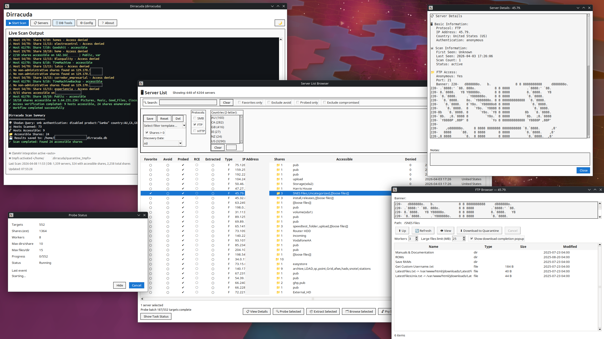

## Setup

```bash
git clone https://github.com/b3p3k0/dirracuda
cd dirracuda
```

Or for the latest development (experimental features and brand new bugs!) version:

```bash
git clone https://github.com/b3p3k0/dirracuda -b development --single-branch
cd dirracuda
```
Optionally, run the interactive installer (designed for Ubuntu 24.04 LTS+ )— it handles dependencies, venv, config, and optional extras:

```bash
bash install.sh
```

**Manual setup** (other distros, or if you prefer to do it yourself):

You'll need Python 3.8+ and Tkinter. Python 3.8 remains compatible with this
release but [reached upstream end of life on October 7,
2024](https://peps.python.org/pep-0569/); use Python 3.10 or newer for an
actively supported runtime.

```bash
# Ubuntu/Debian
sudo apt install python3-tk python3-venv

# Fedora/RHEL
sudo dnf install python3-tkinter python3-virtualenv

# Arch
sudo pacman -S tk python-virtualenv
```

Then:
```bash
python3 -m venv venv
source venv/bin/activate
pip install -r requirements.txt
mkdir -p ~/.dirracuda/conf ~/.dirracuda/conf.d/core ~/.dirracuda/conf.d/prefs ~/.dirracuda/conf.d/experimental
cp conf/config.json.example ~/.dirracuda/conf/config.json
```

Edit `~/.dirracuda/conf.d/core/scan.json` (or launch a new scan from the dashboard) and add your Shodan API key (requires paid membership):

```json
{
  "shodan": {
    "api_key": ""
  }
}
```
Paste the key between the quotes.
`~/.dirracuda/conf/config.json` is still generated for compatibility, but runtime reads/writes are authoritative under `~/.dirracuda/conf.d/`.

Launch the GUI from your venv:

```bash
./dirracuda
```

---

## Dependencies

### Python packages

| Package | Version | Purpose |
|---------|---------|---------|
| shodan | ≥1.25.0 | Shodan API client - discovers scan candidates by country and filter |
| smbprotocol | ≥1.10.0 | Pure-Python SMB2/3 transport for cautious-mode sessions |
| pyspnego | ≥0.8.0 | SPNEGO authentication support; required by smbprotocol |
| impacket | ≥0.11.0 | SMB1/2/3 transport for legacy compatibility, share enumeration, and browser operations |
| Pillow | ≥8.0.0 | Image rendering in the file viewer (PNG, JPEG, GIF, WebP, BMP, TIFF) |

### System tools

| Tool | Install | Purpose |
|------|---------|---------|
| tkinter | `apt install python3-tk` | GUI framework; required to run Dirracuda |
| ClamAV (`clamscan` / `clamdscan`) | `apt install clamav clamav-daemon` | Optional post-download malware scan step for bulk extract and browser downloads |
| tmpfs (Linux) | built into the Linux kernel (`mount -t tmpfs ...`) | Optional RAM-backed quarantine path at `~/.dirracuda/data/tmpfs_quarantine`; legacy mountpoints are detected for compatibility; app is detect-only and falls back to disk quarantine if tmpfs is unavailable |

---

## Using Dirracuda

### Before You Start

You're connecting to machines you don't control. A few baseline precautions before you scan:

- **VPN** - don't scan from your real IP address
- **VM** - run Dirracuda inside a virtual machine, especially if you plan to browse or extract files; unknown hosts can serve malicious content
- **Network isolation** - keep the VM on an isolated network segment, not bridged directly to your LAN
- **Don't open extracted files on your host** - quarantine defaults to `~/.dirracuda/data/quarantine/` inside the VM for a reason; treat everything you pull as untrusted
- **Audit the source code** - I'm not a threat actor, but I could be. Don't just clone and run things from Github all willy-nilly
- **Don't run as root** - that's just silly!

### Dashboard

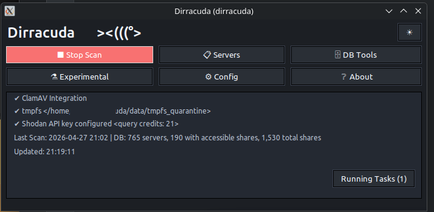

The main window. From here you can:

- Launch discovery from one **▶ Start Scan** button - selected providers run one at a time (`Reddit` → `SearXNG` → `Shodan`), and Shodan queues selected SMB/FTP/HTTP protocols in sequence
- Access [Accessories](#accessories) 
- Open the Server List Browser to work with hosts you've found
- Manage your database (import, export, merge, maintenance)
- Edit configuration
- Open **Running Tasks** to monitor active/queued work and reopen hidden monitor dialogs (scan/probe/extract)
- Toggle Sherlock auto-triage from the Start Scan dialog's runtime controls when you want probes to refresh Risk findings immediately

### Keyboard Shortcuts
For the full list of keyboard shortcuts, see [`docs/KBD_QUICKREF.md`](docs/KBD_QUICKREF.md).

### Discovery

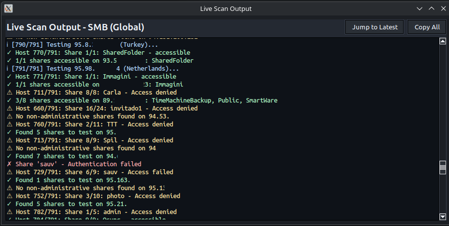

Triggered from **▶ Start Scan** with the protocol(s) selected. All three follow the same pipeline: Shodan query → reachability check → protocol-specific verification. Only hosts that pass get stored; failures are recorded with a reason code so you can see exactly where each candidate dropped out. Scan summary shows Shodan candidates vs. verified count. The same host registry handles all three protocols - the same IP can carry SMB, FTP, and multiple HTTP endpoint entries without collision.

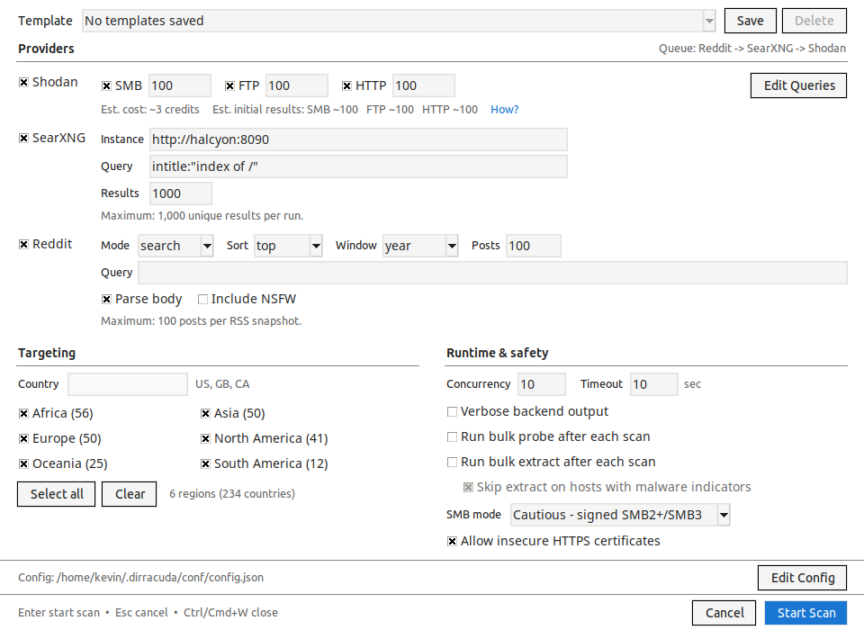

**SMB** - default dork: `smb authentication: disabled product:"Samba"`. Applies two extra pre-connection filters: org filtering (drops excluded ISPs and hosting providers) and 30-day deduplication (CLI overrides: `--rescan-all`, `--rescan-failed`). Verification tries Anonymous, Guest/blank, and Guest/Guest in sequence; whichever succeeds is recorded alongside country and timestamp, so auth method drift shows up across rescans. Two security modes: **Cautious** (default) restricts to signed SMB2+/SMB3 and rejects SMB1; **Legacy** lifts those restrictions and tends to find more targets. 

**FTP** - default dork: `port:21 "230 Login successful"`. Verification includes anonymous login and root directory listing. Failure codes: `connect_fail`, `auth_fail`, `list_fail`, `timeout`.

**HTTP** - default dork: `http.title:"Index of /"`. Verification, probing,
browsing, and extraction connect to the recorded IP and port. A saved hostname
is used only for the HTTP `Host` header, TLS SNI, and certificate identity.
Redirects may follow at most three same-origin hops; a scheme, host, or
effective-port change is rejected. Target traffic ignores ambient HTTP proxy
environment variables.

HTTPS target verification is permissive by default so self-signed directory
indexes remain reachable. With **App Config → Security → HTTP Target TLS →
Allow insecure TLS** enabled, certificate-chain and hostname checks are skipped;
a machine in the middle can intercept or impersonate the target. Disable it for
strict verification. The Start Scan checkbox overrides this default for that
run only.

`Edit Queries` in Start Scan opens the modeless `Discovery Dorks` editor (single-instance) for SMB/FTP/HTTP base queries.
Changes there are manual-save only.
GUI scan dialogs no longer include a per-scan `Custom Shodan Filters` field; GUI query customization is centralized in `Edit Queries` / Dorkbook. CLI users can still pass ad-hoc filters with `--filter`.

Start Scan shows a preflight confirmation that includes an approximate Shodan query-cost estimate before launch.

### Shodan Credits

Shodan charges by **result page** — roughly 100 candidates per credit. Dirracuda controls this through a **Max Shodan Results** field next to each protocol toggle in the scan dialog.

Cost is `ceil(Max Shodan Results / 100)` credits per selected protocol — the default `100` costs ~1 credit, `1000` costs ~10.

The verified host count stored in your database will be lower than the candidate count — Shodan may return fewer matches than the cap, and hosts that fail the reachability check, protocol verification, or exclusion filters don't make it through.

The **preflight screen** shows your live balance and an estimated post-scan balance before you commit. If Dirracuda can't reach Shodan to check your balance,  estimates are suppressed and a link to the [Shodan dashboard](https://developer.shodan.io/dashboard) is shown instead.

> For implementation details — how credits are derived from caps, config keys, adaptive page-stop behavior — see [Shodan candidate-cap controls](docs/TECHNICAL_REFERENCE.md#shodan-candidate-cap-controls-all-discovery-protocols) in the Technical Reference.

**Post-scan bulk probe/extract scope** - when bulk probe or bulk extract is enabled from the scan flow, targets are limited to accessible hosts from the scan that just completed (same protocol). .

### Server List

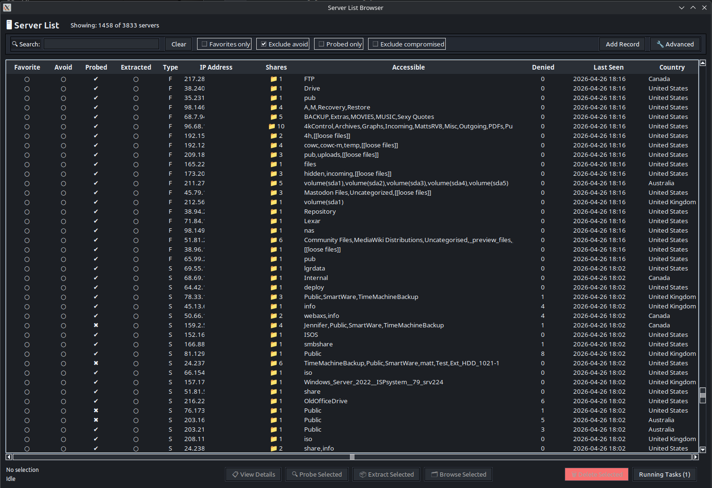

 Shows discovered hosts with IP/hostname, country, and accessible share counts as well as status indicators and a favorite/avoid list.

**Operations** (right-click a host or use the bottom-row buttons):

| Action | Description |
|--------|-------------|
| 📋 Copy IP | Copy selected server IP address to clipboard |
| 🔍 Probe Selected | Enumerate shares, detect ransomware indicators |
| 🔎 Scan Sherlock | Re-check selected hosts against their latest probe snapshots and refresh the alert-only Risk column |
| 📦 Extract Selected | Collect files with hard limits on count, size, and time |
| 🗂️ Browse Selected | Read-only exploration of accessible shares; HTTP rows open at their saved hostname/path when available |
| ⭐ Toggle Favorite | Mark/unmark selected servers as favorites |
| 🚫 Toggle Avoid | Mark/unmark selected servers to avoid |
| ⚠ Toggle Compromised | Mark/unmark selected servers as likely compromised |
| 🗑️ Delete Selected | Remove selected servers from the database |

Server List also includes an **Add Record** control (next to `Advanced`) for manually inserting one SMB/FTP/HTTP host row into the active database. Save keeps your current filters unchanged. If the newly added row does not appear, it is usually hidden by an active filter (most commonly `Show Only Shares >0`). Inserted records can then be probed and investigated from the GUI.

### Probing Shares

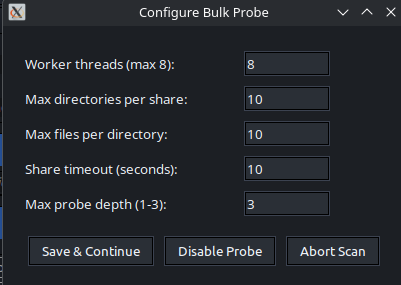

Read-only directory enumeration that previews accessible shares without downloading files. Probing collects root files, subdirectories, and file listings for each accessible share (with configurable limits on depth and breadth).

**Ransomware detection:** Filenames are matched against 25+ known ransom-note patterns (WannaCry, Hive, STOP/Djvu, etc.). Matches flag the server with a red indicator in the list view.

Live scan/probe/extract output is shown in monitor dialogs. Hiding a monitor does not stop the task; reopen it from **Running Tasks**.

### Browsing Shares


The SMB, FTP, and HTTP browsers provide read-only navigation with familiar file
explorer controls. Double-click opens a file or descends into a directory.

The viewer auto-detects file types: text files display with an encoding selector (UTF-8, Latin-1, etc.), binary files switch to hex mode, and images (PNG, JPEG, GIF, WebP, BMP, TIFF) render with fit-to-window scaling.


Files over the configured maximum (default: 5 MB) trigger a warning. Change
`file_browser.viewer.max_view_size_mb` in
`~/.dirracuda/conf.d/core/storage.json`, or click **Ignore Once** to load the
file up to the 1 GB hard cap.

Downloads are staged in quarantine (`~/.dirracuda/data/quarantine/`). When ClamAV is enabled, downloaded files are post-processed by verdict (clean files optionally promoted to extracted, infected files moved to known-bad). The browser never writes to remote systems.

#### Optional tmpfs quarantine (Linux)

Dirracuda can stage quarantine files in RAM-backed `tmpfs` instead of disk.

- Canonical mountpoint is `~/.dirracuda/data/tmpfs_quarantine`
- Legacy mountpoints are still detected for compatibility: `~/.dirracuda/quarantine_tmpfs` and `~/.smbseek/quarantine_tmpfs`
- Linux only (controls are disabled on non-Linux platforms)
- Dirracuda is detect-only and never runs `mount`/`umount`
- If no supported tmpfs mount is present, Dirracuda falls back to the configured disk quarantine path and shows one warning per app session

For setup, either:

1. Run `bash install.sh` and in Step 8 choose tmpfs + optional `/etc/fstab` update.
2. Build the mount path from your actual home directory, print the matching
   `/etc/fstab` line, and paste that line into `/etc/fstab`:

```bash
home_dir="$(getent passwd "$(id -un)" | cut -d: -f6)"
mountpoint="$home_dir/.dirracuda/data/tmpfs_quarantine"
sudo mkdir -p "$mountpoint"
printf 'tmpfs  %s  tmpfs  noexec,nosuid,nodev,size=512M,noswap  0  0\n' "$mountpoint"
# Paste the printed line into /etc/fstab, then:
sudo mount -a
```

Dirracuda will reuse this mount when tmpfs mode is enabled.

Enable in **App Config**:

- Check `Use memory (tmpfs) for quarantine`

Or set in `~/.dirracuda/conf.d/core/storage.json`:

```json
{
  "quarantine": {
    "use_tmpfs": true
  }
}
```

Manual setup notes (Linux):

```bash
# Validate mount exists before starting Dirracuda with tmpfs enabled
mount | grep -F "$HOME/.dirracuda/data/tmpfs_quarantine"

# Inspect current tmpfs usage
df -h "$HOME/.dirracuda/data/tmpfs_quarantine"
```

### Extracting Files


Automated file collection with configurable limits:

- Max total size
- Max runtime
- Max directory depth
- File extension filtering

All extracted files land in quarantine. The defaults are conservative - check `~/.dirracuda/conf.d/core/storage.json` if you need to adjust them.

#### Optional ClamAV scanning (bulk extract + browser downloads)

ClamAV integration is optional and highly recommended. On a fresh setup, if
`clamscan` or `clamdscan` is detected, Dirracuda enables ClamAV integration
automatically. If you disable it later in App Config, that choice is preserved.

When enabled, ClamAV post-processes files downloaded via:

- Bulk extract paths (`Dashboard` post-scan bulk extract and `Server List` batch extract)
- Browser/manual file downloads (SMB/FTP/HTTP browser windows)

Each file is scanned and may then optionally be routed by verdict:

- **clean** → moved to `~/.dirracuda/data/extracted/<host>/<date>/<share>/...`
- **infected** → moved to `~/.dirracuda/data/quarantine/<known_bad_subdir>/<host>/<date>/<share>/...` (default subdir: `known_bad`)
- **scanner error/timeout/missing binary** → file stays in quarantine; extract continues (fail-open)

Configure it from **App Config → ClamAV Settings**:

- Enable/disable scanning
- Backend: `auto`, `clamdscan`, or `clamscan`
- Scanner timeout (seconds)
- Extracted root path
- Known-bad subfolder name
- Show/hide post-extract ClamAV results dialog

### DB Tools

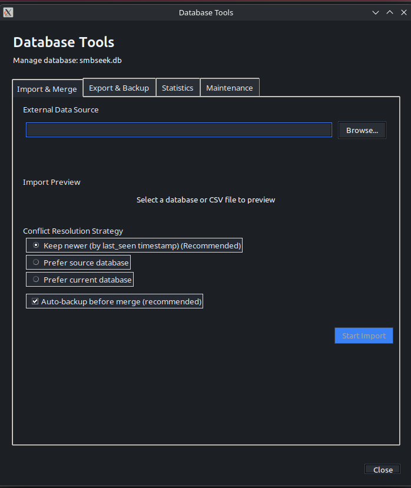

Opened via **DB Tools** on the dashboard. Four tabs:

**Import & Merge** - supports two source types:
- External `.db` merge: merge by IP into current DB (includes shares, credentials, file manifests, vulnerabilities, failure logs).
- CSV host import: import protocol server rows only (SMB/FTP/HTTP registries), using the same conflict strategies.

Three conflict strategies are available in both paths: **Keep Newer** (default - picks whichever record has the more recent `last_seen`), **Keep Source**, and **Keep Current**. Auto-backup fires before import/merge unless you disable it.

**Export & Backup** - **Export** runs `VACUUM INTO` to produce a clean, defragmented copy at a path you choose. **Quick Backup** drops a timestamped copy (`dirracuda_backup_YYYYMMDD_HHMMSS.db`) next to the main database file.

**Statistics** - server and share counts, database size, date range, and a top-10 country breakdown. Read-only; won't lock the database.

**Maintenance** - Vacuum/optimize, integrity check, and age-based purge. The purge shows a full cascade preview before deleting - servers not seen within N days (default: 30) plus all associated shares, credentials, file manifests, vulnerabilities, and cached probe data.

### CSV Host Import Standard

CSV import is intentionally simple: **select -> preview -> write**. The app does lightweight validation and previews skips/warnings, but input CSV quality is the operator's responsibility. This is designed so experienced users can easily bring in their existing data and begin using it in Dirracuda.

Required column:
- `ip_address`

Optional columns:
- `host_type` (`S`, `F`, `H`; aliases `SMB`, `FTP`, `HTTP`)
- `country`, `country_code`, `auth_method`, `first_seen`, `last_seen`, `scan_count`, `status`, `notes`, `shodan_data`
- `port`, `anon_accessible`, `banner` (FTP/HTTP rows)
- `scheme`, `title` (HTTP rows)

Behavior notes:
- One CSV row maps to one protocol host row.
- `S` rows write to `smb_servers`, `F` to `ftp_servers`, `H` to `http_servers`.
- If the current DB lacks a protocol table/columns (legacy DB shape), those protocol rows are skipped and shown in preview warnings.
- CSV import does not create share/file/vulnerability/failure records; it imports host registries only. Imported hosts can be probed from the Server List Browser to populate these fields.

---

## Configuration

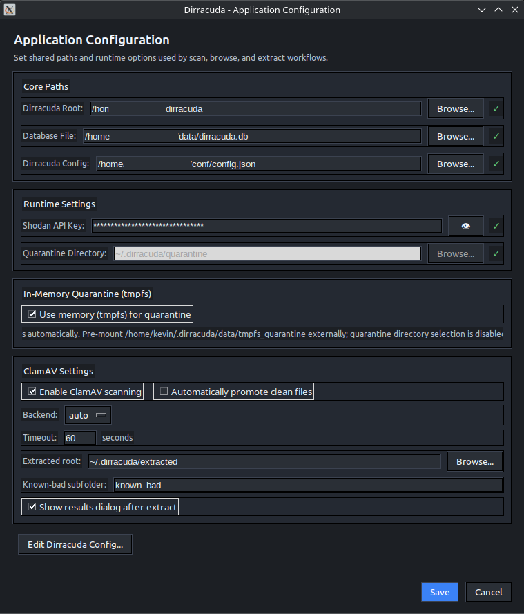

Runtime settings are modular and stored under `~/.dirracuda/conf.d/`:

- `core/scan.json` - discovery + scan controls (`shodan`, `workflow`, `connection`, `discovery`, `access`, `ftp`, `http`)
- `core/storage.json` - storage/runtime paths (`database`, `file_collection`, `file_browser`, `ftp_browser`, `http_browser`, `quarantine`, `clamav`, `gui_app`)
- `core/security.json` - security integrations (`security`, `censys`)
- `core/output.json` - output formatting settings (`output`)
- `prefs/user-prefs.json` - GUI/user preferences (replaces legacy `state/gui_settings.json`)
- `experimental/{se_dork,reddit_grab,dorkbook,keymaster,webui,sherlock}.json` - experimental module settings

`~/.dirracuda/conf/config.json` is retained as a generated compatibility view for legacy readers.

Two additional files hold editable lists:

- `~/.dirracuda/conf/exclusion_list.json` - Organizations to skip during Shodan queries (hosting providers, ISPs you don't care about etc.). Add entries to the `organizations` array.
- `~/.dirracuda/conf/ransomware_indicators.json` - Filename patterns checked during probe. Matches flag a server as likely compromised.

These are separate so you can customize or share them without touching app settings.

The GUI includes a built-in config editor for common settings and an integrated simple text editor for full configuration.

## Accessories

Accessories are grouped under the `⚗ Accessories` button in the dashboard header.

The dialog is modeless and tab-based. Current tabs:
- `SearXNG`
- `Reddit`
- `Web UI`
- `Dorkbook`
- `Keymaster`
- `Sherlock`

### SearXNG

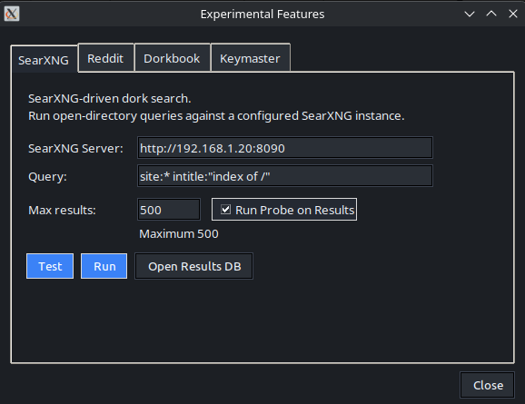

Use this tab to run open-directory dork queries against a SearXNG server, keep confirmed open indexes, and review/probe the results.

Quick start:
1. Dashboard → `⚗ Accessories` → `SearXNG` tab.
2. Fill in your server and query.
3. Click `Test` to confirm the server is reachable and JSON search is enabled.
4. Click `Run` to collect results.
5. Click `Open Results DB` to review and probe retained URLs.

Inputs (persisted across opens/restarts):
- **SearXNG Server** — base URL of the SearXNG instance you control
- **Query** — dork query (default: `site:* intitle:"index of /"`)
- **Max results** — unique-result fetch cap per run (default 500, max 1,000)
- **Run Probe on Results** — optional bulk probe pass for retained results

What each action does:
- **Test** checks server reachability and JSON search support.
- **Run** executes the query, keeps only confirmed open-index results, and updates status with fetched/stored counts. Each fetched page is stored, classified, filtered, and optionally probed before the next page request. That work consumes the active pacing window; Dirracuda sleeps only for any time left over. Fetching deduplicates normalized URLs and stops at the requested unique-result count, 40 pages, or the first clean empty page. Temporary per-engine failures are advisory when a page still returns results, with 10/20/30-second soft backoff until a clean page resets normal pacing. An empty throttled page triggers a hard retry: early runs (fewer than 5 productive pages and fewer than 50 unique URLs) allow two retries (30 seconds, then 180 seconds); mature runs allow one (30 seconds only). Direct SearXNG HTTP 429 responses use the same run-wide retry budget and honor a valid bounded `Retry-After`. Completed pages remain available if a later request fails, and partial runs still reach primary-DB sync. The 1,000-result setting is a ceiling, not a guarantee. If probe is enabled, the status line also shows probe totals (`✔/✖/○`). On completion, retained SearXNG rows are auto-synced into main HTTP server surfaces. A standalone run shows a result popup, while Live Scan Output keeps the full rollup. In a multi-provider Start Scan run, the popup is suppressed while the serial provider queue continues.
- **Open Results DB** opens the SearXNG browser against the active primary DB context for new runs. Historical sidecar data is still available from the legacy sidecar browser path.
- **Cancel a running search** — use the **Running Tasks** control in the dashboard footer, select the SearXNG task, and click **Cancel Task**. In a multi-provider Start Scan run, cancelling the provider queue task also cancels the active SearXNG search. Cancelled runs still sync any retained open-index rows to the primary HTTP table, and completed results are preserved.

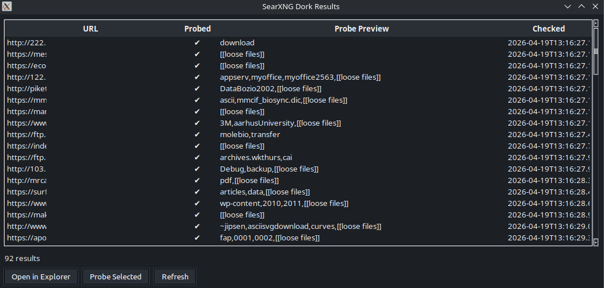

Results browser:
- Columns: `URL`, `Probed`, `Probe Preview`, `Checked`
- Actions: `Copy URL`, `Open in Explorer`, `Open in system browser`, `Probe Selected` / `Probe URL`; double-click opens a read-only result details view.
- Primary-backed mode hides manual promotion controls because retained SearXNG rows are synced during run completion. Legacy sidecar browsing keeps promotion controls for historical rows.

#### SearXNG live validation (opt-in)

`scripts/live_test_searxng.py` runs an end-to-end pipeline check against a real instance using a temporary database. Requires `--confirm-live`; never runs automatically.

```bash
./venv/bin/python scripts/live_test_searxng.py --confirm-live --max-results 100
```

#### SearXNG `format=json` and 403 troubleshooting

If `Test` fails with a 403 on `format=json`, enable JSON output in your SearXNG `settings.yml`:

```yaml
search:
  formats:
    - html
    - json
```

Then restart SearXNG and run `Test` again.

### Reddit Ingestion (redseek)

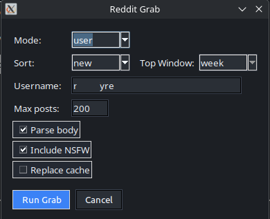

redseek ingests submissions from `r/opendirectories`. New runs write `reddit_posts`, `reddit_targets`, and `reddit_ingest_state` directly to the active primary DB, and parsed SMB/FTP/HTTP targets are automatically promoted into the main protocol tables at run completion. No manual "Add to dirracuda DB" step is needed for new runs.

Legacy data already in `~/.dirracuda/data/experimental/reddit_od.db` remains accessible under Accessories → Legacy Sidecar Data → Reddit, with manual promotion still available from that view.

Ingest modes in `Reddit Grab` (Accessories):

| Mode | Endpoint | Required input | Notes |
|------|----------|----------------|-------|
| `feed` | `/r/opendirectories/{sort}.rss` | none | Default anonymous RSS mode |
| `search` | `/r/opendirectories/search.rss` with `restrict_sr=1` | query | Subreddit-scoped keyword search |

Sort options:
- `new`
- `top` with window `hour`, `day`, `week`, `month`, `year`, or `all`

Only submissions exposed by Reddit's public Atom/RSS feeds are processed. Comments/replies are not.
RSS does not expose the old JSON cursor, so each run makes one anonymous feed request. Dirracuda sends `limit=<Max posts>` and supports 1–100 posts per snapshot (default and maximum: 100); Reddit may still return fewer. `Max pages` is kept only for compatibility.
User/author mode is unavailable in anonymous RSS mode. Historical rows from older user-mode runs remain viewable in existing databases.

Reddit Grab options:
- **Run probe on results** — optional explicit probe pass for concrete HTTP/HTTPS/FTP targets found during that ingest run. Unknown-protocol rows are skipped with a clear notice instead of guessing a protocol. Probe summaries and snapshots are carried into the primary DB automatically.

Successful standalone Reddit runs keep the existing result popup and also append a
Shodan-style completion rollup to Live Scan Output. Multi-provider Start Scan runs
suppress the popup while the serial queue continues. The console copy records posts,
discovered/new targets, optional probe and sync totals, and the active primary database
path.

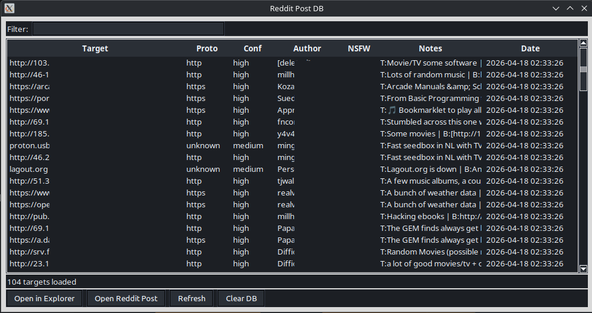

Reddit Post DB (current runs — primary DB):
- Columns include target metadata plus probe status, preview, and checked time.
- `Probe Selected` runs the full probe stack for HTTP/HTTPS/FTP targets and stores the probe snapshot.
- Double-click opens a read-only details view with Reddit metadata and the probe tree when a snapshot is available.
- Rows from new runs are already synced to the main database; manual promotion is not available from this view.

Disclaimer:

> Dirracuda's Reddit ingestion feature uses publicly accessible Atom/RSS feeds to retrieve posts from `r/opendirectories`.
> No authentication is required, and only publicly available data is accessed.
> This method is not part of Reddit's official API and may change or break at any time.

Known limitations:
- Reddit RSS feeds are unofficial and may change without notice
- Data availability is limited and not a complete historical archive
- RSS has reduced metadata compared with the discontinued JSON listing endpoint; NSFW filtering is best-effort
- Rate limiting may interrupt runs (HTTP 429 aborts the current run)
- Some posts contain no usable targets
- Data quality depends entirely on user-submitted content

### Dorkbook

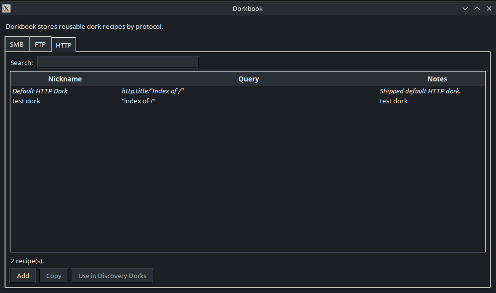

Dorkbook is a notebook for reusable search queries.

Quick start:
1. Dashboard → `⚗ Accessories` → `Dorkbook` tab.
2. Click `Open Dorkbook`.
3. Use `SMB` / `FTP` / `HTTP` tabs to manage recipes.

Behavior:
- Sidecar DB path: `~/.dirracuda/data/experimental/dorkbook.db`
- Built-ins are read-only (italicized) and seeded one per protocol
- Custom rows support `Add`, `Copy`, `Use in Discovery Dorks`, `Edit`, `Delete`
- `Use in Discovery Dorks` populates the protocol-matched field in Discovery Dorks editor as an unsaved/manual-save change

### Keymaster

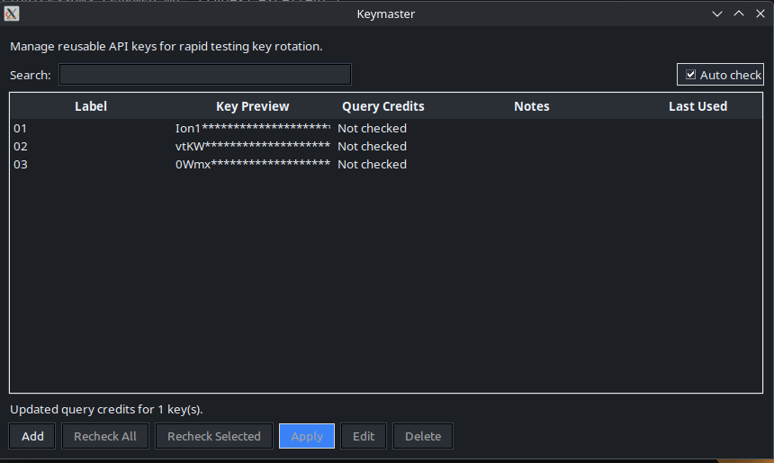

Keymaster stores reusable Shodan API keys for rapid key rotation during testing.

Quick start:
1. Dashboard → `⚗ Accessories` → `Keymaster` tab.
2. Click `Open Keymaster`.
3. On first secure-mode use, set a dedicated Keymaster passphrase.
4. Unlock once per app session.
5. Add one or more keys with a label, API key, and optional notes.
6. Select a key and click `Apply` (or double-click the row, or use the right-click menu).

What Apply does:
- Writes the selected key to `shodan.api_key` in the active config file.
- Affects future scans only — a scan already running or queued continues with the key that was active at launch.

Sidecar DB path: `~/.dirracuda/data/experimental/keymaster.db`

Storage behavior:
- Secure storage is enabled by default.
- Key material is encrypted at rest in Keymaster sidecar storage.
- Existing legacy plaintext rows are auto-migrated on successful unlock/setup.
- If you disable secure storage in the Keymaster window, existing encrypted rows are converted back to plaintext in the sidecar DB.
- `Forgot Passphrase / Reset` is destructive by design: it clears Keymaster rows and passphrase metadata so secure mode can be reinitialized.

Key table columns: `Label`, `Key Preview`, `Query Credits`, `Notes`, `Last Used`.

Key Preview format: keys longer than 8 characters show as `first4 + asterisks`; shorter keys are fully masked.

### Sherlock

Sherlock highlights keywords captured in probe snapshots. It
matches share, folder, and file names against keyword/wildcard patterns, sorts
them by severity and category, then colors each hit by severity or by one of your
custom User colors. It never downloads files, reads file contents, authenticates,
or probes on its own.

Use Accessories -> Sherlock to:
- turn matching on after successful probes
- choose whether matching ignores case
- set High/Med/Low colors and optional User1/User2/User3 colors
- open **Manage Patterns...** to edit the built-in and custom pattern catalog

The Pattern Manager has two panes. Categories sit on the left with a per-category
count; pick one to filter the right pane, or pick `All Categories` to see
everything. The right pane lists grouped values — patterns that share a label,
severity, category, and tag show up as one row, so `*w2*`, `*w4*`, and `*tax*`
under "Tax docs" read as a single entry. Add or edit a value with a comma-
separated `Patterns` field; each token becomes its own underlying pattern. Add,
copy, and delete categories from the left pane; tag one or more selected value
rows with the `Tag` control; and search, multi-select, restore built-ins, or
export the whole catalog to JSON from the right.

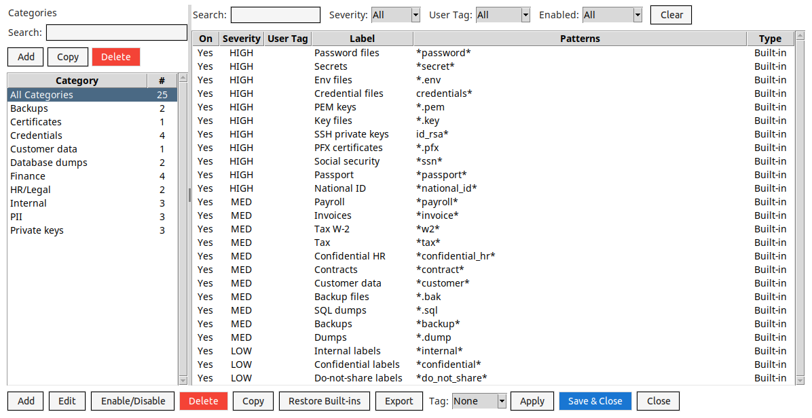

When Sherlock finds matches, the Server List `Risk` column shows `HIGH n`,
`MED n`, or `LOW n`; blank means there is no current finding to show. Row color
uses the pattern's User color when one is set, otherwise the severity color.
You can also run Sherlock manually from the Server List against selected hosts'
latest probe snapshots.

If **Run after probe** is enabled, probe summaries show the same Risk column and
colors. Detail popups and Web UI Results show the latest saved Sherlock summary;
the Web UI is currently read-only for Sherlock.

Settings are stored at `~/.dirracuda/conf.d/experimental/sherlock.json`.

### Censys Discovery

Development status: **suspended**.

Reason:
- Free-tier Censys API access does not provide candidate-list query endpoints required for in-app discovery runs.
- I'm not invested enough to upgrade my account; if someone wants to help test it dm me ;)

What is retained:
- Backend module and config contract remain in-repo for future reactivation.
- Sidecar DB path remains `~/.dirracuda/data/experimental/censys_discovery.db`.

Current UI state:
- No Censys tab in Accessories.
- No Censys settings tab in Application Configuration.

## Web UI (Optional)

An optional browser-based interface for scan management, results browsing, and database export. Runs as a separate service alongside the desktop GUI; disabled by default.

```bash
pip install -r experimental/webui/requirements-web.txt
./dirracuda-d credentials set admin
./dirracuda-d start
# → http://127.0.0.1:2600
```

For setup, configuration, remote mode, and security guidance, see [experimental/webui/README.md](experimental/webui/README.md).

`./dirracuda-d` is the runtime-headless service manager. It automatically uses
the repository virtualenv and provides `start`, `stop`, `restart`, `status`,
`run`, `logs`, `doctor`, config checks, credential setup, JSON output, and
optional per-user systemd installation. Run `./dirracuda-d --help` for the full
command list.

From the desktop app, use `Accessories → Web UI` to control the same service.
The tab reports whether direct-process or systemd control is active.
`Manage Credentials` is also the trusted local recovery path: it can replace
the single configured Web UI password without the old password, requires the
new password twice, clears that account's lockouts, and restarts a running
managed service to sign out existing browser sessions. The browser account page
continues to require the current password.

Current Web UI layout:
- `Scans` (dropdown): `shodan`, `searxng`, `reddit`
- `Results` (includes read-only Sherlock Risk badges/details when persisted)
- `Export`
- `Extras` (dropdown): `dorkbook`, `keymaster`
- `Config`, `Account`

Notes:
- Root `/scans` and `/extras` are intentionally not registered and return 404.
- Queue state is shared and survives page navigation/refresh.
- Dorkbook prefill is immediate-persist to discovery config.
- Keymaster `apply` writes `shodan.api_key`; secure-mode toggle/reset stays desktop-only for now.

Remote access requires `remote_enabled=true`, a matching CIDR allowlist, and TLS
or the explicit insecure override. If remote access is enabled while the bind is
still loopback, Dirracuda promotes `127.0.0.1` to `0.0.0.0` (or `::1` to `::`)
on save/load so Uvicorn can accept non-loopback traffic. The desktop tab shows
the wildcard listening endpoint separately from the usable local browser URL.
LAN clients connect to the host's actual interface address, not the wildcard
listener address.
Remote plaintext HTTP is reported prominently by the CLI and both UIs.
IP-literal Host values and `localhost` are accepted automatically; custom DNS
names must be added to `trusted_hosts`.

For route-level behavior, API contracts, and security/runtime details, see
[docs/TECHNICAL_REFERENCE.md](docs/TECHNICAL_REFERENCE.md).

---

## Advanced

### Templates

**Scan templates** save your unified scan configuration - protocol selection, country/region filters, Shodan filters, max results, shared concurrency/timeout, and SMB/HTTP protocol-specific toggles. Click "Save Current" in the Start Scan dialog. Templates live in `~/.dirracuda/state/templates/scan/` as JSON files you can edit directly.

**Filter templates** save your server list filters - search text, date range, countries, checkboxes. Click "Save Filters" in the advanced filter panel. Stored in `~/.dirracuda/state/templates/filter/`.

Both auto-restore your last-used template on startup.

### CLI Usage

This program began as a collection of loosely related scripts; they came together and were revised to form the "backend" before I integrated the GUI. The CLI tools can still be useful for scripting and automation. 

```bash
# SMB discovery
./cli/smbseek.py --country US              # Discover US servers
./cli/smbseek.py --country US,GB,CA        # Multiple countries
./cli/smbseek.py --string "SIPR files"     # Search by keyword
./cli/smbseek.py --verbose                 # Detailed output

# FTP discovery
./cli/ftpseek.py --country US
./cli/ftpseek.py --country US,GB,CA
./cli/ftpseek.py --verbose

# HTTP discovery
./cli/httpseek.py --country US
./cli/httpseek.py --country US,GB,CA
./cli/httpseek.py --verbose
```

---

## Development

This started as a collection of crude bash and python scripts I've written over 30+ years of networking and security work - dorks, one-liners for poking at servers, that sort of thing. At some point it made sense to turn them into something with a GUI and a database, but the undertaking was far outside my skillset. I understand fundamentals of programming and logic but get lost in the sauce of syntax and structure.

Fortunately AI has gotten good enough to generate functional code with proper oversight. Claude and Codex were extensively used to bring everything together and grow this from a handful of rough scripts to a full workflow manager. You can review much of the architecture and planning docs in the development branch if you're curious.

---

## Legal & Ethics

**I am not a lawyer and this is not legal advice**

You should only scan networks you own or have explicit permission to test. Unauthorized access is illegal in most jurisdictions - full stop.

That said: security research matters. Curiosity about how systems work isn't malicious, and understanding vulnerabilities is how we fix them. This tool exists because improperly secured data is a real problem worth studying. Use it to learn, to audit, to improve defenses and responsibly disclose. Don't be a dick.

If you're unsure whether something is authorized, do not proceed until you
have written permission that clearly covers the planned testing.

---

## Acknowledgements

Licensed under GNU GPL v3. See `LICENSE.md` and `licenses/` for details.
