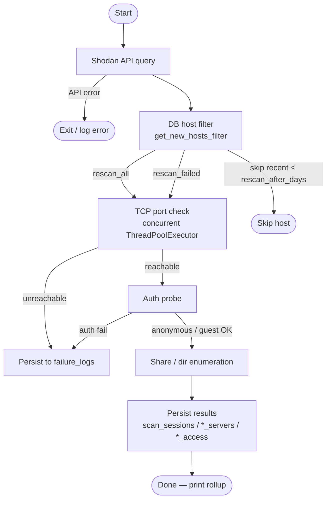
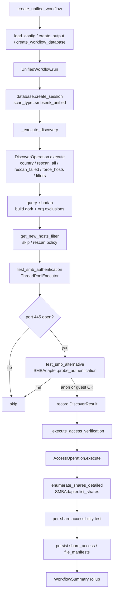

# Dirracuda Technical Reference

**Version:** current (`development` branch)
**Scope:** Internals for developers and security analysts who need more than the README and less than reading every file themselves.

Dirracuda scans for internet-accessible servers exposing open or weakly-authenticated directories across three protocols: SMB, FTP, and HTTP. It discovers candidates through the Shodan API, verifies access, persists results to a local SQLite database, and provides both a CLI and a Tkinter GUI for interacting with the data.

---

## Document Conventions

- File paths are relative to the repository root unless prefixed with `~/`.
- Config keys are written in dot-notation (`shodan.api_key`).
- Mermaid diagrams are used for flowcharts and the ER diagram. They render on GitHub and in VS Code with the Mermaid extension.
- The SMB RCE vulnerability analysis feature (`--check-rce`) is **incomplete and suspended indefinitely**. There is currently no planned resumption of development; §4.2 and §8 document retained internals only, not production-ready capability.

---

## 1. System Overview

### 1.1 High-Level Block Diagram

```
┌─────────────────────────────────────────────────────────────────────┐
│  CLI Layer                                                          │
│  cli/smbseek.py    cli/ftpseek.py    cli/httpseek.py               │
└──────────┬─────────────────┬──────────────────┬────────────────────┘
           │                 │                  │
           ▼                 ▼                  ▼
┌─────────────────────────────────────────────────────────────────────┐
│  Workflow Layer                                                      │
│  shared/workflow.py       shared/ftp_workflow.py                    │
│  (UnifiedWorkflow)        (FtpWorkflow)                             │
│                           shared/http_workflow.py                   │
│                           (HttpWorkflow)                            │
└──────────┬─────────────────┬──────────────────┬────────────────────┘
           │                 │                  │
           ▼                 ▼                  ▼
┌─────────────────────────────────────────────────────────────────────┐
│  Command Layer                                                       │
│  commands/discover/    commands/ftp/      commands/http/            │
│  commands/access/                                                   │
└─────────────────────────────┬───────────────────────────────────────┘
                              │
           ┌──────────────────┼──────────────────────┐
           ▼                  ▼                       ▼
┌──────────────┐  ┌─────────────────────┐  ┌─────────────────────┐
│ shared/       │  │ tools/              │  │ conf/               │
│ config.py     │  │ db_manager.py       │  │ config.json         │
│ output.py     │  │ db_schema.sql       │  │ exclusion_list.json │
│ database.py   │  │ db_maintenance.py   │  │ ransomware_         │
│ *_browser.py  │  │                     │  │ indicators.json     │
│ rce_scanner/  │  └──────────┬──────────┘  └─────────────────────┘
└──────────────┘             │
                             ▼
                     ┌──────────────┐
                     │ SQLite        │
                     │ dirracuda.db  │
                     └──────────────┘

┌─────────────────────────────────────────────────────────────────────┐
│  GUI Layer                                                          │
│  dirracuda (authoritative entry point)                              │
│    └─ gui/components/dashboard.py (compat shim)                     │
│         └─ gui/dashboard/widget.py (DashboardWidget implementation) │
│              ├─ unified_scan_dialog.py → scan_manager.py           │
│              │                            └─ backend_interface/     │
│              │                                (subprocess → CLI)    │
│              ├─ server_list_window/ (SMB / FTP / HTTP tabs)         │
│              ├─ running_tasks_window.py                             │
│              ├─ db_tools_dialog.py                                  │
│              └─ [config editor, browser windows, extract dialogs]   │
│  gui/utils/ui_dispatcher.py  (thread-safe Tk marshaling)          │
│  gui/utils/settings_manager.py  (persists ~/.dirracuda/state/      │
│                                  gui_settings.json)                │
└─────────────────────────────────────────────────────────────────────┘
```

For SMB/FTP/HTTP scan flows, the GUI invokes CLI scripts as subprocesses via `gui/utils/backend_interface/interface.py` and parses stdout for progress data. Experimental SearXNG dorking (`experimental/se_dork`), Reddit ingestion (`experimental/redseek`), Dorkbook recipe management (`experimental/dorkbook`), and Keymaster key management (`experimental/keymaster`) are in-process paths launched from the dashboard.

### 1.2 Core Workflow Flowchart



This shape applies to all three protocols. Protocol-specific differences are covered in §4.

---

## 2. Directory Structure

| Path | Responsibility | Key Files |
|------|---------------|-----------|
| `cli/` | Argument parsing; invoke workflow factory; exit cleanly on error | `smbseek.py`, `ftpseek.py`, `httpseek.py` |
| `commands/discover/` | SMB Shodan query, host filtering, concurrent auth | `shodan_query.py`, `auth.py`, `operation.py`, `host_filter.py`, `connection_pool.py` |
| `commands/access/` | SMB share enumeration and accessibility testing | `operation.py`, `share_enumerator.py`, `share_tester.py`, `rce_analyzer.py` |
| `commands/ftp/` | FTP discovery and access stages | `shodan_query.py`, `verifier.py`, `operation.py`, `models.py` |
| `commands/http/` | HTTP discovery and access stages (parallel to FTP) | `shodan_query.py`, `verifier.py`, `operation.py`, `models.py` |
| `shared/` | Protocol-agnostic utilities shared by CLI and GUI | See §2.1 |
| `experimental/se_dork/` | SearXNG dork search pipeline (client, service, store, classifier, models) | `client.py`, `service.py`, `store.py`, `classifier.py`, `models.py` |
| `experimental/redseek/` | Reddit ingestion pipeline (client fetch, parse, sidecar persistence) | `client.py`, `service.py`, `parser.py`, `store.py` |
| `experimental/dorkbook/` | Dorkbook sidecar persistence for reusable protocol dorks | `models.py`, `store.py` |
| `experimental/keymaster/` | Keymaster sidecar persistence for reusable API keys | `models.py`, `store.py` |
| `gui/components/`, `gui/dashboard/` | Tkinter windows/dialogs plus dashboard shim+implementation | `gui/components/dashboard.py` (compat shim), `gui/dashboard/widget.py`, `unified_scan_dialog.py`, `server_list_window/`, `running_tasks_window.py`, `db_tools_dialog.py`, `*_browser_window.py` |
| `gui/utils/` | GUI infrastructure | `ui_dispatcher.py`, `scan_manager.py`, `backend_interface/`, `probe_runner.py`, `extract_runner.py`, `settings_manager.py` |
| `tools/` | Database management utilities | `db_manager.py`, `db_schema.sql`, `db_maintenance.py`, `db_migrations.py`* |
| `signatures/rce_smb/` | YAML CVE signature definitions | `*.yaml` |
| `conf/` | Application configuration | `config.json.example`, `exclusion_list.json`, `ransomware_indicators.json` |

*`db_migrations.py` lives in `shared/` not `tools/`.

### 2.1 `shared/` Module Map

| Module | Purpose |
|--------|---------|
| `workflow.py` | `UnifiedWorkflow` — SMB 2-stage pipeline orchestrator |
| `ftp_workflow.py` | `FtpWorkflow` — FTP 2-stage pipeline orchestrator |
| `http_workflow.py` | `HttpWorkflow` — HTTP 2-stage pipeline orchestrator |
| `database.py` | `SMBSeekWorkflowDatabase` — host filtering, session tracking, wraps `DatabaseManager` |
| `config.py` | `SMBSeekConfig` — loads `~/.dirracuda/conf/config.json` (with fallback), deep-merge with defaults, typed accessors |
| `output.py` | `SMBSeekOutput` — formatted console output (color, verbose, quiet modes) |
| `smb_browser.py` | Read-only SMB file browser |
| `ftp_browser.py` | `FtpNavigator` — list directories, download files, cancel mid-operation |
| `http_browser.py` | HTTP directory/file browser |
| `rce_scanner/` | Signature-based SMB RCE analysis (incomplete; development suspended indefinitely) |
| `db_migrations.py` | `run_migrations()` — additive schema migrations, called on startup |
| `smb_adapter.py` | `SMBAdapter` — unified SMB backend abstraction (smbprotocol + impacket) |
| `results.py` | `DiscoverResult`, `AccessResult` dataclasses |

---

## 3. Configuration

### 3.1 `~/.dirracuda/conf/config.json`

All configuration lives in one JSON file, deep-merged against hardcoded defaults in `SMBSeekConfig.__init__`. Missing keys fall back to defaults silently; a missing file prints a warning and uses defaults entirely.

**Key sections:**

| Section | Key Fields | Notes |
|---------|-----------|-------|
| `shodan` | `api_key`, `query_limits.max_results` (1000), `query_limits.max_query_credits_per_scan` (1), `query_limits.min_usable_hosts_target` (50), `query_components.base_query`, `product_filter`, `additional_exclusions`, `use_organization_exclusions`, `string_filters` | SMB budget controls live under global `shodan.query_limits`; FTP/HTTP keep protocol-local `shodan` sub-blocks for query settings. |
| `workflow` | `rescan_after_days` (30), `skip_failed_hosts` (true) | Controls rescan policy in `get_new_hosts_filter()` |
| `connection` | `timeout` (30s), `port_check_timeout` (5s), `rate_limit_delay` (1s), `share_access_delay` (2s) | SMB connection and throttle settings |
| `discovery` | `max_concurrent_hosts` (10), `max_worker_cap` (20), `smart_throttling` (false) | Thread pool sizing for auth stage |
| `access` | `max_concurrent_hosts` (1 default) | SMB share enumeration concurrency |
| `file_collection` | `max_files_per_target` (3), `max_total_size_mb` (500), `max_directory_depth` (3), `included_extensions`, `excluded_extensions` | Automated file extraction limits |
| `file_browser` | `max_entries_per_dir` (5000), `max_depth` (12), `download_chunk_mb` (4), `quarantine_root`, `download_worker_count` (1–3, default 2), `download_large_file_mb` | GUI browser limits; `download_worker_count` and `download_large_file_mb` are persisted as GUI settings keys, not loaded from this config file — they appear in the browser tuning strip; large-file threshold routing active for SMB and FTP only |
| `ftp` | `shodan.query_components.base_query`, `verification.{connect,auth,listing}_timeout`, `discovery/access.max_concurrent_hosts` | FTP-specific settings |
| `http` | Parallel to `ftp`; adds `verification.{allow_insecure_tls,verify_http,verify_https,subdir_timeout}` | HTTP-specific settings |
| `rce` | `enabled_default` (false), `safe_active_budget.max_requests` (2), `intrusive_mode_enabled` (false) | RCE probe budget; intrusive mode must be explicitly enabled |
| `clamav` | `enabled` (false), `backend` ("auto"), `timeout_seconds` (60), `extracted_root`, `known_bad_subdir` | Post-extraction AV scanning |
| `quarantine` | `use_tmpfs` (false), `tmpfs_size_mb` (512, compatibility-only) | tmpfs quarantine for file downloads (detect-only; no runtime mount/umount) |
| `pry` | `wordlist_path`, `user_as_pass` (true), `stop_on_lockout` (true), `attempt_delay` (1.0s) | Password audit tool settings |

### 3.2 `SMBSeekConfig` (shared/config.py)

`load_config(config_file=None)` is the factory. Returns an `SMBSeekConfig` instance with `~/.dirracuda/conf/config.json` as the default path.

Typed accessors of note:

| Method | Returns |
|--------|---------|
| `get_shodan_api_key()` | `str` — raises `ValueError` if empty |
| `get_ftp_config()` | `dict` — full FTP section with defaults merged |
| `get_http_config()` | `dict` — full HTTP section with defaults merged |
| `get_rce_config()` | `dict` — full RCE section with safe defaults |
| `get_clamav_config()` | `dict` — ClamAV settings with defaults |
| `get_max_concurrent_hosts()` | `int` — SMB access concurrency, min 1 |
| `get_max_concurrent_discovery_hosts()` | `int` — SMB discovery concurrency, min 1 |
| `get_max_concurrent_ftp_discovery_hosts()` | `int` — FTP discovery concurrency, min 1 |
| `validate_configuration()` | `bool` — checks API key, exclusion file, bounds |
| `resolve_target_countries(args_country)` | `list[str]` — parses comma-separated `--country` arg; empty list = global scan |
| `should_rescan_host(last_seen_days)` | `bool` — compares against `rescan_after_days` |
| `get_exclusion_list()` | `list[str]` — org names loaded from `~/.dirracuda/conf/exclusion_list.json` (with legacy fallback) |
| `get_ransomware_indicators()` | `list[str]` — patterns from `~/.dirracuda/conf/ransomware_indicators.json` (with legacy fallback) |

### 3.3 Two-Config System (GUI)

The GUI maintains a separation between application config and user preferences:

- **`~/.dirracuda/conf/config.json`** — application settings (home-canonical)
- **`~/.dirracuda/state/gui_settings.json`** — user preferences managed by `gui/utils/settings_manager.py` (window geometry, last-used template, theme, backend path)

Config resolution order for GUI settings: CLI arg → `gui_settings.json` value → `~/.dirracuda/conf/config.json` fallback. This prevents app updates from resetting window positions or scan templates.

Path drift guard: layout-v2 bootstrap/migration includes a self-heal pass for stale/missing legacy path fields (`database.path`, `gui_app.database_path`, `backend.database_path`, `backend.last_database_path`, `backend.config_path`). Known legacy/repo-local targets are reset to canonical home paths; canonical and explicit custom paths are preserved.

SearXNG Dorking experimental UI settings persisted in `gui_settings.json`:

- `se_dork.instance_url`
- `se_dork.query`
- `se_dork.max_results`

Reddit experimental UI settings currently persisted in `gui_settings.json`:

- `experimental.warning_dismissed`
- `reddit_grab.mode`
- `reddit_grab.sort`
- `reddit_grab.top_window`
- `reddit_grab.query`
- `reddit_grab.username`
- `reddit_grab.max_posts`
- `reddit_grab.parse_body`
- `reddit_grab.include_nsfw`
- `reddit_grab.replace_cache`

Dorkbook UI settings currently persisted in `gui_settings.json`:

- `windows.dorkbook.geometry`
- `dorkbook.active_protocol_tab`

Runtime warning preferences currently persisted in `gui_settings.json`:

- `runtime_warnings.tmpfs_legacy_mount_dismissed`

---

## 4. Scanning Workflows

### 4.1 SMB Workflow

**Entry point:** `cli/smbseek.py` → `create_unified_workflow(args)` → `UnifiedWorkflow.run(args)`



**Auth sequence** (`commands/discover/auth.py`):

1. `check_port(ip, 445)` — TCP connect with `port_check_timeout`
2. `test_smb_alternative(op, ip)` — routes through `SMBAdapter.probe_authentication()`:
   - Tries `smbprotocol` first 
   - Falls back to `impacket` in legacy mode
3. Auth cache: successful `auth_method` is cached in `op._auth_method_cache` per IP to avoid redundant probes

**Cautious mode** (`--cautious` flag):
- `require_signing=True` on the SMB `Connection`
- Dialects restricted to SMB 2.0.2, 2.1, 3.0.2, 3.1.1 (SMB1 rejected)
- Hosts that return unsigned sessions or require SMB1 are silently excluded

**Concurrency and throttling:**

`get_optimal_workers(op, total_hosts, max_concurrent)` scales the thread pool:
- ≤10 hosts: `min(3, max_concurrent, total_hosts)`
- >10 hosts: `min(max_concurrent, total_hosts, max_worker_cap)`

With `smart_throttling=true`, `throttled_auth_wait()` adjusts the rate-limit delay dynamically based on active thread count and adds ±20% jitter. With it disabled, `basic_throttled_auth_wait()` applies a flat `rate_limit_delay` between attempts.

Progress is reported on the first host, every 10 hosts, and the final host.

**Shodan budget controls (all discovery protocols):**

- GUI scan dialogs are budget-authoritative (no user-facing `Max Shodan Results` control):
  - per protocol runtime window is derived as `max_shodan_results = protocol_budget * 100`.
- CLI/config-driven flows can still apply explicit `max_results`; in those paths
  `effective_limit = min(max_results, protocol_budget * 100)`.
- Budget keys:
  - `query_limits.smb_max_query_credits_per_scan`
  - `query_limits.ftp_max_query_credits_per_scan`
  - `query_limits.http_max_query_credits_per_scan`
- Legacy SMB alias `query_limits.max_query_credits_per_scan` is still read for backward compatibility.
- SMB supports adaptive early stop when budget > 1:
  - stop once exclusion-passing candidate count reaches `query_limits.min_usable_hosts_target`,
  - or when budget pages are exhausted.
- FTP/HTTP use strict page caps (no adaptive top-up in current build).

**Share enumeration** (`commands/access/share_enumerator.py`):

`enumerate_shares_detailed(op, ip, username, password)` calls `SMBAdapter.list_shares()`. Fatal status codes (`DEPENDENCY_MISSING`, `NORMALIZATION_ERROR`) abort enumeration for that host immediately rather than retrying.

### 4.2 FTP Workflow

**Entry point:** `cli/ftpseek.py` → `create_ftp_workflow(args)` → `FtpWorkflow.run(args)`

`FtpWorkflow` is a slim orchestrator. All stage logic lives in `commands/ftp/operation.py`.

**Stage 1 — Discovery** (`run_discover_stage`):

1. `query_ftp_shodan()` — Shodan dork: `port:21 "230 Login successful"` (+ optional country filter and custom filters), page-based fetch with FTP budget cap
2. Concurrent TCP port checks via `ThreadPoolExecutor` (up to `ftp.discovery.max_concurrent_hosts`, default 10)
3. Port-failed hosts are persisted immediately via `FtpPersistence.persist_discovery_outcomes_batch()`
4. Returns `(reachable_candidates, shodan_total)` — only reachable hosts proceed to stage 2

**Stage 2 — Access** (`run_access_stage`):

1. Concurrent `try_anon_login(ip, port, timeout=auth_timeout)` via `ThreadPoolExecutor` (up to `ftp.access.max_concurrent_hosts`, default 4)
2. On successful login: `try_root_listing(ip, port, timeout=listing_timeout, include_entries=True)` — returns `(ok, entry_count, reason, root_entries)`
3. All outcomes (success and failure) batched to `FtpPersistence.persist_access_outcomes_batch()` in a single commit

**Failure codes** returned in `FtpAccessOutcome.auth_status`:
- `connect_fail` — TCP connection refused or timeout
- `auth_fail` — anonymous login rejected
- `list_fail` — login succeeded but `LIST` command failed
- `timeout` — operation exceeded configured timeout

**Progress:** matches SMB cadence — `_should_report_progress(completed, total, batch_size=10)` and `_report_concurrent_progress()` emit identical-format lines.

**Rollup** (stdout markers parsed by `gui/utils/backend_interface/progress.py`):
```
📊 Hosts Scanned: N
🔓 Hosts Accessible: N
📁 Accessible Directories: N
🎉 FTP scan completed successfully
```
The success marker is only emitted on the non-error path; its absence signals failure to the GUI's progress parser.

### 4.3 HTTP Workflow

**Entry point:** `cli/httpseek.py` → `create_http_workflow(args)` → `HttpWorkflow.run(args)`

Structurally identical to FTP. Implementation lives in `commands/http/operation.py`.

**Shodan dork:** defaults to `http.title:"Index of /"` from `http.shodan.query_components.base_query` in `~/.dirracuda/conf/config.json` (page-based fetch with HTTP budget cap).
Operators can edit SMB/FTP/HTTP discovery dorks from `Start Scan -> Edit Queries` (Discovery Dorks editor).

**Verifier** checks both HTTP and HTTPS on the discovered port; `allow_insecure_tls` controls whether TLS cert errors are fatal. `is_index_page` flag on `http_access` records rows distinguishes confirmed open-directory indexes from other accessible responses.

### 4.4 Rescan Policies

`SMBSeekWorkflowDatabase.get_new_hosts_filter(shodan_ips, rescan_all, rescan_failed)` compares the incoming Shodan IP set against `smb_servers.last_seen`:

| Flag | Behavior |
|------|---------|
| (none) | Skip hosts seen within `workflow.rescan_after_days` (default 30 days) |
| `--rescan-failed` | Include hosts with `failure_logs` entries in addition to new hosts |
| `--rescan-all` | Scan everything Shodan returned regardless of last_seen |

FTP and HTTP have equivalent filtering via `FtpPersistence` and `HttpPersistence` (checked against `ftp_servers.last_seen` / `http_servers.last_seen`).

---

## 5. Database & Data Model

### 5.1 ER Diagram

```mermaid
erDiagram
    scan_sessions {
        int id PK
        text tool_name
        text scan_type
        datetime timestamp
        datetime started_at
        datetime completed_at
        text status
        int total_targets
        int successful_targets
        int failed_targets
        text country_filter
        text config_snapshot
    }

    smb_servers {
        int id PK
        text ip_address UK
        text host_type
        text country
        text auth_method
        datetime first_seen
        datetime last_seen
        int scan_count
        text status
    }

    share_access {
        int id PK
        int server_id FK
        int session_id FK
        text share_name
        bool accessible
        text auth_status
        text permissions
    }

    file_manifests {
        int id PK
        int server_id FK
        int session_id FK
        text share_name
        text file_path
        text file_name
        int file_size
        bool is_ransomware_indicator
        bool is_sensitive
    }

    vulnerabilities {
        int id PK
        int server_id FK
        int session_id FK
        text vuln_type
        text severity
        text title
        decimal cvss_score
        text cve_ids
        text status
    }

    host_user_flags {
        int server_id PK_FK
        bool favorite
        bool avoid
        text notes
    }

    host_probe_cache {
        int server_id PK_FK
        text status
        datetime last_probe_at
        int indicator_matches
        text snapshot_path
        int latest_snapshot_id
    }

    share_credentials {
        int id PK
        int server_id FK
        text share_name
        text username
        text password
        text source
    }

    failure_logs {
        int id PK
        int session_id FK
        text ip_address
        text failure_type
        text failure_reason
        int retry_count
        bool resolved
    }

    ftp_servers {
        int id PK
        text ip_address UK
        text host_type
        text country
        int port
        bool anon_accessible
        text banner
        datetime first_seen
        datetime last_seen
    }

    ftp_access {
        int id PK
        int server_id FK
        int session_id FK
        bool accessible
        text auth_status
        bool root_listing_available
        int root_entry_count
    }

    ftp_user_flags {
        int server_id PK_FK
        bool favorite
        bool avoid
        text notes
    }

    ftp_probe_cache {
        int server_id PK_FK
        text status
        datetime last_probe_at
        int indicator_matches
        text snapshot_path
        int latest_snapshot_id
        int accessible_dirs_count
        text accessible_dirs_list
        int extracted
        text rce_status
    }

    http_servers {
        int id PK
        text ip_address
        int port
        text scheme
        text banner
        text title
        datetime first_seen
        datetime last_seen
        UNIQUE ip_address_port
    }

    http_access {
        int id PK
        int server_id FK
        int session_id FK
        bool accessible
        int status_code
        bool is_index_page
        int dir_count
        int file_count
        bool tls_verified
    }

    http_user_flags {
        int server_id PK_FK
        bool favorite
        bool avoid
        text notes
    }

    http_probe_cache {
        int server_id PK_FK
        text status
        datetime last_probe_at
        int indicator_matches
        text snapshot_path
        int latest_snapshot_id
        int accessible_dirs_count
        text accessible_dirs_list
        int accessible_files_count
        int extracted
        text rce_status
    }

    probe_snapshots {
        int id PK
        text snapshot_hash UK
        text host_type
        text ip_address
        int port
        int protocol_server_id
        datetime run_at
        text source
        text raw_snapshot_json
        datetime created_at
    }

    probe_snapshot_entries {
        int id PK
        int snapshot_id FK
        text share_name
        text entry_kind
        text path
        text parent_path
        bool is_truncated
        text metadata_json
    }

    probe_snapshot_errors {
        int id PK
        int snapshot_id FK
        text share_name
        text message
    }

    probe_snapshot_rce {
        int id PK
        int snapshot_id FK
        text rce_status
        text verdict_summary
        text analysis_json
    }

    extract_run_summaries {
        int id PK
        text ip_address
        text host_type
        int protocol_server_id
        int port
        datetime started_at
        datetime finished_at
        text stop_reason
        bool timed_out
        int files_downloaded
        int bytes_downloaded
        int files_skipped
        int errors_count
        text clamav_summary_json
        text summary_json
        text source
        datetime created_at
    }

    app_migration_state {
        text key PK
        text value
        datetime updated_at
    }

    app_migration_reports {
        int id PK
        text migration_name
        text source
        text item_key
        text reason_code
        text detail
        datetime created_at
    }

    smb_servers ||--o{ share_access : "server_id"
    smb_servers ||--o{ file_manifests : "server_id"
    smb_servers ||--o{ vulnerabilities : "server_id"
    smb_servers ||--o| host_user_flags : "server_id"
    smb_servers ||--o| host_probe_cache : "server_id"
    smb_servers ||--o{ share_credentials : "server_id"
    scan_sessions ||--o{ share_access : "session_id"
    scan_sessions ||--o{ file_manifests : "session_id"
    scan_sessions ||--o{ vulnerabilities : "session_id"
    scan_sessions ||--o{ failure_logs : "session_id (nullable)"
    ftp_servers ||--o{ ftp_access : "server_id"
    ftp_servers ||--o| ftp_user_flags : "server_id"
    ftp_servers ||--o| ftp_probe_cache : "server_id"
    scan_sessions ||--o{ ftp_access : "session_id (nullable)"
    http_servers ||--o{ http_access : "server_id"
    http_servers ||--o| http_user_flags : "server_id"
    http_servers ||--o| http_probe_cache : "server_id"
    scan_sessions ||--o{ http_access : "session_id (nullable)"
    probe_snapshots ||--o{ probe_snapshot_entries : "snapshot_id"
    probe_snapshots ||--o{ probe_snapshot_errors : "snapshot_id"
    probe_snapshots ||--o{ probe_snapshot_rce : "snapshot_id"
```

### 5.2 Schema Notes

**Protocol isolation.** SMB, FTP, and HTTP each have their own server registry (`smb_servers`, `ftp_servers`, `http_servers`). An IP can appear in all three. The `v_host_protocols` view resolves which protocols are present per IP:

```sql
SELECT ip_address, has_smb, has_ftp, has_http, protocol_presence
FROM v_host_protocols
WHERE ip_address = '1.2.3.4';
```

**`host_type` values:** `'S'` = SMB, `'F'` = FTP, `'H'` = HTTP.

**`scan_sessions.config_snapshot`** stores a JSON blob of the effective config at scan time for retrospective analysis.

**`failure_logs.session_id`** is nullable (`ON DELETE SET NULL`) so failure records survive session deletion.

**`share_credentials`** is populated by the Pry password audit tool. Unique index on `(server_id, share_name, source)`.

**`scan_sessions.scan_type`** values by tool:
- `smbseek_unified` — `cli/smbseek.py`
- `ftpseek` — `cli/ftpseek.py`
- `httpseek` — `cli/httpseek.py`

**Probe snapshot unification (current behavior):**
- New probe snapshots are stored in normalized DB tables (`probe_snapshots` + child tables), not new local JSON cache files.
- `host_probe_cache` / `ftp_probe_cache` / `http_probe_cache` keep `snapshot_path` for compatibility and now also track `latest_snapshot_id`.
- Probe reads use DB-first resolution with file fallback when no DB snapshot is attached yet.

**Startup migration orchestration (GUI startup):**
- Canonical entrypoint `dirracuda` runs background startup unification via `gui/utils/db_unification.py`.
- Includes idempotent legacy probe-cache backfill, targeted sidecar host-entity import, one-time keep/discard prompt for old cache files, and non-blocking warning+retry on migration failure.
- `gui/main.py` is a compatibility shim only: it preserves import compatibility but exits non-zero when invoked as a runtime entrypoint.

### 5.3 Views

| View | Purpose |
|------|---------|
| `v_active_servers` | Per-SMB-server summary: accessible share count, files discovered, open vulnerability count |
| `v_vulnerability_summary` | Aggregate vuln counts grouped by type and severity, sorted by CVSS severity tier |
| `v_scan_statistics` | Per-tool daily session stats: targets, success rate |
| `v_host_protocols` | Cross-protocol IP presence map (see §5.2) |

### 5.4 Database Layer Internals

**`tools/db_manager.py`:**
- `DatabaseManager` — owns the SQLite connection, exposes `execute_query()` (returns `list[dict]`)
- `SMBSeekDataAccessLayer` — wraps `DatabaseManager` with named query methods

**`shared/database.py`:**
- `SMBSeekWorkflowDatabase` — workflow-level operations: `create_session()`, `get_new_hosts_filter()`, `show_database_status()`
- Calls `run_migrations(db_path)` on construction before touching any tables

**`shared/db_migrations.py`:**
- `run_migrations()` is called on every CLI startup
- Migrations are additive only (all use `IF NOT EXISTS` guards); no destructive migrations
- Protocol-specific tables and additive extensions are introduced incrementally to preserve compatibility with older DB shapes
- Current migrations also provision probe snapshot normalization tables, app migration metadata/report tables, and extraction summary tables

**`commands/ftp/operation.py` and equivalent HTTP file use `FtpPersistence` / `HttpPersistence`** (also in `shared/database.py`) which connect directly to the DB path without going through `SMBSeekWorkflowDatabase`.

### 5.5 SearXNG Dork Sidecar Database (`~/.dirracuda/data/experimental/se_dork.db`)

The SearXNG Dorking module (`experimental/se_dork`) writes runtime workflow data to a separate SQLite database.

Dirracuda now also supports one-time targeted startup import of resolvable host entities from this sidecar into `dirracuda.db` for shareability/portability. Sidecar tables remain authoritative for SearXNG module internals.

Tables:
- `dork_runs` — one row per dork search run (`run_id` PK), with `instance_url`, `query`, `max_results`, `fetched_count`, `deduped_count`, `verified_count`, `status`, `error_message`, `started_at`, `finished_at`
- `dork_results` — one row per candidate URL per run (`result_id` PK), FK `run_id → dork_runs(run_id)`; deduped per run on `UNIQUE(run_id, url_normalized)`; stores `url`, `url_normalized`, `title`, `snippet`, `source_engine`, `source_engines_json`, `verdict`, `reason_code`, `http_status`, `checked_at`

Verdict values: `OPEN_INDEX`, `MAYBE`, `NOISE`, `ERROR`.

URL normalization (`store.normalize_url`): scheme and netloc lowercased; path case preserved; trailing slash stripped from path; query string and fragment dropped.

### 5.6 Reddit Sidecar Database (`~/.dirracuda/data/experimental/reddit_od.db`)

The Reddit module (`experimental/redseek`) writes runtime workflow data to a separate SQLite database.

Dirracuda now also supports one-time targeted startup import of resolvable host entities from this sidecar into `dirracuda.db` for shareability/portability. Sidecar tables remain authoritative for Reddit module internals.

Tables:
- `reddit_posts` — one row per Reddit post (`post_id` PK), with `source_sort` values `new`, `top`, `search`, or `user`
- `reddit_targets` — extracted targets from post text/title, deduped by unique `dedupe_key`
- `reddit_ingest_state` — per-mode state rows keyed by `(subreddit, sort_mode)`

Current `sort_mode` keys:
- `new`
- `top:<window>` where `<window>` is `hour|day|week|month|year|all`
- `search:<sort>:<window_or_na>:<normalized_query>`
- `user:<sort>:<window_or_na>:<normalized_username>`

Compatibility note: legacy `top` state is migrated to `top:week` on first week-top run; legacy row is left in place.

### 5.7 Dorkbook Sidecar Database (`~/.dirracuda/data/experimental/dorkbook.db`)

The Dorkbook module (`experimental/dorkbook`) writes to a separate SQLite database and remains sidecar-only (no automatic startup import into `dirracuda.db`).

Tables:
- `dorkbook_entries` — protocol-scoped recipes keyed by `entry_id`

Core columns:
- `protocol` (`SMB|FTP|HTTP`)
- `nickname` (optional)
- `query` (required)
- `query_normalized` (trimmed query for duplicate guard)
- `notes` (optional)
- `row_kind` (`builtin|custom`)
- `builtin_key` (stable key for shipped built-ins)
- `created_at`, `updated_at`

Constraints:
- `UNIQUE(protocol, query_normalized)` blocks exact trimmed duplicates per protocol
- `UNIQUE(builtin_key)` supports built-in upsert/refresh
- Built-ins are read-only in UI/store mutation paths

---

## 6. Graphical User Interface

### 6.1 Entry Point and Component Hierarchy

`dirracuda` is the authoritative GUI entry point. `gui/main.py` is a deprecated compatibility shim (import-only) and is not a supported runtime launch path.

```
dirracuda
└─ Dirracuda GUI (gui/components/dashboard.py shim -> gui/dashboard/widget.py)
   ├─ UnifiedScanDialog (gui/components/unified_scan_dialog.py)
   │    ├─ ScanDorkEditorDialog (gui/components/scan_dork_editor_dialog.py)
   │    │    └─ Open Dorkbook -> DorkbookWindow (singleton/modeless)
   │    └─ ScanManager (gui/utils/scan_manager.py)
   │         └─ BackendInterface (gui/utils/backend_interface/interface.py)
   │              ├─ ProcessRunner   — subprocess lifecycle
   │              ├─ ProgressParser  — stdout regex field matching
   │              ├─ ErrorParser     — stderr classification
   │              └─ MockOperations  — fake backend for --mock mode
   ├─ ServerListWindow (gui/components/server_list_window/)
   │    ├─ SMB tab
   │    ├─ FTP tab
   │    └─ HTTP tab
   ├─ ExperimentalFeaturesDialog (gui/components/experimental_features_dialog.py)
   │    ├─ Dorkbook tab (gui/components/experimental_features/dorkbook_tab.py)
   │    │    └─ DorkbookWindow (gui/components/dorkbook_window.py)
   │    ├─ SearXNG Dorking tab (gui/components/experimental_features/se_dork_tab.py)
   │    │    └─ SeDorkBrowserWindow (gui/components/se_dork_browser_window.py)
   │    └─ Reddit tab (gui/components/experimental_features/reddit_tab.py)
   │         ├─ RedditGrabDialog (gui/components/reddit_grab_dialog.py)
   │         └─ RedditBrowserWindow (gui/components/reddit_browser_window.py)
   ├─ DBToolsDialog (gui/components/db_tools_dialog.py)
   │    └─ DBToolsEngine (gui/utils/db_tools_engine.py)
   ├─ RunningTasksWindow (gui/components/running_tasks_window.py)
   │    └─ RunningTaskRegistry (gui/utils/running_tasks.py, process-wide)
   └─ [config editor, scan dialogs, browser windows, extract dialogs]
```

### 6.2 Thread Safety

Tkinter is not thread-safe. All GUI mutations from worker threads must go through `UIDispatcher` (`gui/utils/ui_dispatcher.py`):

```python
dispatcher = UIDispatcher(root)     # created at startup
dispatcher.schedule(widget.config, text="Updated")  # safe from any thread
```

Internally: `schedule()` pushes `(callback, args, kwargs)` to a `queue.Queue`. The dispatcher polls the queue via `root.after()` every 50ms (`POLL_INTERVAL_MS`), processing up to 20 items per tick (`MAX_ITEMS_PER_POLL`) to avoid blocking the main loop during bursts. `stop()` must be called before `root.destroy()`.

### 6.3 Scan Lifecycle (GUI → CLI)

1. User configures and starts a scan in `UnifiedScanDialog`
2. `ScanManager.start_scan()` launches the appropriate CLI script as a subprocess via `BackendInterface`
3. `ProgressParser` reads stdout line-by-line and extracts fields via regex patterns (matching the emoji-prefixed rollup lines emitted by workflows, e.g. `📊 Hosts Scanned: N`)
4. `ErrorParser` classifies stderr to distinguish expected failures from unexpected crashes
5. Cancellation: `ProcessRunner` sends SIGTERM and waits for graceful exit
6. `--mock` mode substitutes `MockOperations` for the subprocess, enabling GUI testing without a real backend

SearXNG dorking, Reddit ingestion, and Dorkbook do not use this subprocess path. `DashboardWidget` dispatches these features in-process through their GUI modules and service/store layers.

### 6.4 Dashboard Controls

| Control | Function |
|---------|---------|
| Start Scan | Opens `UnifiedScanDialog` (protocol selector + scan options), then always shows preflight confirmation with live-balance + cost visibility before launch. Numeric estimates are shown only when live balance lookup succeeds. |
| Server List | Opens `ServerListWindow` with SMB / FTP / HTTP tabs |
| DB Tools | Opens `DBToolsDialog` |
| Experimental | Opens `ExperimentalFeaturesDialog` (`Dorkbook`, `SearXNG Dorking`, `Reddit` tabs) |
| Configuration | Opens config editor |
| Dark/Light toggle | Switches ttkthemes theme; persisted in `gui_settings.json` |
| Running Tasks | Opens non-modal task manager for active/queued work; supports monitor reopen via double-click |

### 6.5 Server List

Displays hosts from `smb_servers`, `ftp_servers`, `http_servers` in separate tabs. Per-row actions:

| Action | Backend |
|--------|---------|
| Copy IP | Clipboard |
| Probe | `probe_runner.py` (SMB) / `ftp_probe_runner.py` / `http_probe_runner.py` — runs a quick directory listing; summary status persists in `*_probe_cache`, full snapshots persist in normalized `probe_snapshots` tables and are linked by `latest_snapshot_id` |
| Browse | Opens `SMBBrowserWindow` / `FtpBrowserWindow` / `HttpBrowserWindow` via `smb_browser.py` / `ftp_browser.py` / `http_browser.py` |
| Extract | `extract_runner.py` — downloads files per `file_collection` limits; optional ClamAV scan post-extract |
| Pry | `pry_runner.py` — wordlist-based password audit; stores found credentials in `share_credentials` |
| Favorite / Avoid / Compromised | Sets flags in `host_user_flags` / `ftp_user_flags` / `http_user_flags` |
| Delete | Cascades via FK `ON DELETE CASCADE` |

Long-running monitor dialogs (scan/probe/extract and related batch jobs) are non-modal and integrated with the shared Running Tasks registry. Hiding a monitor does not cancel work; active/queued tasks remain reopenable through Running Tasks.

### 6.6 File Browser

All three protocol browsers are read-only. Navigation traverses directories up to `file_browser.max_depth` (12) with a max of `max_entries_per_dir` (5000) entries per listing. File viewing:
- Text files: decoded as UTF-8 (fallback to Latin-1) up to `viewer.max_view_size_mb` (5MB)
- Image files: displayed inline up to `viewer.max_image_size_mb` (15MB) / `max_image_pixels` (20M px)
- Binary files: hex view at 16 bytes/row

Downloads are staged to `file_browser.quarantine_root` (`~/.dirracuda/data/quarantine` by default). If `quarantine.use_tmpfs` is true, Dirracuda uses a pre-mounted tmpfs when detected (canonical-first: `~/.dirracuda/data/tmpfs_quarantine`, then legacy fallbacks).

Download concurrency is controlled by the worker-count spinbox in the browser UI (range 1–3, default 2), persisted in GUI settings under `file_browser.download_worker_count`. For SMB and FTP, a large-file threshold (GUI settings key `file_browser.download_large_file_mb`) dispatches files above that size to a dedicated large-file worker; remaining files share a separate small-file pool. HTTP uses worker-count concurrency only — there is no large-file queue routing for HTTP in the current release. The HTTP browser renders the large-file threshold control but disables it with an explanatory note.

### 6.7 Pry Password Audit

Pry is a proof-of-concept wordlist-based SMB credential tester. It is not a drop-in replacement for Hydra or Medusa — it lacks protocol-level optimisations and has limited error recovery.

Config keys under `pry`:
- `wordlist_path` — required; no default; empty string disables Pry
- `user_as_pass` — also try each username as its own password
- `stop_on_lockout` — abort on lockout detection
- `attempt_delay` — seconds between attempts per host
- `max_attempts` — 0 = unlimited

Found credentials are stored in `share_credentials` with `source='pry'`. The unique index on `(server_id, share_name, source)` means re-running Pry upserts rather than duplicates.

### 6.8 DB Tools Dialog

Backed by `gui/utils/db_tools_engine.py`. Capabilities:

- **Import/merge** — load an external `dirracuda.db`; conflict resolution is timestamp-based (most recent `last_seen` wins per IP)
- **Export/backup** — copy to dated file in `database.backup_directory`
- **Statistics** — server count by country, protocol breakdown
- **Maintenance** — SQLite VACUUM, integrity check (`PRAGMA integrity_check`), cascade-deletion preview before purging old sessions

### 6.9 Experimental Features (Dorkbook, SearXNG, Reddit, Keymaster)

`ExperimentalFeaturesDialog` is a modeless tab host opened from the dashboard `Experimental` button. Tabs are registry-driven (`gui/components/experimental_features/registry.py`), so adding/removing experimental modules is a registry edit, not dialog shell surgery.

Current tabs:
- `Dorkbook`
- `SearXNG Dorking`
- `Reddit`
- `Keymaster`

Warning banner behavior:
- First open shows a warning banner with a "Don't show this notice again" checkbox
- Dismissal writes `experimental.warning_dismissed=true` immediately (not deferred to dialog close)

Dorkbook entry path:

```text
Dashboard -> Experimental tab -> Open Dorkbook
  -> DorkbookWindow (reads/writes ~/.dirracuda/data/experimental/dorkbook.db)
  -> singleton modeless window (focus existing on repeated open)
```

Discovery Dorks editor path:

```text
Dashboard -> Start Scan -> Edit Queries
  -> ScanDorkEditorDialog (singleton modeless editor)
  -> Save writes only SMB/FTP/HTTP base-query keys
  -> Open Dorkbook button opens/focuses DorkbookWindow
```

Per-tab behavior:
- Protocol tabs: SMB / FTP / HTTP
- Actions: Add, Copy, Use in Discovery Dorks, Edit, Delete
- Right-click menu mirrors the same row actions
- Double-click row is an alias of "Use in Discovery Dorks"
- Built-ins are seeded/read-only and italicized
- Delete confirmation can be muted for the current app session
- "Use in Discovery Dorks" populates the protocol-matched editor field as unsaved/manual-save state
- If no scan-config context is available, use-action warns and performs no write

Integration seam:
- `DorkbookWindow` routes all use-actions through `populate_discovery_dork_from_dorkbook(...)`
- The seam opens/focuses `ScanDorkEditorDialog` and updates the matched field only; config is unchanged until explicit Save

SearXNG Dorking entry path:

```
Dashboard -> Experimental tab -> Test (preflight)
  -> SeDorkTab._invoke_test -> run_preflight(url) on worker thread
  -> status label shows pass/fail with reason code
```

```
Dashboard -> Experimental tab -> Run (dork search)
  -> SeDorkTab._invoke_run -> run_dork_search(options) on worker thread
  -> writes dork_runs + dork_results rows to ~/.dirracuda/data/experimental/se_dork.db
  -> status label shows fetched/stored counts
```

```
Dashboard -> Experimental tab -> Open Results DB
  -> SeDorkBrowserWindow (reads ~/.dirracuda/data/experimental/se_dork.db)
  -> optional "Add to dirracuda DB" action if ServerListWindow callback is available
  -> "Not available" shown if callback is absent (open Server List first to enable it)
```

SearXNG preflight checks (`experimental/se_dork/client.py`):
1. GET `/config` — reachability probe
2. GET `/search?q=hello&format=json` — JSON capability check; HTTP 403 maps to `INSTANCE_FORMAT_FORBIDDEN` (fix: enable `search.formats: [json]` in SearXNG `settings.yml`)

Reddit ingest entry path:

```
Dashboard -> Experimental tab -> Open Reddit Grab
  -> RedditGrabDialog -> run_ingest(options) on worker thread
  -> result dialog (counts, dedupe, rate-limit errors)
```

Reddit Post DB entry path:

```
Dashboard -> Experimental tab -> Open Reddit Post DB
  -> RedditBrowserWindow (reads ~/.dirracuda/data/experimental/reddit_od.db)
  -> optional "Add to dirracuda DB" action if ServerListWindow callback is available
```

Reddit modes exposed in `RedditGrabDialog`:
- `feed` — fetches `/r/opendirectories/{new|top}.json`
- `search` — fetches `/r/opendirectories/search.json` with user query and `restrict_sr=1`
- `user` — fetches subreddit-scoped author query with `type=link`; service runtime-guards subreddit+author before writes

Top windows for `sort=top`: `hour`, `day`, `week`, `month`, `year`, `all`.

Keymaster entry path:

```text
Dashboard -> Experimental tab -> Open Keymaster
  -> KeymasterWindow (reads/writes ~/.dirracuda/data/experimental/keymaster.db)
  -> singleton modeless window (focus existing on repeated open)
```

Apply operation (double-click row, context menu Apply, or Apply button):

```text
KeymasterWindow._apply_selected_key()
  -> write shodan.api_key to active config path (targeted key write only)
  -> km_store.touch_last_used(conn, key_id)
  -> active-scan behavior: running scans keep start-time key; apply affects future scans only
```

Config path resolution order:
1. Explicit path passed from dashboard (`config_path` argument).
2. `settings_manager` key `backend.config_path` when present.
3. `settings_manager.get_smbseek_config_path()` fallback.

Key table columns: `Label`, `Key Preview`, `Query Credits`, `Notes`, `Last Used`.

Key Preview format: keys longer than 8 characters show as `first4 + asterisks + last4`; shorter keys are fully masked.

Add/Edit modal: Label, API Key (masked entry; no reveal toggle in v1), Notes.

Delete: requires confirmation; no session-mute option in v1.

#### Keymaster credit-check limits

- Burst balance checks are capped at 5 saved keys.
- Startup auto-check runs only when:
  - `Auto check` is enabled
  - saved key count is `<= 5`
- When saved key count is `> 5`:
  - startup auto-check is skipped (status-line message)
  - `Recheck All` is disabled (button + context menu)
  - `Recheck Selected` remains available
- `Auto check` is persisted in GUI settings under `keymaster.auto_check_query_credits`.

---

## 7. Security Considerations

### 7.1 Operating Environment

The README recommends and these are worth repeating:
- Run in a VM, not on a primary workstation
- Route traffic through a VPN
- Isolate the scanning host from the rest of your network
- Never run as root

SMB scanning requires port 445 outbound. FTP requires 21 (and a passive data port range if the server uses passive mode). HTTP/HTTPS require 80/443.

### 7.2 SMB Mode Selection

| Mode | Dialects | Signing | Use When |
|------|---------|---------|----------|
| Default | SMB 1/2/3 (library default) | Not required | Broad discovery |
| Cautious (`--cautious`) | SMB 2.0.2, 2.1, 3.0.2, 3.1.1 | Required | Assessing targets where you care about session integrity |
| Legacy | SMB 1 permitted (library fallback) | Not required | Old targets that won't negotiate SMB2+ |

Cautious mode is implemented in `test_smb_auth()` (`commands/discover/auth.py`): sets `require_signing=True` and restricts `dialects` to the SMB2+ set on the `Connection` object.

### 7.3 File Handling

Downloaded files land in `quarantine_root` (default `~/.dirracuda/data/quarantine`). If `quarantine.use_tmpfs=true`, Dirracuda checks for an existing tmpfs mount at `~/.dirracuda/data/tmpfs_quarantine` (with legacy compatibility checks) and uses it when present; otherwise it falls back to disk quarantine for the session. Dirracuda never mounts or unmounts tmpfs at runtime. When a legacy tmpfs mountpoint is detected, startup shows a migration warning that can be dismissed persistently via `runtime_warnings.tmpfs_legacy_mount_dismissed`.

ClamAV integration (`clamav.enabled=true`, `backend=auto`) runs `clamscan` or connects to `clamd` (auto-detected) after extraction. Flagged files are moved to `clamav.known_bad_subdir` under `extracted_root`.

### 7.4 RCE Probe Limits (Suspended Feature)

RCE analysis is disabled by default (`rce.enabled_default=false`). The implementation is incomplete and development is suspended indefinitely (no planned resume). If explicitly enabled via `--check-rce`:
- Probe budget: 2 requests per host (`safe_active_budget.max_requests`)
- Per-host timeout: 5 seconds
- Jitter: 250ms between probes
- `intrusive_mode_enabled` is hardcoded off in `is_intrusive_mode_enabled()` unless explicitly set `true` in config — only do this for authorised active testing

### 7.5 Ethical Use

This tool is for authorised security research and auditing only. Running it against systems you do not own or lack explicit permission to test is illegal in most jurisdictions. The Shodan dorks target publicly indexed hosts; that does not constitute permission to access them.

---

## 8. Extensibility

### 8.1 Adding a New Protocol

The FTP and HTTP modules were added without touching the SMB codebase. The pattern:

1. **Command package** — create `commands/<proto>/` with:
   - `models.py` — dataclasses for candidates and outcomes (`<Proto>Candidate`, `<Proto>DiscoveryOutcome`, `<Proto>AccessOutcome`), plus `<Proto>DiscoveryError`
   - `shodan_query.py` — Shodan dork + `build_<proto>_query()`
   - `verifier.py` — `port_check()`, `try_auth()`, `try_listing()`
   - `operation.py` — `run_discover_stage(workflow)` and `run_access_stage(workflow, candidates)` following the FTP pattern exactly

2. **Workflow** — create `shared/<proto>_workflow.py` with `<Proto>Workflow` and `create_<proto>_workflow(args)` factory mirroring `shared/ftp_workflow.py`

3. **Database protocol tables** — add `<proto>_servers`, `<proto>_access`, `<proto>_user_flags`, `<proto>_probe_cache` tables to `tools/db_schema.sql` using `CREATE TABLE IF NOT EXISTS`. Add additive migrations in `shared/db_migrations.py` (and include normalized snapshot support where applicable).

4. **Persistence class** — add `<Proto>Persistence` to `shared/database.py` following `FtpPersistence`

5. **CLI entry point** — `cli/<proto>seek.py` with argparse and `create_<proto>_workflow().run(args)`

6. **GUI** — new scan dialog (`gui/components/<proto>_scan_dialog.py`), browser window (`gui/components/<proto>_browser_window.py`), probe runner (`gui/utils/<proto>_probe_runner.py`), and dispatch/load integration (`gui/utils/probe_cache_dispatch.py`) with DB-first snapshot persistence; add a tab to `ServerListWindow`

### 8.2 Adding RCE Signatures

Drop a YAML file into `signatures/rce_smb/`. The signature format and required fields are documented in `docs/guides/RCE_SIGNATURE_GUIDE.md`. The scanner (`shared/rce_scanner/scanner.py`) loads all `*.yaml` files from that directory at runtime.

The RCE feature remains incomplete and suspended indefinitely; signatures you add will still load, but the scoring and verdict pipeline is not production-ready and is not under active development.

### 8.3 Adding GUI Components

- **Simple dialog** — single file in `gui/components/`; follow `gui/components/scan_dialog.py` as the template
- **Complex multi-panel window** — use the `gui/components/server_list_window/` package pattern: a directory with `__init__.py` and an `actions/` sub-package for row-level operations
- All worker threads must route UI mutations through `UIDispatcher.schedule()` (see §6.2)
- New scan-related dialogs should use `ScanManager` for subprocess lifecycle rather than spawning processes directly

---

## 9. Glossary

| Term | Definition |
|------|-----------|
| **SMB** | Server Message Block — network file-sharing protocol (ports 445 / 139); versions 1, 2, 3 |
| **FTP** | File Transfer Protocol — port 21 control channel |
| **HTTP** | HyperText Transfer Protocol — used here to mean open directory listing pages served over HTTP/HTTPS |
| **Shodan** | Internet-wide scanner and search engine; Dirracuda uses its search API to discover candidate hosts |
| **Dork** | A Shodan search query string targeting specific service characteristics |
| **RCE** | Remote Code Execution — unintended arbitrary command execution on a remote host |
| **CVSS** | Common Vulnerability Scoring System — numerical severity score (0.0–10.0) |
| **CVE** | Common Vulnerabilities and Exposures — standardised vulnerability identifier (e.g. CVE-2017-0144) |
| **CLI** | Command-Line Interface |
| **GUI** | Graphical User Interface — the Tkinter dashboard |
| **ERD** | Entity-Relationship Diagram |
| **YAML** | YAML Ain't Markup Language — format used for RCE signature definitions |
| **NTLM** | NT LAN Manager — Microsoft authentication protocol used in SMB sessions |
| **tmpfs** | Temporary filesystem backed by RAM (Linux); used here for ephemeral quarantine storage |
| **ClamAV** | Open-source antivirus engine; used for optional post-extraction scanning |
| **Pry** | Dirracuda's built-in SMB wordlist password auditor (proof-of-concept) |
| **smbprotocol** | Pure-Python SMB2/3 library; primary SMB backend |
| **Impacket** | Python library with SMB1/2/3 support; fallback SMB backend and share enumeration backend |
| **Cautious mode** | SMB scan mode requiring SMB2+ and session signing; rejects SMB1 and unsigned sessions |
| **Legacy mode** | SMB scan mode that permits SMB1 negotiation |
| **`v_host_protocols`** | SQLite view resolving which protocols (SMB/FTP/HTTP) are present for each IP address |
