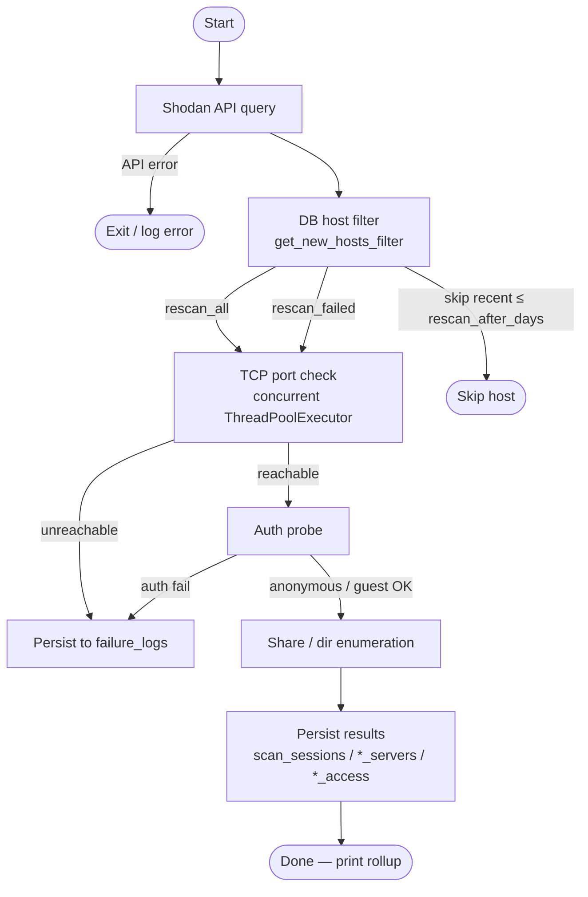
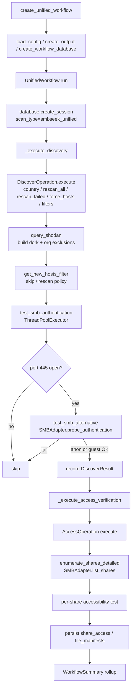

# Dirracuda Technical Reference

**Version:** current (`development` branch)
**Scope:** Internals for developers and security analysts who need more than the README and less than reading every file themselves.

Dirracuda scans for internet-accessible servers exposing open or weakly-authenticated directories across three protocols: SMB, FTP, and HTTP. It discovers candidates through the Shodan API, verifies access, persists results to a local SQLite database, and provides CLI, Tkinter GUI, and optional Web UI surfaces for interacting with the data.

---

## Document Conventions

- File paths are relative to the repository root unless prefixed with `~/`.
- Config keys are written in dot-notation (`shodan.api_key`).
- Mermaid diagrams are used for flowcharts and the ER diagram. They render on GitHub and in VS Code with the Mermaid extension.
- The SMB RCE vulnerability analysis feature was **sunset and removed from runtime in C3**. C7 removed the remaining signature loader/data artifacts and dependency ties.

---

## 1. System Overview

### 1.1 High-Level Block Diagram

```
┌─────────────────────────────────────────────────────────────────────┐
│  CLI Layer                                                          │
│  cli/smbseek.py    cli/ftpseek.py    cli/httpseek.py               │
└──────────┬─────────────────┬──────────────────┬────────────────────┘
           │                 │                  │
           ▼                 ▼                  ▼
┌─────────────────────────────────────────────────────────────────────┐
│  Workflow Layer                                                      │
│  shared/workflow.py       shared/ftp_workflow.py                    │
│  (UnifiedWorkflow)        (FtpWorkflow)                             │
│                           shared/http_workflow.py                   │
│                           (HttpWorkflow)                            │
└──────────┬─────────────────┬──────────────────┬────────────────────┘
           │                 │                  │
           ▼                 ▼                  ▼
┌─────────────────────────────────────────────────────────────────────┐
│  Command Layer                                                       │
│  commands/discover/    commands/ftp/      commands/http/            │
│  commands/access/                                                   │
└─────────────────────────────┬───────────────────────────────────────┘
                              │
           ┌──────────────────┼──────────────────────┐
           ▼                  ▼                       ▼
┌──────────────┐  ┌─────────────────────┐  ┌─────────────────────┐
│ shared/       │  │ tools/              │  │ conf/               │
│ config.py     │  │ db_manager.py       │  │ config.json         │
│ output.py     │  │ db_schema.sql       │  │ exclusion_list.json │
│ database.py   │  │ db_maintenance.py   │  │ ransomware_         │
│ *_browser.py  │  │                     │  │ indicators.json     │
│ path_service.py │           └──────────┬──────────┘  └─────────────────────┘
└──────────────┘             │
                             ▼
                     ┌──────────────┐
                     │ SQLite        │
                     │ dirracuda.db  │
                     └──────────────┘

┌─────────────────────────────────────────────────────────────────────┐
│  GUI Layer                                                          │
│  dirracuda (authoritative entry point)                              │
│    └─ gui/components/dashboard.py (compat shim)                     │
│         └─ gui/dashboard/widget.py (DashboardWidget implementation) │
│              ├─ unified_scan_dialog.py → scan_manager.py           │
│              │                            └─ backend_interface/     │
│              │                                (subprocess → CLI)    │
│              ├─ server_list_window/ (SMB / FTP / HTTP tabs)         │
│              ├─ running_tasks_window.py                             │
│              ├─ db_tools_dialog.py                                  │
│              └─ [config editor, browser windows, extract dialogs]   │
│  gui/utils/ui_dispatcher.py  (thread-safe Tk marshaling)          │
│  gui/utils/settings_manager.py  (persists ~/.dirracuda/conf.d/     │
│                                  prefs/user-prefs.json)           │
└─────────────────────────────────────────────────────────────────────┘

┌─────────────────────────────────────────────────────────────────────┐
│  Optional Web UI Layer                                              │
│  experimental/webui/server.py -> experimental/webui/app.py (FastAPI app factory)              │
│    ├─ auth/session/CSRF helpers                                     │
│    ├─ tasks.py (single-active scan queue -> CLI subprocess runner)  │
│    └─ db.py (read-only result queries + VACUUM INTO export)         │
└─────────────────────────────────────────────────────────────────────┘
```

For SMB/FTP/HTTP scan flows, the GUI invokes CLI scripts as subprocesses via `gui/utils/backend_interface/interface.py` and parses stdout for progress data. Experimental SearXNG dorking (`experimental/se_dork`), Reddit ingestion (`experimental/redseek`), Dorkbook recipe management (`experimental/dorkbook`), and Keymaster key management (`experimental/keymaster`) are in-process paths launched from the dashboard.

The optional Web UI is disabled by default and installed separately with
`experimental/webui/requirements-web.txt`. Its C4 scan launcher follows the same CLI
subprocess boundary as the Tkinter GUI: one active scan at a time, strict request
validation, explicit `shell=False`, repo-root `cwd`, unbuffered Python output,
and merged stdout/stderr progress logs. Web UI SMB tasks run with `--legacy` by
default so SMB1-capable targets are included. When `run_probe_after_scan=true`,
the task runner executes a protocol-aware post-scan probe stage for SMB/FTP/HTTP
verified hosts. The `/scans` UI now requires a preflight review step (credit
estimate + balance visibility + explicit confirmation) before any queue writes.
Queue visibility on `/scans` is server-backed: the page hydrates active/queued
tasks from `GET /api/scans` so entries persist across navigation and refresh.
Web UI scan writes and `/results` reads now share a single resolved DB source:
main-config `database.path` by default, with explicit `create_app(db_path=...)`
override precedence for tests or controlled deployments.

**Web UI routes (C4–C6):**

| Route | Auth | Description |
|-------|------|-------------|
| `POST /api/scans/preflight` | session + CSRF + same-origin | Preflight cost/balance estimator for selected protocols before queue submission. Request: `protocols` (`1..3` unique values from `smb\|ftp\|http`) and shared `max_shodan_results` (`1..100000`). Response includes estimated total/per-protocol query credits, current balance payload, estimated post-scan balance when available, and Shodan dashboard fallback URL. Error contract: `400` invalid payload, `403` origin/CSRF failure, `500` unexpected fatal error. |
| `POST /api/scans` | session + CSRF | Queue one scan task (`protocol`: `smb\|ftp\|http`). Includes `max_shodan_results` (1..100000) for per-task query-limit/budget overrides. Optional `run_probe_after_scan` triggers protocol-aware post-scan probe stage for the same protocol after the scan subprocess succeeds. |
| `GET /api/scans` | session | Queue snapshot endpoint for `/scans` hydration (`active` + `queued`) so queue state survives navigation and refresh. |
| `GET /api/scans/{task_id}` | session | Task status/log polling for queued/running/completed scan tasks |
| `POST /api/scans/{task_id}/cancel` | session + CSRF | Cancel queued task or request cancellation for active task (scan/probe stage) |
| `GET /api/dashboard/shodan-balance` | session | Dashboard balance status endpoint (query credits only). Reads Shodan API key from main config server-side, never returns key material. Supports `force=true` to bypass cache. Response states: `ok`, `no_key`, `unavailable` (with sanitized reason code only). |
| `GET /results` | session | Results page (`ALL/SMB/FTP/HTTP` tabs, desktop-style search + row filters, desktop-parity row columns, pagination with first/prev/next/last/jump-to). Search matches IP address and accessible-shares text (case-insensitive substring). `Favorite`, `Avoid`, and `Probed` cells are inline toggle actions; a dedicated `Probe` action cell launches protocol-aware probe runs. A leading checkbox column enables current-page bulk actions (`Toggle Favorite`, `Toggle Avoid`, `Toggle Compromised`, `Probe Selected`, `Clear Selection`). Selection resets on results reloads (page/filter/protocol changes). Probe actions run asynchronously with status polling and a single-active-job guard. Click any non-action part of a row to open a single inline details accordion under that row; compact overview + read-only notes are shown immediately, with a nested **Show full details** toggle (10-line scrollable text area) and an **Open with system** button that hands protocol URLs to browser/system handlers in a new tab/window context. For HTTP/FTP rows, URL path selection prefers explicit probe snapshot base paths (for example `/wp-uploads`) and otherwise falls back to root index `/` instead of inferred first-directory candidates. The details panel includes a static external-application caution, and private/incognito launch cannot be forced from browser JavaScript. Refresh is manual via the **Refresh** button; no background auto-refresh/polling is performed. |
| `GET /api/results/{protocol}` | session | Paginated JSON rows; `protocol` ∈ `all\|smb\|ftp\|http`; `page` 1–10 000; `page_size` 1–200; optional `search` (case-insensitive substring on `ip_address` and `accessible_shares_list`). Legacy `country` query is rejected with `400`. Response includes `total_count`, `total_pages`, and per-row identity keys (`row_key`, `protocol_server_id`) used for lazy details loading. |
| `GET /api/results/details` | session | Row-details JSON for inline expansion. Query params: `host_type` (`S\|F\|H`) and `protocol_server_id` (>0). Returns identity fields, structured `overview`, read-only `notes`, multiline `full_details_text`, and `open_with_url` (server-derived protocol URL for external handoff; HTTP/FTP prefer explicit snapshot `start_path` and otherwise use `/`). Error contract: `400` invalid params, `404` not found, `500` query/runtime error. |
| `POST /api/results/actions/toggle` | session + CSRF + same-origin | Toggle host-state actions for one or more current-page rows. Request body: `{"action":"favorite\|avoid\|compromised","targets":[{"host_type":"S\|F\|H","protocol_server_id":<int>,"row_key":"<optional>"}]}` with strict payload validation (`targets` length 1..200, no extra keys). Response always includes per-target outcomes with partial-success support (`updated`, `failed`, `results[]`). Error contract: `400` invalid payload, `403` origin/CSRF failure, `500` unexpected fatal runtime error. Compromised toggle parity matches desktop semantics: compromised := (`status == "issue"` OR `indicator_matches > 0`); ON writes `status="issue"` + `indicator_matches>=1`; OFF writes `status="clean"` + `indicator_matches=0`. |
| `POST /api/results/actions/probe` | session + CSRF + same-origin | Start an async probe job for one or more current-page rows. Request body: `{"targets":[{"host_type":"S\|F\|H","protocol_server_id":<int>,"row_key":"<optional>"}]}` with strict payload validation (`targets` length 1..200, no extra keys). `202` response returns `{job_id,status,total_targets,poll_url}`. If another probe job is already running, `409` returns `{error,job_id,poll_url}` for the active job. |
| `GET /api/results/actions/probe/{job_id}` | session | Poll async probe-job status and per-target outcomes. Response shape: `{job_id,status,summary:{total,completed,succeeded,failed},results[],started_at,finished_at}` where each `results[]` item includes row identity, `ok`, and either updated probe `state` or an `error`. `404` when job id is unknown/expired. |
| `POST /api/export` | session + CSRF | Export main DB via `VACUUM INTO`; artifact written to `~/.dirracuda/exports/`; response: `{"filename": "dirracuda_export_YYYYMMDD_HHMMSS_<8hex>.db"}` |
| `GET /api/export/{filename}` | session | Download an export artifact; filename enforced against allowlist regex before serving |
| `GET /config` | session | Web UI config page (bind/port/remote/TLS/allowlist/session timeout, and auth lockout fields) |
| `POST /config` | session + CSRF | Validate and save Web UI fields. Canonical runtime target is `~/.dirracuda/conf.d/experimental/webui.json` (stored as `{ "webui": {...} }`). UI submits idle timeout in minutes and absolute timeout in hours; server converts to stored seconds before `save_config`. Auth lockout fields (`auth_lockout_threshold`, `auth_lockout_window_sec`, `auth_lockout_base_duration_sec`, `auth_lockout_max_duration_sec`) are optional in the payload; missing keys preserve the existing config values. |
| `GET /health` | none | Liveness check. Returns `{"status": "ok", "rate_limiter": "ok"}` when the rate-limit DB is accessible, or `{"status": "ok", "rate_limiter": "error"}` when the DB is unavailable (degraded localhost mode or runtime DB failure). A `"rate_limiter": "error"` response does not prevent logins in localhost mode but signals that lockout enforcement is disabled. |

**Web UI routes (C29–C34):**

| Route | Auth | Description |
|-------|------|-------------|
| `GET /scans` | n/a | Route not registered; returns 404. Use `/scans/shodan`, `/scans/searxng`, or `/scans/reddit`. |
| `GET /scans/searxng` | session | SearXNG discovery page (run with optional inline probe pass). |
| `GET /scans/reddit` | session | Reddit ingestion page (anonymous RSS feed/search modes). |
| `GET /extras` | n/a | Route not registered; returns 404. Use `/extras/dorkbook` or `/extras/keymaster`. |
| `GET /extras/dorkbook` | session | Dorkbook recipe management. |
| `GET /extras/keymaster` | session | Keymaster unlock/manage/apply. |
| `GET /export` | session | Dedicated export page (moved off `/results` in C29). |
| `POST /api/searxng/preflight` | session + CSRF + same-origin | Validate SearXNG instance URL. |
| `POST /api/searxng/run` | session + CSRF + same-origin | Queue SearXNG discovery run; 202 + job_id. |
| `POST /api/reddit/run` | session + CSRF + same-origin | Queue Reddit ingest run; 202 + job_id. |
| `GET /api/dorkbook/entries` | session | List Dorkbook entries by protocol (SMB/FTP/HTTP) + optional search. |
| `POST /api/dorkbook/entries` | session + CSRF + same-origin | Create entry in Dorkbook sidecar DB. |
| `DELETE /api/dorkbook/entries/{entry_id}` | session + CSRF + same-origin | Delete custom dork entry (built-in dorks cannot be deleted). |
| `POST /api/dorkbook/prefill` | session + CSRF + same-origin | Apply selected dork to canonical discovery config (immediate-persist). |
| `GET /api/keymaster/status` | session | Passphrase configured + lock state. |
| `GET /api/keymaster/keys` | session | List keys; response includes `api_key_masked` (first 4 + last 4 chars only); no key material. |
| `POST /api/keymaster/unlock` | session + CSRF + same-origin | Unlock with passphrase; session keys stored in `session.keymaster_session_keys`. |
| `POST /api/keymaster/keys` | session + CSRF + same-origin | Create key; 409 on duplicate api_key. |
| `PATCH /api/keymaster/keys/{key_id}` | session + CSRF + same-origin | Update label/notes/key; blank `api_key` preserves existing. |
| `DELETE /api/keymaster/keys/{key_id}` | session + CSRF + same-origin | Delete key. |
| `POST /api/keymaster/apply` | session + CSRF + same-origin | Write `shodan.api_key` to main config. 200 on success; 403 if keymaster locked; 422 if key_id invalid/missing from body; 404 if key not found or no config file present; 500 on write error. |
| `GET /api/jobs` | session | Shared queue snapshot for scan tasks plus SearXNG/Reddit run jobs. |
| `GET /api/jobs/{job_id}` | session | Job status for any async run/probe job. |
| `POST /api/jobs/{job_id}/cancel` | session + CSRF + same-origin | Cancel run/probe job. |

Navigation and IA (C29): the left nav sidebar groups Scans (shodan, searxng, reddit) and Extras (dorkbook, keymaster) as toggle-only parents. Root `/scans` and `/extras` are not registered routes and return 404. `/export` is a standalone page; export controls no longer live on `/results`.

Shared job queue (C30): `/api/jobs*` is additive to the existing `/api/scans*` contract, which is unchanged. The queue tracks scan tasks plus SearXNG/Reddit run jobs with a normalized shape: `job_id`, `source`, `kind`, `status`, `progress`. Promotions are excluded from the queue.

Keymaster apply missing-config behavior (C34): `POST /api/keymaster/apply` resolves the main config via two branches — canonical path (matches repo `config_file`) calls `load_main_config()` + `update_sections`; non-canonical path reads and writes JSON directly. Returns 422 when `key_id` is invalid or absent from the request body. Returns 404 when the key row is not found in the DB or when no config file is present on disk. The 404-on-missing-config is the intended contract, not a 500.

Web UI preference persistence (C19): authenticated pages can optionally persist allowlisted, non-sensitive UI selectors/toggles in browser `localStorage` after explicit one-time opt-in. This uses two keys (`dirracuda_pref_consent_v1`, `dirracuda_pref_data_v1`) and never stores free-text filters, credentials, or auth/session/CSRF material. Preference-storage controls (enable/disable/clear) are available on `/config`.

Dashboard balance behavior (C21): `/dashboard` fetches Shodan query-credit status on page load and via manual Refresh only (no polling). The server uses a 150-second in-memory cache keyed by non-reversible API-key fingerprint and returns sanitized failure reasons (`auth`, `timeout`, `network`, `rate_limited`, `provider`, `unknown`) without exposing provider raw errors.

`experimental/webui/db.py` implements unified results readers for desktop-parity rows and `export_db`. Readers use read-only URI connections (`mode=ro`) and runtime schema guards (`sqlite_master` + `PRAGMA table_info`) so optional protocol tables/columns degrade safely on older or partial schemas. The export function opens the source with `mode=rw` (no-create) to prevent silent empty-DB creation when the source is absent. Write-side results toggles live in `experimental/webui/db_actions.py`; this module uses `mode=rw` (no-create), per-target savepoints for partial success, and schema/column presence checks before each mutation. Async row/bulk probe jobs live in `experimental/webui/results_probe_actions.py` and reuse the shared protocol probe dispatch path plus protocol-aware probe-cache persistence with legacy-schema fallback.

**Web UI startup and remote mode (C8):**

`experimental/webui/server.py::run()` loads Web UI config via `load_config()` (which calls `validate()`) before starting uvicorn. Canonical runtime target is `~/.dirracuda/conf.d/experimental/webui.json` (`{ "webui": {...} }` wrapper). CLI `--host`/`--port` are treated as validated overrides over the loaded config (re-validated after merge). Startup exits immediately on any validation failure — no silent fallback. Desktop service control launches with module semantics (`python -m experimental.webui.server`) rather than direct script execution, so package imports resolve correctly after the `experimental/webui` move. The default bind remains `127.0.0.1:2600`; legacy explicit `port: 5480` entries are auto-migrated to `2600` on load.

Remote-bind normalization runs before persisted config validation and writes.
With `remote_enabled=true`, an IPv4 loopback bind is promoted to `0.0.0.0` and
an IPv6 loopback bind is promoted to `::`; explicit non-loopback binds are
preserved. Existing contradictory config files are migrated atomically on load.
An explicit server `--host` override remains authoritative for that process.

Config fields relevant to remote mode:

| Field | Default | Description |
|-------|---------|-------------|
| `bind_address` | `"127.0.0.1"` | IP to bind. Enabling remote mode promotes loopback to the matching wildcard listener. |
| `port` | `2600` | TCP port for the Web UI listener. |
| `remote_enabled` | `false` | Must be `true` for any non-loopback bind. |
| `allowed_cidrs` | `["127.0.0.1/32","::1/128"]` | IP allowlist enforced per-request when `remote_enabled=true`. |
| `tls.enabled` | `true` | TLS on/off. Remote with TLS requires cert+key. |
| `tls.cert_file` / `tls.key_file` | `""` | Paths to PEM cert and key. Required for remote TLS. |
| `tls.allow_insecure_remote` | `false` | Allow non-loopback HTTP. Must be explicitly set; no default. |
| `auth.lockout_threshold` | `5` | Failed attempts per (account, IP) pair before lockout. Range: 3–20. |
| `auth.lockout_window_sec` | `900` | Observation window (seconds) in which failures are counted. Range: 60–3600. |
| `auth.lockout_base_duration_sec` | `300` | Initial lockout duration (seconds). Doubles on each subsequent lockout (exponential backoff). Range: 30–3600. |
| `auth.lockout_max_duration_sec` | `3600` | Maximum lockout duration (seconds) after repeated lockouts. Must be ≥ base duration. Range: 300–86400. |

Startup enforcement rules (fail-closed, checked before uvicorn starts):
- Loopback bind: always allowed with any TLS state.
- Non-loopback: requires `remote_enabled=true`, non-empty `allowed_cidrs`, and either (TLS enabled with cert+key present) or (`tls.allow_insecure_remote=true` with TLS disabled).
- TLS enabled for remote without cert/key files readable on disk → startup refused.

Service control keeps listener and access endpoints distinct. Uvicorn and the
pidfile retain the configured bind (`0.0.0.0`, `::`, or an explicit interface
address). Health checks and local browser actions map wildcard IPv4 to
`127.0.0.1` and wildcard IPv6 to `::1`; IPv6 URLs use brackets. LAN clients use
the host's real interface address rather than a wildcard address.

Allowlist middleware: registered as an HTTP middleware in `create_app()`. When `remote_enabled=True`, each request's `request.client.host` is checked against `allowed_cidrs` (parsed as `ipaddress.ip_network` objects). Non-matching or non-parseable addresses get 403. When `remote_enabled=False`, the check is skipped entirely — localhost mode is unaffected.

**Anti-automation lockout (O1 — OWASP ASVS V6.3.1 / NIST SP 800-63B §5.2.2):** `experimental/webui/rate_limiter.py` provides persistent per-`(account, IP)` login lockout backed by `~/.dirracuda/state/webui_ratelimit.db` (SQLite, mode `0600`, DELETE journal — no WAL sidecar files). Lockout key format: `account:{username}:ip:{client_ip}`. After `lockout_threshold` failures within `lockout_window_sec`, the composite key is locked for `lockout_base_duration_sec * 2^(lockout_count-1)` (capped at `lockout_max_duration_sec`). A successful login calls `DELETE FROM auth_attempts WHERE account = ?`, clearing all IP entries for the account. Stale rows are pruned in the same transaction as each `record_failure` call. All auth-state outcomes (wrong password, locked, unknown user) return an identical 401 body — no lockout state is disclosed.

**Password policy (O2 — OWASP ASVS V6.2.1/V6.2.3/V6.2.4/V6.2.5 / NIST SP 800-63B §3.1.1.2):** `experimental/webui/auth.py::set_password()` enforces: minimum 15 characters; case-insensitive match against `experimental/webui/pwlist.txt` (top-10000 common passwords, MIT-licensed SecLists data); no composition rules (passphrases accepted). `validate_password_policy()` raises `BlocklistUnavailableError(RuntimeError)` if the blocklist is absent, unreadable (`OSError`), or undersized (fewer than 3000 entries after parsing — `BLOCKLIST_MIN_SIZE`). Web routes handle `BlocklistUnavailableError` → 503 and `ValueError` → 400 separately. `verify_password()` is not affected by policy — pre-policy credentials remain verifiable. The `GET /account` + `POST /api/auth/change-password` endpoints provide authenticated credential rotation; the change requires the current password. The desktop credentials dialog (`webui_tab.py`) enforces the same separation: bootstrap (no stored creds) takes editable username/password; rotation (one stored cred) takes read-only username + current password + new password; multiple stored credentials block the dialog with an operator message directing to CLI management.

**Response security headers (O3 — OWASP HTTP Headers Cheat Sheet / CSP Cheat Sheet):** `experimental/webui/app.py` registers a `_security_headers` HTTP middleware (outermost wrapper, runs after allowlist check) that applies the following headers to every response:

| Header | Value |
|---|---|
| `Content-Security-Policy` | `default-src 'self'; script-src 'self'; style-src 'self'; img-src 'self' data:; font-src 'self'; connect-src 'self'; object-src 'none'; base-uri 'none'; frame-ancestors 'none'; form-action 'self'` |
| `X-Frame-Options` | `DENY` |
| `X-Content-Type-Options` | `nosniff` |
| `Referrer-Policy` | `no-referrer` |
| `Cache-Control` | `no-store` (applied to all non-`/static/` paths; static assets are excluded) |
| `Strict-Transport-Security` | `max-age=63072000; includeSubDomains` (only when `request.url.scheme == "https"`) |

The `_CSP_POLICY` constant is defined once at module scope in `app.py`. `script-src 'self'` excludes `unsafe-inline`; all page JavaScript is served from `experimental/webui/static/*.js`. No inline `<script>` blocks or inline `style=` attributes are present in rendered HTML templates.

`Cache-Control: no-store` scope: applies to all dynamic routes including authenticated HTML pages, JSON API responses, export trigger (`POST /api/export`), export download (`GET /api/export/{filename}`), and health (`GET /health`). The only exemption is the `/static/` path prefix (CSS, JS, images). This scope is intentional — the middleware has no route-level allow-list.

Runtime DB error behavior: if a SQLite error occurs on `check_locked` or `record_failure` after successful startup, remote mode returns 503 (fail-closed); localhost mode logs the error and degrades gracefully (logins proceed unthrottled, health endpoint reports `"rate_limiter": "error"`). Startup behavior: remote mode refuses to start if the rate-limit DB is unavailable; localhost mode assigns a `NullRateLimiter` and starts degraded.

**Reverse proxy note:** `request.client.host` reflects the TCP peer address as seen by the ASGI server. Behind a reverse proxy, this will be the proxy's address rather than the real client IP unless forwarded-header trust is correctly configured at the ASGI server layer — that configuration is deployment-specific and not managed by `experimental/webui/server.py`. Without it, allowlist decisions may be wrong (all traffic passes as the proxy address, or forwarded headers can be spoofed). See [FastAPI proxy guidance](https://fastapi.tiangolo.com/advanced/behind-a-proxy/) and [uvicorn deployment docs](https://www.uvicorn.org/deployment/) for details on trusted-proxy configuration.

### 1.2 Core Workflow Flowchart


```mermaid
flowchart TD
    A([Start]) --> B[Shodan API query]
    B -->|API error| Z1([Exit / log error])
    B --> C[DB host filter\nget_new_hosts_filter]
    C -->|rescan_all| D
    C -->|rescan_failed| D
    C -->|skip recent ≤ rescan_after_days| Z2([Skip host])
    D[TCP port check\nconcurrent ThreadPoolExecutor] -->|unreachable| E1[Persist to failure_logs]
    D -->|reachable| E[Auth probe]
    E -->|anonymous / guest OK| F[Share / dir enumeration]
    E -->|auth fail| E1
    F --> G[Persist results\nscan_sessions / *_servers / *_access]
    G --> H([Done — print rollup])
```

This shape applies to all three protocols. Protocol-specific differences are covered in §4.

---

## 2. Directory Structure

| Path | Responsibility | Key Files |
|------|---------------|-----------|
| `cli/` | Argument parsing; invoke workflow factory; exit cleanly on error | `smbseek.py`, `ftpseek.py`, `httpseek.py` |
| `commands/discover/` | SMB Shodan query, host filtering, concurrent auth | `shodan_query.py`, `auth.py`, `operation.py`, `host_filter.py`, `connection_pool.py` |
| `commands/access/` | SMB share enumeration and accessibility testing | `operation.py`, `share_enumerator.py`, `share_tester.py` |
| `commands/ftp/` | FTP discovery and access stages | `shodan_query.py`, `verifier.py`, `operation.py`, `models.py` |
| `commands/http/` | HTTP discovery and access stages (parallel to FTP) | `shodan_query.py`, `verifier.py`, `operation.py`, `models.py` |
| `shared/` | Protocol-agnostic utilities shared by CLI and GUI | See §2.1 |
| `experimental/se_dork/` | SearXNG dork search pipeline (client, service, store, classifier, models) | `client.py`, `service.py`, `store.py`, `classifier.py`, `models.py` |
| `experimental/redseek/` | Reddit ingestion pipeline (client fetch, parse, primary-DB persistence, auto-sync) | `client.py`, `service.py`, `parser.py`, `store.py`, `mapper.py`, `main_db_sync.py` |
| `experimental/dorkbook/` | Dorkbook sidecar persistence for reusable protocol dorks | `models.py`, `store.py` |
| `experimental/keymaster/` | Keymaster sidecar persistence for reusable API keys | `models.py`, `store.py` |
| `experimental/censys_discovery/` | Censys Platform v3 discovery sidecar (**development suspended**; backend retained, UI currently hidden) | `client.py`, `service.py`, `store.py`, `query_builder.py`, `models.py` |
| `gui/components/`, `gui/dashboard/` | Tkinter windows/dialogs plus dashboard shim+implementation | `gui/components/dashboard.py` (compat shim), `gui/dashboard/widget.py`, `unified_scan_dialog.py`, `server_list_window/`, `running_tasks_window.py`, `db_tools_dialog.py`, `*_browser_window.py` |
| `gui/utils/` | GUI infrastructure | `ui_dispatcher.py`, `scan_manager.py`, `backend_interface/`, `probe_runner.py`, `extract_runner.py`, `settings_manager.py` |
| `experimental/webui/` | Optional FastAPI Web UI package; disabled by default | `app.py`, `server.py`, `config.py`, `auth.py`, `sessions.py`, `dependencies.py`, `tasks.py`, `templates/` |
| `tools/` | Database management utilities | `db_manager.py`, `db_schema.sql`, `db_maintenance.py`, `db_migrations.py`* |
| `conf/` | Application configuration | `config.json.example`, `exclusion_list.json`, `ransomware_indicators.json` |

*`db_migrations.py` lives in `shared/` not `tools/`.

### 2.1 `shared/` Module Map

| Module | Purpose |
|--------|---------|
| `workflow.py` | `UnifiedWorkflow` — SMB 2-stage pipeline orchestrator |
| `ftp_workflow.py` | `FtpWorkflow` — FTP 2-stage pipeline orchestrator |
| `http_workflow.py` | `HttpWorkflow` — HTTP 2-stage pipeline orchestrator |
| `database.py` | `SMBSeekWorkflowDatabase` — host filtering, session tracking, wraps `DatabaseManager` |
| `config.py` | `SMBSeekConfig` — loads shard-composed runtime config (canonical home layout), deep-merge with defaults, typed accessors |
| `output.py` | `SMBSeekOutput` — formatted console output (color, verbose, quiet modes) |
| `smb_browser.py` | Read-only SMB file browser |
| `ftp_browser.py` | `FtpNavigator` — list directories, download files, cancel mid-operation |
| `http_browser.py` | HTTP directory/file browser |
| `db_migrations.py` | `run_migrations()` — additive schema migrations, called on startup |
| `smb_adapter.py` | `SMBAdapter` — unified SMB backend abstraction (smbprotocol + impacket) |
| `results.py` | `DiscoverResult`, `AccessResult` dataclasses |

---

## 3. Configuration

### 3.1 Canonical Modular Runtime Config (`~/.dirracuda/conf.d/`)

Runtime config is shard-composed from canonical home paths. The compatibility file
`~/.dirracuda/conf/config.json` is still materialized for legacy readers, but shard files are authoritative.

**Core shards**

| Shard | Owned Top-Level Sections |
|-------|---------------------------|
| `conf.d/core/scan.json` | `shodan`, `workflow`, `connection`, `discovery`, `access`, `ftp`, `http`, `exclusion_progress_interval` |
| `conf.d/core/storage.json` | `database`, `file_collection`, `file_browser`, `ftp_browser`, `http_browser`, `quarantine`, `clamav`, `gui_app` |
| `conf.d/core/security.json` | `security`, `censys` |
| `conf.d/core/output.json` | `output` |

**Experimental shards**

| Shard | Owned Section |
|-------|----------------|
| `conf.d/experimental/se_dork.json` | `se_dork` |
| `conf.d/experimental/reddit_grab.json` | `reddit_grab` |
| `conf.d/experimental/dorkbook.json` | `dorkbook` |
| `conf.d/experimental/keymaster.json` | `keymaster` |
| `conf.d/experimental/webui.json` | `webui` |

Dedicated standalone files remain unchanged:

- `~/.dirracuda/conf/exclusion_list.json`
- `~/.dirracuda/conf/ransomware_indicators.json`

### 3.2 `SMBSeekConfig` + Config Store

`load_config(config_file=None)` returns `SMBSeekConfig`. Default mode uses canonical shard-composed runtime config and preserves typed accessor behavior.

- Owner-scoped writes use section ownership (`update_sections(...)`, `set_section(...)`).
- On first modular startup, legacy `config.json` + `gui_settings.json` are split into shards with timestamped backups and migration reports under `~/.dirracuda/state/migrations/`.
- Dual-read transition: shards are authoritative when present; legacy read is used only when migration fails and no shards exist.

Typed accessors (`get_shodan_api_key()`, `get_ftp_config()`, `get_http_config()`, etc.) remain stable for callers.

### 3.3 GUI/User Preferences

GUI/user prefs are now canonical in:

- `~/.dirracuda/conf.d/prefs/user-prefs.json`

Experimental module UI prefs are persisted in their module shards:

- `~/.dirracuda/conf.d/experimental/se_dork.json`
- `~/.dirracuda/conf.d/experimental/reddit_grab.json`
- `~/.dirracuda/conf.d/experimental/dorkbook.json`
- `~/.dirracuda/conf.d/experimental/keymaster.json`

Legacy `~/.dirracuda/state/gui_settings.json` is migrated forward automatically on first modular startup.

Path policy: runtime config resolution is canonical-only (`~/.dirracuda`). User-facing `--config` style runtime overrides are deprecated/ignored.

---

## 4. Scanning Workflows

### 4.1 SMB Workflow

**Entry point:** `cli/smbseek.py` → `create_unified_workflow(args)` → `UnifiedWorkflow.run(args)`


```mermaid
flowchart TD
    A[create_unified_workflow] --> B[load_config / create_output / create_workflow_database]
    B --> C[UnifiedWorkflow.run]
    C --> D[database.create_session\nscan_type=smbseek_unified]
    D --> E[_execute_discovery]
    E --> F[DiscoverOperation.execute\ncountry / rescan_all / rescan_failed / force_hosts / filters]
    F --> G[query_shodan\nbuild dork + org exclusions]
    G --> H[get_new_hosts_filter\nskip / rescan policy]
    H --> I[test_smb_authentication\nThreadPoolExecutor]
    I --> J{port 445 open?}
    J -->|no| K[skip]
    J -->|yes| L[test_smb_alternative\nSMBAdapter.probe_authentication]
    L -->|anon or guest OK| M[record DiscoverResult]
    L -->|fail| K
    M --> N[_execute_access_verification]
    N --> O[AccessOperation.execute]
    O --> P[enumerate_shares_detailed\nSMBAdapter.list_shares]
    P --> Q[per-share accessibility test]
    Q --> R[persist share_access / file_manifests]
    R --> S[WorkflowSummary rollup]
```

**Auth sequence** (`commands/discover/auth.py`):

1. `check_port(ip, 445)` — TCP connect with `port_check_timeout`
2. `test_smb_alternative(op, ip)` — routes through `SMBAdapter.probe_authentication()`:
   - Tries `smbprotocol` first 
   - Falls back to `impacket` in legacy mode
3. Auth cache: successful `auth_method` is cached in `op._auth_method_cache` per IP to avoid redundant probes

**Cautious mode** (`--cautious` flag):
- `require_signing=True` on the SMB `Connection`
- Dialects restricted to SMB 2.0.2, 2.1, 3.0.2, 3.1.1 (SMB1 rejected)
- Hosts that return unsigned sessions or require SMB1 are silently excluded

**Concurrency and throttling:**

`get_optimal_workers(op, total_hosts, max_concurrent)` scales the thread pool:
- ≤10 hosts: `min(3, max_concurrent, total_hosts)`
- >10 hosts: `min(max_concurrent, total_hosts, max_worker_cap)`

With `smart_throttling=true`, `throttled_auth_wait()` adjusts the rate-limit delay dynamically based on active thread count and adds ±20% jitter. With it disabled, `basic_throttled_auth_wait()` applies a flat `rate_limit_delay` between attempts.

Progress is reported on the first host, every 10 hosts, and the final host.

**Shodan candidate-cap controls (all discovery protocols):**

- GUI scan dialogs are candidate-cap authoritative. Each protocol has an inline **Max Shodan Results** field:
  - per-protocol runtime window is `max_shodan_results = protocol_candidate_cap`.
  - internal page budgets are derived as `ceil(protocol_candidate_cap / 100)` so legacy budget guards do not undercut explicit caps.
- CLI/config-driven flows can still apply explicit `max_results`; in those paths
  `effective_limit = min(max_results, protocol_budget * 100)`.
- Persisted GUI cap keys:
  - `query_cap.smb_max_shodan_results_per_scan`
  - `query_cap.ftp_max_shodan_results_per_scan`
  - `query_cap.http_max_shodan_results_per_scan`
- Compatibility budget keys:
  - `query_limits.smb_max_query_credits_per_scan`
  - `query_limits.ftp_max_query_credits_per_scan`
  - `query_limits.http_max_query_credits_per_scan`
- Legacy SMB alias `query_limits.max_query_credits_per_scan` is still read for backward compatibility.
- SMB supports adaptive early stop in config-driven flows when budget > 1:
  - stop once exclusion-passing candidate count reaches `query_limits.min_usable_hosts_target`,
  - or when budget pages are exhausted.
- GUI-launched SMB scans set the runtime usable-host target above the candidate cap so a cap of 1000 can fetch up to the full 1000 candidates instead of stopping after the first good page.
- FTP/HTTP use strict page caps (no adaptive top-up in current build).

**Share enumeration** (`commands/access/share_enumerator.py`):

`enumerate_shares_detailed(op, ip, username, password)` calls `SMBAdapter.list_shares()`. Fatal status codes (`DEPENDENCY_MISSING`, `NORMALIZATION_ERROR`) abort enumeration for that host immediately rather than retrying.

### 4.2 FTP Workflow

**Entry point:** `cli/ftpseek.py` → `create_ftp_workflow(args)` → `FtpWorkflow.run(args)`

`FtpWorkflow` is a slim orchestrator. All stage logic lives in `commands/ftp/operation.py`.

**Stage 1 — Discovery** (`run_discover_stage`):

1. `query_ftp_shodan()` — Shodan dork: `port:21 "230 Login successful"` (+ optional country filter, optional CLI `--filter` custom filters), page-based fetch with FTP budget cap
2. Concurrent TCP port checks via `ThreadPoolExecutor` (up to `ftp.discovery.max_concurrent_hosts`, default 10)
3. Port-failed hosts are persisted immediately via `FtpPersistence.persist_discovery_outcomes_batch()`
4. Returns `(reachable_candidates, shodan_total)` — only reachable hosts proceed to stage 2

**Stage 2 — Access** (`run_access_stage`):

1. Concurrent `try_anon_login(ip, port, timeout=auth_timeout)` via `ThreadPoolExecutor` (up to `ftp.access.max_concurrent_hosts`, default 4)
2. On successful login: `try_root_listing(ip, port, timeout=listing_timeout, include_entries=True)` — returns `(ok, entry_count, reason, root_entries)`
3. All outcomes (success and failure) batched to `FtpPersistence.persist_access_outcomes_batch()` in a single commit

**Failure codes** returned in `FtpAccessOutcome.auth_status`:
- `connect_fail` — TCP connection refused or timeout
- `auth_fail` — anonymous login rejected
- `list_fail` — login succeeded but `LIST` command failed
- `timeout` — operation exceeded configured timeout

**Progress:** matches SMB cadence — `_should_report_progress(completed, total, batch_size=10)` and `_report_concurrent_progress()` emit identical-format lines.

**Rollup** (stdout markers parsed by `gui/utils/backend_interface/progress.py`):
```
📊 Hosts Scanned: N
🔓 Hosts Accessible: N
📁 Accessible Directories: N
🎉 FTP scan completed successfully
```
The success marker is only emitted on the non-error path; its absence signals failure to the GUI's progress parser.

### 4.3 HTTP Workflow

**Entry point:** `cli/httpseek.py` → `create_http_workflow(args)` → `HttpWorkflow.run(args)`

Structurally identical to FTP. Implementation lives in `commands/http/operation.py`.

**Shodan dork:** defaults to `http.title:"Index of /"` from `http.shodan.query_components.base_query` in `~/.dirracuda/conf.d/core/scan.json` (page-based fetch with HTTP budget cap).
Operators can edit SMB/FTP/HTTP discovery dorks from `Start Scan -> Edit Queries` (Discovery Dorks editor). GUI scan dialogs do not expose a per-scan custom-filter text box; that surface is intentionally centralized to avoid conflicting query-control paths.

**Verifier** checks both HTTP and HTTPS on the discovered port; `allow_insecure_tls` controls whether TLS cert errors are fatal. `is_index_page` flag on `http_access` records rows distinguishes confirmed open-directory indexes from other accessible responses.

### 4.4 Rescan Policies

`SMBSeekWorkflowDatabase.get_new_hosts_filter(shodan_ips, rescan_all, rescan_failed)` compares the incoming Shodan IP set against `smb_servers.last_seen`:

| Flag | Behavior |
|------|---------|
| (none) | Skip hosts seen within `workflow.rescan_after_days` (default 30 days) |
| `--rescan-failed` | Include hosts with `failure_logs` entries in addition to new hosts |
| `--rescan-all` | Scan everything Shodan returned regardless of last_seen |

FTP and HTTP have equivalent filtering via `FtpPersistence` and `HttpPersistence` (checked against `ftp_servers.last_seen` / `http_servers.last_seen`).

---

## 5. Database & Data Model

### 5.1 ER Diagram

```mermaid
erDiagram
    scan_sessions {
        int id PK
        text tool_name
        text scan_type
        datetime timestamp
        datetime started_at
        datetime completed_at
        text status
        int total_targets
        int successful_targets
        int failed_targets
        text country_filter
        text config_snapshot
    }

    smb_servers {
        int id PK
        text ip_address UK
        text host_type
        text country
        text auth_method
        datetime first_seen
        datetime last_seen
        int scan_count
        text status
    }

    share_access {
        int id PK
        int server_id FK
        int session_id FK
        text share_name
        bool accessible
        text auth_status
        text permissions
    }

    file_manifests {
        int id PK
        int server_id FK
        int session_id FK
        text share_name
        text file_path
        text file_name
        int file_size
        bool is_ransomware_indicator
        bool is_sensitive
    }

    vulnerabilities {
        int id PK
        int server_id FK
        int session_id FK
        text vuln_type
        text severity
        text title
        decimal cvss_score
        text cve_ids
        text status
    }

    host_user_flags {
        int server_id PK_FK
        bool favorite
        bool avoid
        text notes
    }

    host_probe_cache {
        int server_id PK_FK
        text status
        datetime last_probe_at
        int indicator_matches
        text snapshot_path
        int latest_snapshot_id
    }

    share_credentials {
        int id PK
        int server_id FK
        text share_name
        text username
        text password
        text source
    }

    failure_logs {
        int id PK
        int session_id FK
        text ip_address
        text failure_type
        text failure_reason
        int retry_count
        bool resolved
    }

    ftp_servers {
        int id PK
        text ip_address UK
        text host_type
        text country
        int port
        bool anon_accessible
        text banner
        datetime first_seen
        datetime last_seen
    }

    ftp_access {
        int id PK
        int server_id FK
        int session_id FK
        bool accessible
        text auth_status
        bool root_listing_available
        int root_entry_count
    }

    ftp_user_flags {
        int server_id PK_FK
        bool favorite
        bool avoid
        text notes
    }

    ftp_probe_cache {
        int server_id PK_FK
        text status
        datetime last_probe_at
        int indicator_matches
        text snapshot_path
        int latest_snapshot_id
        int accessible_dirs_count
        text accessible_dirs_list
        int extracted
        text rce_status
    }

    http_servers {
        int id PK
        text ip_address
        int port
        text scheme
        text banner
        text title
        datetime first_seen
        datetime last_seen
        UNIQUE ip_address_port
    }

    http_access {
        int id PK
        int server_id FK
        int session_id FK
        bool accessible
        int status_code
        bool is_index_page
        int dir_count
        int file_count
        bool tls_verified
    }

    http_user_flags {
        int server_id PK_FK
        bool favorite
        bool avoid
        text notes
    }

    http_probe_cache {
        int server_id PK_FK
        text status
        datetime last_probe_at
        int indicator_matches
        text snapshot_path
        int latest_snapshot_id
        int accessible_dirs_count
        text accessible_dirs_list
        int accessible_files_count
        int extracted
        text rce_status
    }

    probe_snapshots {
        int id PK
        text snapshot_hash UK
        text host_type
        text ip_address
        int port
        int protocol_server_id
        datetime run_at
        text source
        text raw_snapshot_json
        datetime created_at
    }

    probe_snapshot_entries {
        int id PK
        int snapshot_id FK
        text share_name
        text entry_kind
        text path
        text parent_path
        bool is_truncated
        text metadata_json
    }

    probe_snapshot_errors {
        int id PK
        int snapshot_id FK
        text share_name
        text message
    }

    probe_snapshot_rce {
        int id PK
        int snapshot_id FK
        text rce_status
        text verdict_summary
        text analysis_json
    }

    extract_run_summaries {
        int id PK
        text ip_address
        text host_type
        int protocol_server_id
        int port
        datetime started_at
        datetime finished_at
        text stop_reason
        bool timed_out
        int files_downloaded
        int bytes_downloaded
        int files_skipped
        int errors_count
        text clamav_summary_json
        text summary_json
        text source
        datetime created_at
    }

    app_migration_state {
        text key PK
        text value
        datetime updated_at
    }

    app_migration_reports {
        int id PK
        text migration_name
        text source
        text item_key
        text reason_code
        text detail
        datetime created_at
    }

    smb_servers ||--o{ share_access : "server_id"
    smb_servers ||--o{ file_manifests : "server_id"
    smb_servers ||--o{ vulnerabilities : "server_id"
    smb_servers ||--o| host_user_flags : "server_id"
    smb_servers ||--o| host_probe_cache : "server_id"
    smb_servers ||--o{ share_credentials : "server_id"
    scan_sessions ||--o{ share_access : "session_id"
    scan_sessions ||--o{ file_manifests : "session_id"
    scan_sessions ||--o{ vulnerabilities : "session_id"
    scan_sessions ||--o{ failure_logs : "session_id (nullable)"
    ftp_servers ||--o{ ftp_access : "server_id"
    ftp_servers ||--o| ftp_user_flags : "server_id"
    ftp_servers ||--o| ftp_probe_cache : "server_id"
    scan_sessions ||--o{ ftp_access : "session_id (nullable)"
    http_servers ||--o{ http_access : "server_id"
    http_servers ||--o| http_user_flags : "server_id"
    http_servers ||--o| http_probe_cache : "server_id"
    scan_sessions ||--o{ http_access : "session_id (nullable)"
    probe_snapshots ||--o{ probe_snapshot_entries : "snapshot_id"
    probe_snapshots ||--o{ probe_snapshot_errors : "snapshot_id"
    probe_snapshots ||--o{ probe_snapshot_rce : "snapshot_id"
```

### 5.2 Schema Notes

**Protocol isolation.** SMB, FTP, and HTTP each have their own server registry (`smb_servers`, `ftp_servers`, `http_servers`). An IP can appear in all three. The `v_host_protocols` view resolves which protocols are present per IP:

```sql
SELECT ip_address, has_smb, has_ftp, has_http, protocol_presence
FROM v_host_protocols
WHERE ip_address = '1.2.3.4';
```

**`host_type` values:** `'S'` = SMB, `'F'` = FTP, `'H'` = HTTP.

**`scan_sessions.config_snapshot`** stores a JSON blob of the effective config at scan time for retrospective analysis.

**`failure_logs.session_id`** is nullable (`ON DELETE SET NULL`) so failure records survive session deletion.

**`share_credentials`** was populated by the Pry password audit tool. Unique index on `(server_id, share_name, source)`. The Pry runtime was removed in C2; this table remains readable and its schema is preserved for DB compatibility.

**`scan_sessions.scan_type`** values by tool:
- `smbseek_unified` — `cli/smbseek.py`
- `ftpseek` — `cli/ftpseek.py`
- `httpseek` — `cli/httpseek.py`

**Probe snapshot unification (current behavior):**
- New probe snapshots are stored in normalized DB tables (`probe_snapshots` + child tables), not new local JSON cache files.
- `host_probe_cache` / `ftp_probe_cache` / `http_probe_cache` keep `snapshot_path` for compatibility and now also track `latest_snapshot_id`.
- Probe reads use DB-first resolution with file fallback when no DB snapshot is attached yet.

**Startup migration orchestration (GUI startup):**
- Canonical entrypoint `dirracuda` runs background startup unification via `gui/utils/db_unification.py`.
- Includes idempotent legacy probe-cache backfill, targeted sidecar host-entity import, one-time keep/discard prompt for old cache files, and non-blocking warning+retry on migration failure.
- `gui/main.py` is a compatibility shim only: it preserves import compatibility but exits non-zero when invoked as a runtime entrypoint.

### 5.3 Views

| View | Purpose |
|------|---------|
| `v_active_servers` | Per-SMB-server summary: accessible share count, files discovered, open vulnerability count |
| `v_vulnerability_summary` | Aggregate vuln counts grouped by type and severity, sorted by CVSS severity tier |
| `v_scan_statistics` | Per-tool daily session stats: targets, success rate |
| `v_host_protocols` | Cross-protocol IP presence map (see §5.2) |

### 5.4 Database Layer Internals

**`tools/db_manager.py`:**
- `DatabaseManager` — owns the SQLite connection, exposes `execute_query()` (returns `list[dict]`)
- `SMBSeekDataAccessLayer` — wraps `DatabaseManager` with named query methods

**`shared/database.py`:**
- `SMBSeekWorkflowDatabase` — workflow-level operations: `create_session()`, `get_new_hosts_filter()`, `show_database_status()`
- Calls `run_migrations(db_path)` on construction before touching any tables

**`shared/db_migrations.py`:**
- `run_migrations()` is called on every CLI startup
- Migrations are additive only (all use `IF NOT EXISTS` guards); no destructive migrations
- Protocol-specific tables and additive extensions are introduced incrementally to preserve compatibility with older DB shapes
- Current migrations also provision probe snapshot normalization tables, app migration metadata/report tables, and extraction summary tables

**`commands/ftp/operation.py` and equivalent HTTP file use `FtpPersistence` / `HttpPersistence`** (also in `shared/database.py`) which connect directly to the DB path without going through `SMBSeekWorkflowDatabase`.

### 5.5 SearXNG Runtime Tables (Primary DB Context)

The SearXNG Dorking module (`experimental/se_dork`) now writes runtime workflow tables into the active primary DB context (same DB path used by the running GUI/WebUI session).

**Storage contract**: `run_dork_search` persists `dork_runs`/`dork_results` in the active primary DB path and auto-syncs retained HTTP/HTTPS rows into main protocol host tables during run completion. Each page commits raw rows, performs classification and probing without an open SQLite transaction, then commits verdict/probe state before fetching the next page. Main protocol-table sync still runs once at completion. Manual promotion is not required for new runs. Successful runs append a Shodan-style rollup to Live Scan Output. Standalone runs keep the result popup; multi-provider Start Scan runs suppress it while the serial provider queue continues.

**Upstream pacing contract**: page 1 runs immediately. The next-page deadline starts when a response arrives. Storing, classifying, filtering, and optional probing run sequentially and consume that window; the service sleeps only for the remainder. Normal deadlines use ±20% jitter around 2 seconds for pages 2–5, 4 seconds for pages 6–10, 6 seconds for pages 11–20, and 8 seconds for pages 21–40. A non-empty response remains productive when `unresponsive_engines` reports 403/429, access denied, rate limit, CAPTCHA, or Cloudflare conditions. Such pages use 10, 20, and then at most 30 seconds for consecutive affected pages; a clean page resets normal pacing. Empty throttled pages use a run-wide retry ladder. Direct HTTP 429 responses consume the same retry budget and honor `Retry-After` within 1–300 seconds. Completed pages remain durable when a later fetch fails and finish as a partial run with a warning. Zero-row exhaustion returns a structured run error.

**Runtime policy (C11A)**: `RunOptions` exposes three clamped fields used at the service layer.

| Field | Default | Clamp | Effect |
|---|---|---|---|
| `request_timeout` | 15 s | 5–60 | Timeout for reachability check and each fetch call |
| `short_retry_delay` | 30 s | 5–60 | First hard-retry cooldown (early and mature runs) |
| `long_retry_delay` | 180 s | 60–300 | Second hard-retry cooldown (early runs only) |

A run becomes **mature** after 5 productive pages or 50 unique URLs (whichever comes first). A productive page adds at least one unique URL and completes the full persist/classify/retain/probe pipeline. Early runs allow two retry slots (short then long); mature runs allow only one (short). `Accessories` and WebUI callers use defaults and are not affected in C11A.

**Live validation harness (C11D)**: `scripts/live_test_searxng.py` is an opt-in script for end-to-end testing of the SearXNG dork pipeline against a real instance. It requires `--confirm-live` before any network access. A `tempfile.mkdtemp()` directory holds the run DB; the primary database is never opened. After the run, the script asserts stage ordering, SQLite structural integrity, and DB/RunResult field consistency, then deletes the temp directory. Pass `--keep-db` to retain it for debugging. Use `--cancel-after-classify N` for deterministic cancellation at the classified-page boundary (no human Ctrl+C needed). Pytest may import the script's helper functions; it must never execute live behavior. The `--confirm-live` gate prevents any network call, temp-directory creation, or service invocation even when the module is imported.

**Live Scan Output semantic coloring (C11C)**: SearXNG and Reddit progress lines, provider-queue transitions, and completion rollups are colored at display time in `gui/components/log_semantic_color.py::colorize_for_display`, which is called inside `append_log_line` before text is inserted into the Tk Text widget. `log_history` always stores the original input, so C11C adds no ANSI escapes to Copy All and history ordering is unaffected. Pre-existing Shodan subprocess ANSI (raw CLI stdout) passes through unchanged. The feature reuses the existing ANSI tag infrastructure (`ansi_fg_bright_blue` / `_green` / `_yellow` / `_red`) and theme-backed colors already configured in `dashboard_logs.configure_log_tags`. `_log_status_event(message)` signature is unchanged; all callers and test doubles continue to work. Rollup coloring requires `"\n" in line` to prevent misclassification of a standalone `SUMMARY_TITLE` heading emitted by Shodan. The classifier is an exact-allowlist of known SearXNG/Reddit/queue message prefixes — generic keywords are not used.

**SearXNG tuning controls (C11B)**: Start Scan exposes the three fields above as themed sliders in the SearXNG provider row. Values persist through GUI settings (`unified_scan_dialog.searxng_request_timeout`, `..._short_retry_delay`, `..._long_retry_delay`) and scan templates (`searxng_options.request_timeout`, `..._short_retry_delay`, `..._long_retry_delay`). The scan request carries them as `searxng_request_timeout`, `searxng_short_retry_delay`, `searxng_long_retry_delay`. Dashboard code (`gui/components/dashboard_searxng_scan.py`) reads these keys and coerces them with the same half-up step-snapping helper before constructing `RunOptions`; out-of-range or malformed values fall back to the field defaults. The service layer then clamps again independently. Accessories and WebUI continue using `RunOptions` defaults and are unaffected.

**`dork_runs.status` values**: `running`, `done`, `error`, `cancelled`. Status `cancelled` is set when the caller signals the optional `cancel_event: threading.Event` passed to `run_dork_search`. Cancellation is not an error: `error_message` is null, and the run remains accessible in the results browser. The primary-table sync still runs for cancelled runs that created a `run_id`, preserving any retained rows.

Legacy sidecar files (for example `~/.dirracuda/data/experimental/se_dork.db`) may still exist for historical browsing/migration paths, but they are no longer the default write target for new SearXNG runs.

Tables:
- `dork_runs` — one row per dork search run (`run_id` PK), with `instance_url`, `query`, `max_results`, `fetched_count`, `deduped_count`, `verified_count`, `status`, `error_message`, `started_at`, `finished_at`
- `dork_results` — one row per candidate URL per run (`result_id` PK), FK `run_id → dork_runs(run_id)`; deduped per run on `UNIQUE(run_id, url_normalized)`; stores `url`, `url_normalized`, `title`, `snippet`, `source_engine`, `source_engines_json`, `verdict`, `reason_code`, `http_status`, `checked_at`, probe summary fields, and optional `probe_snapshot_json` for full probe-tree carry-forward

Verdict values: `OPEN_INDEX`, `MAYBE`, `NOISE`, `ERROR`.

URL normalization (`store.normalize_url`): scheme and netloc lowercased; path case preserved; trailing slash stripped from path; query string and fragment dropped.

### 5.6 Reddit Runtime Tables (primary DB, `dirracuda.db`)

The Reddit module (`experimental/redseek`) writes new run data directly to the active primary DB alongside the main SMB/FTP/HTTP tables. After each run completes, `experimental/redseek/main_db_sync.sync_targets_to_main_db` promotes parsed targets into the primary protocol tables automatically, using `_probe_candidate_keys` from `IngestResult` to scope the sync to the current run only.

Tables (created on first run via `store.init_db(db_path)`):
- `reddit_posts` — one row per Reddit post (`post_id` PK), with current `source_sort` values `new`, `top`, or `search`; historical rows may still contain `user`
- `reddit_targets` — extracted targets from post text/title, deduped by unique `dedupe_key`; stores probe summary fields and optional `probe_snapshot_json` for full probe-tree carry-forward
- `reddit_ingest_state` — per-mode state rows keyed by `(subreddit, sort_mode)`

Current `sort_mode` keys:
- `new`
- `top:<window>` where `<window>` is `hour|day|week|month|year|all`
- `search:<sort>:<window_or_na>:<normalized_query>`

Historical `sort_mode` keys may include `user:<sort>:<window_or_na>:<normalized_username>` from pre-C10.1 runs. New anonymous RSS runs support feed/search only.

Compatibility note: legacy `top` state is migrated to `top:week` on first week-top run; legacy row is left in place.

`replace_cache` behavior: `replace_cache_scope="state_only"` is always used when the primary DB is the target — only `reddit_ingest_state` is cleared (cursor reset), never `reddit_posts` or `reddit_targets`.

**Legacy sidecar** (`~/.dirracuda/data/experimental/reddit_od.db`): historical data from runs before C10 remains available under Accessories → Legacy Sidecar Data → Reddit. The sidecar is no longer written by new runs.

### 5.7 Dorkbook Sidecar Database (`~/.dirracuda/data/experimental/dorkbook.db`)

The Dorkbook module (`experimental/dorkbook`) writes to a separate SQLite database and remains sidecar-only (no automatic startup import into `dirracuda.db`).

Tables:
- `dorkbook_entries` — protocol-scoped recipes keyed by `entry_id`

Core columns:
- `protocol` (`SMB|FTP|HTTP`)
- `nickname` (optional)
- `query` (required)
- `query_normalized` (trimmed query for duplicate guard)
- `notes` (optional)
- `row_kind` (`builtin|custom`)
- `builtin_key` (stable key for shipped built-ins)
- `created_at`, `updated_at`

Constraints:
- `UNIQUE(protocol, query_normalized)` blocks exact trimmed duplicates per protocol
- `UNIQUE(builtin_key)` supports built-in upsert/refresh
- Built-ins are read-only in UI/store mutation paths

---

## 6. Graphical User Interface

### 6.1 Entry Point and Component Hierarchy

`dirracuda` is the authoritative GUI entry point. `gui/main.py` is a deprecated compatibility shim (import-only) and is not a supported runtime launch path.

```
dirracuda
└─ Dirracuda GUI (gui/components/dashboard.py shim -> gui/dashboard/widget.py)
   ├─ UnifiedScanDialog (gui/components/unified_scan_dialog.py)
   │    ├─ ScanDorkEditorDialog (gui/components/scan_dork_editor_dialog.py)
   │    │    └─ Open Dorkbook -> DorkbookWindow (singleton/modeless)
   │    └─ ScanManager (gui/utils/scan_manager.py)
   │         └─ BackendInterface (gui/utils/backend_interface/interface.py)
   │              ├─ ProcessRunner   — subprocess lifecycle
   │              ├─ ProgressParser  — stdout regex field matching
   │              ├─ ErrorParser     — stderr classification
   │              └─ MockOperations  — fake backend for --mock mode
   ├─ ServerListWindow (gui/components/server_list_window/)
   │    ├─ SMB tab
   │    ├─ FTP tab
   │    └─ HTTP tab
   ├─ ExperimentalFeaturesDialog (gui/components/experimental_features_dialog.py)
   │    ├─ SearXNG tab (gui/components/experimental_features/se_dork_tab.py)
   │    │    └─ SeDorkBrowserWindow (gui/components/se_dork_browser_window.py)
   │    ├─ Reddit tab (gui/components/experimental_features/reddit_tab.py)
   │    │    ├─ RedditGrabDialog (gui/components/reddit_grab_dialog.py)
   │    │    └─ RedditBrowserWindow (gui/components/reddit_browser_window.py)
   │    ├─ Web UI tab (gui/components/experimental_features/webui_tab.py)
   │    │    └─ inline controls: status/start/stop/open browser/copy URL
   │    ├─ Dorkbook tab (gui/components/experimental_features/dorkbook_tab.py)
   │    │    └─ DorkbookWindow (gui/components/dorkbook_window.py)
   │    └─ Keymaster tab (gui/components/experimental_features/keymaster_tab.py)
   │         └─ KeymasterWindow (gui/components/keymaster_window.py)
   ├─ DBToolsDialog (gui/components/db_tools_dialog.py)
   │    └─ DBToolsEngine (gui/utils/db_tools_engine.py)
   ├─ RunningTasksWindow (gui/components/running_tasks_window.py)
   │    └─ RunningTaskRegistry (gui/utils/running_tasks.py, process-wide)
   └─ [config editor, scan dialogs, browser windows, extract dialogs]
```

### 6.2 Thread Safety

Tkinter is not thread-safe. All GUI mutations from worker threads must go through `UIDispatcher` (`gui/utils/ui_dispatcher.py`):

```python
dispatcher = UIDispatcher(root)     # created at startup
dispatcher.schedule(widget.config, text="Updated")  # safe from any thread
```

Internally: `schedule()` pushes `(callback, args, kwargs)` to a `queue.Queue`. The dispatcher polls the queue via `root.after()` every 50ms (`POLL_INTERVAL_MS`), processing up to 20 items per tick (`MAX_ITEMS_PER_POLL`) to avoid blocking the main loop during bursts. `stop()` must be called before `root.destroy()`.

### 6.3 Scan Lifecycle (GUI → CLI)

1. User configures and starts a scan in `UnifiedScanDialog`
2. `ScanManager.start_scan()` launches the appropriate CLI script as a subprocess via `BackendInterface`
3. `ProgressParser` reads stdout line-by-line and extracts fields via regex patterns (matching the emoji-prefixed rollup lines emitted by workflows, e.g. `📊 Hosts Scanned: N`)
4. `ErrorParser` classifies stderr to distinguish expected failures from unexpected crashes
5. Cancellation: `ProcessRunner` sends SIGTERM and waits for graceful exit
6. `--mock` mode substitutes `MockOperations` for the subprocess, enabling GUI testing without a real backend

SearXNG dorking, Reddit ingestion, and Dorkbook do not use this subprocess path. `DashboardWidget` dispatches these features in-process through their GUI modules and service/store layers.

Unified desktop provider scheduling is owned by `dashboard_provider_queue.py`. It
launches exactly one selected provider at a time because every provider now writes to
the active primary SQLite database. Completion advances only after provider persistence
and main-DB sync finish. Provider failures are recorded and remaining providers continue;
user cancellation invalidates the queue generation so stale callbacks cannot restart it.
WebUI jobs are outside this desktop scheduler.

### 6.4 Dashboard Controls

| Control | Function |
|---------|---------|
| Start Scan | Opens `UnifiedScanDialog` (provider/protocol selector + scan options), then always shows preflight confirmation with live-balance + cost visibility before launch. Selected providers run serially by registered priority (`Reddit=100`, `SearXNG=200`, `Shodan=300`); Shodan retains its nested SMB/FTP/HTTP protocol queue. Numeric estimates are shown only when live balance lookup succeeds. |
| Database | Opens consolidated DB surface (`View Servers`, `DB Tools`, `[Legacy] Sidecar Data`) |
| Accessories | Opens `ExperimentalFeaturesDialog` (`SearXNG`, `Reddit`, `Web UI`, `Dorkbook`, `Keymaster` tabs) |
| Configuration | Opens config editor |
| About | Opens about dialog |
| Dark/Light toggle | Switches ttkthemes theme; persisted in `~/.dirracuda/conf.d/prefs/user-prefs.json` |
| Running Tasks | Opens non-modal task manager for active/queued work; supports monitor reopen via double-click |

#### Keyboard Contract (Phase 1 + Phase 2)

- Dashboard Alt mappings:
  - `Alt+1` Start Scan
  - `Alt+2` Database
  - `Alt+3` Accessories
  - `Alt+4` Config
  - `Alt+5` About
  - `Alt+6..0` reserved no-op (consumed, not shown in UI helper text)
- App-global bindings (via `bind_all`):
  - `Ctrl/Cmd+Q` quit through existing close-confirm flow
  - `Ctrl/Cmd+H` open User Manual dialog
  - `Ctrl/Cmd+T` toggle theme
- Dialog/window defaults:
  - `Esc` close/cancel via existing handlers
  - `Enter` primary action in core forms/dialogs
  - `Ctrl/Cmd+S` save/apply where supported
  - `Ctrl/Cmd+W` close non-destructive windows/dialogs
- Multiline safety rule:
  - focused `Text` widgets keep newline on plain `Enter`
  - `Ctrl/Cmd+Enter` submits where submit behavior is available
- List/tree parity:
  - Enter maps to existing open/reopen behavior for task/server list surfaces
- Browser windows (SMB/FTP/HTTP):
  - `Enter` / `KP_Enter` open selected row (double-click parity)
  - `BackSpace` / `Alt+Up` parent/up navigation
  - `F5` / `Ctrl/Cmd+R` refresh current view
  - `Esc` / `Ctrl/Cmd+W` close browser window
- File/image viewers:
  - `Esc` / `Ctrl/Cmd+W` close viewer
  - `Ctrl/Cmd+S` save to quarantine only when save callback is available

### 6.5 Server List

Displays hosts from `smb_servers`, `ftp_servers`, `http_servers` in separate tabs. Per-row actions:

| Action | Backend |
|--------|---------|
| Copy IP | Clipboard |
| Probe | `probe_runner.py` (SMB) / `ftp_probe_runner.py` / `http_probe_runner.py` — runs a quick directory listing; summary status persists in `*_probe_cache`, full snapshots persist in normalized `probe_snapshots` tables and are linked by `latest_snapshot_id` |
| Browse | Opens `SMBBrowserWindow` / `FtpBrowserWindow` / `HttpBrowserWindow` via `smb_browser.py` / `ftp_browser.py` / `http_browser.py`. HTTP rows resolve `scheme`, `port`, `probe_host`, and `probe_path` from the authoritative endpoint row; the browser defaults to `/` only when no path is saved. |
| Extract | `extract_runner.py` — downloads files per `file_collection` limits; optional ClamAV scan post-extract |
| ~~Pry~~ | Removed in C2. `share_credentials` table retained for DB compatibility; existing credential rows remain readable. |
| Favorite / Avoid / Compromised | Sets flags in `host_user_flags` / `ftp_user_flags` / `http_user_flags` |
| Delete | Cascades via FK `ON DELETE CASCADE` |

Long-running monitor dialogs (scan/probe/extract and related batch jobs) are non-modal and integrated with the shared Running Tasks registry. Hiding a monitor does not cancel work; active/queued tasks remain reopenable through Running Tasks.

### 6.6 File Browser

All three protocol browsers are read-only. Navigation traverses directories up to `file_browser.max_depth` (12) with a max of `max_entries_per_dir` (5000) entries per listing. File viewing:
- Text files: decoded as UTF-8 (fallback to Latin-1) up to `viewer.max_view_size_mb` (5MB)
- Image files: displayed inline up to `viewer.max_image_size_mb` (15MB) / `max_image_pixels` (20M px)
- Binary files: hex view at 16 bytes/row

The HTTP browser keeps the server IP as its database, cache, and quarantine identity.
When `http_servers.probe_host` is present, requests use that hostname as the URL
authority (including HTTPS SNI), and startup navigation uses
`http_servers.probe_path`. This matches Server List `Copy URL` behavior and supports
virtual-hosted directory indexes.

Downloads are staged to `file_browser.quarantine_root` (`~/.dirracuda/data/quarantine` by default). If `quarantine.use_tmpfs` is true, Dirracuda uses a pre-mounted tmpfs when detected (canonical-first: `~/.dirracuda/data/tmpfs_quarantine`, then legacy fallbacks).

Download concurrency is controlled by the worker-count spinbox in the browser UI (range 1–3, default 2), persisted in GUI settings under `file_browser.download_worker_count`. For SMB and FTP, a large-file threshold (GUI settings key `file_browser.download_large_file_mb`) dispatches files above that size to a dedicated large-file worker; remaining files share a separate small-file pool. HTTP uses worker-count concurrency only — there is no large-file queue routing for HTTP in the current release. The HTTP browser renders the large-file threshold control but disables it with an explanatory note.

### 6.7 Pry Password Audit (Sunset — removed in C2)

The Pry wordlist-based SMB credential tester was removed from the runtime in C2. The `share_credentials` table and its schema are preserved for DB compatibility; existing rows with `source='pry'` remain readable.

### 6.8 DB Tools Dialog

Backed by `gui/utils/db_tools_engine.py`. Capabilities:

- **Import/merge** — load an external `dirracuda.db`; conflict resolution is timestamp-based (most recent `last_seen` wins per IP)
- **Export/backup** — copy to dated file in `database.backup_directory`
- **Statistics** — server count by country, protocol breakdown
- **Maintenance** — SQLite VACUUM, integrity check (`PRAGMA integrity_check`), cascade-deletion preview before purging old sessions

### 6.9 Accessories (SearXNG, Reddit, Web UI, Dorkbook, Keymaster)

`ExperimentalFeaturesDialog` is a modeless tab host opened from the dashboard `Accessories` button. Tabs are registry-driven (`gui/components/experimental_features/registry.py`), so adding/removing experimental modules is a registry edit, not dialog shell surgery.

Current tabs (registry order):
- `SearXNG`
- `Reddit`
- `Web UI`
- `Dorkbook`
- `Keymaster`

Suspended module:
- `Censys Discovery` backend is retained in `experimental/censys_discovery/`, but its GUI surfaces are currently hidden.

Warning banner behavior:
- First open shows a warning banner with a "Don't show this notice again" checkbox
- Dismissal writes `experimental.warning_dismissed=true` immediately (not deferred to dialog close)

Web UI tab behavior:
- Controls are inline in the tab (no separate control window).
- Status/start/stop use `experimental.webui.service_control` with pidfile + health checks.
- Start failures are shown inline as `Failed: <reason>` (for example, exit code or startup timeout) instead of collapsing back to `Stopped`.
- Credential setup opens from `Manage Credentials` into a modal dialog (`Username`, `Password`, `Save Credentials`) and calls `experimental.webui.auth.set_password(...)`; expected validation/save errors are shown inline (no popup spam).
- `WebUI Config` opens a modal dialog with the same control surface as `/config` (`bind_address`, `port`, `remote_enabled`, TLS fields, `allowed_cidrs`, idle/absolute session timeouts, and auth lockout tuning fields).
- Enabling remote access while the bind is loopback visibly changes the field to `0.0.0.0` or `::`; disabling it restores the matching loopback value.
- Config dialog supports `Save` (persist only) and `Save & Restart` (save, then restart/start the service). Validation/save/restart outcomes are shown inline in dialog status text.
- The tab shows the listener endpoint separately from the local URL. Open-browser and copy-URL actions use the reachable local URL, not a wildcard listener address.
- `/config` includes browser preference-storage controls for Web UI selector/toggle persistence (`localStorage`, explicit opt-in, user-clearable).

Dorkbook entry path:

```text
Dashboard -> Accessories tab -> Open Dorkbook
  -> DorkbookWindow (reads/writes ~/.dirracuda/data/experimental/dorkbook.db)
  -> singleton modeless window (focus existing on repeated open)
```

Discovery Dorks editor path:

```text
Dashboard -> Start Scan -> Edit Queries
  -> ScanDorkEditorDialog (singleton modeless editor)
  -> Save writes only SMB/FTP/HTTP base-query keys
  -> Open Dorkbook button opens/focuses DorkbookWindow
```

Per-tab behavior:
- Protocol tabs: SMB / FTP / HTTP
- Actions: Add, Copy, Use in Discovery Dorks, Edit, Delete
- Right-click menu mirrors the same row actions
- Double-click row is an alias of "Use in Discovery Dorks"
- Built-ins are seeded/read-only and italicized
- Delete confirmation can be muted for the current app session
- "Use in Discovery Dorks" writes the selected query immediately to the canonical discovery config (immediate-persist; no separate Save step)
- If no scan-config context is available, use-action warns and performs no write

Integration seam:
- `DorkbookWindow` routes all use-actions through `_apply_dork_to_config(config_path, protocol, query)`
- Canonical path: uses `load_config()` + `cfg.update_sections()`; non-canonical: direct JSON read/write
- Web surface (`/extras/dorkbook`) applies the same immediate-persist contract via `POST /api/dorkbook/prefill`

SearXNG Dorking entry path:

```
Dashboard -> Accessories tab -> Test (preflight)
  -> SeDorkTab._invoke_test -> run_preflight(url) on worker thread
  -> status label shows pass/fail with reason code
```

```
Dashboard -> Accessories tab -> Run (dork search)
  -> SeDorkTab._invoke_run -> run_dork_search(options) on worker thread
  -> fetches up to 500 unique URLs by default (1,000 maximum)
  -> deduplicates normalized URLs while paging; stops at 40 pages,
     the requested unique-result count, or the first empty page
  -> writes dork_runs + dork_results rows in active primary DB context
  -> sync_run_to_main_db(run_id, db_path=primary_db) upserts retained rows into main HTTP tables
  -> status label shows fetched/stored + sync counts
```

```
Dashboard -> Accessories tab -> Open Results DB
  -> SeDorkBrowserWindow (reads active primary DB context for new runs)
  -> allow_promotion=False in primary-backed mode (manual Add-to-DB UI hidden)
  -> double-click opens a read-only row details view from retained metadata and stored probe snapshots
  -> legacy sidecar browser path remains available for historical data and manual promotion
```

Explicit SearXNG Test/preflight checks (`experimental/se_dork/client.py`):
1. GET `/config` — reachability probe
2. GET `/search?q=hello&format=json` — JSON capability check; HTTP 403 maps to `INSTANCE_FORMAT_FORBIDDEN` (fix: enable `search.formats: [json]` in SearXNG `settings.yml`)

Normal Run uses only the `/config` reachability step before opening the run row. The actual page-1 query validates JSON search support, avoiding a redundant `q=hello` request that would otherwise fan out to upstream engines before every run. The WebUI queues `/api/searxng/run` directly; `/api/searxng/preflight` remains available as an explicit compatibility/test endpoint.

Reddit ingest entry path:

```
Dashboard -> Accessories tab -> Open Reddit Grab
  -> RedditGrabDialog -> run_ingest(options, db_path=primary_db)
  -> fetches one anonymous Reddit Atom/RSS snapshot (feed or subreddit-scoped search)
  -> optional explicit bulk probe pass for current-run HTTP/HTTPS/FTP targets
  -> sync_targets_to_main_db(_probe_candidate_keys, db_path=primary_db)
  -> success: result dialog plus persistent Live Scan Output rollup
     (counts, dedupe, probe totals, sync totals, DB path)
  -> failure: error dialog plus timestamped Live Scan Output status
```

Reddit Post DB entry path:

```
Dashboard -> Accessories tab -> Open Reddit Post DB
  -> RedditBrowserWindow (reads reddit_targets in the active primary DB)
  -> "Add to dirracuda DB" and "Clear DB" are hidden and blocked in primary-backed mode
  -> "Probe Selected" stores cacheable probe summaries and full snapshots in reddit_targets
  -> double-click opens a read-only row details view from Reddit metadata and stored probe snapshots
  -> unknown-protocol rows are skipped with explicit Cannot promote/probe messages
```

Legacy Reddit sidecar entry path:

```
Dashboard -> Database -> [Legacy] Sidecar Data -> Reddit
  -> RedditBrowserWindow (reads ~/.dirracuda/data/experimental/reddit_od.db)
  -> legacy "Add to dirracuda DB" promotion remains enabled for historical rows
  -> multi-select bulk import runs in background with BatchStatusDialog progress/cancel and best-effort summary counts
```

Reddit modes exposed in `RedditGrabDialog`:
- `feed` — fetches `/r/opendirectories/{new|top}.rss`
- `search` — fetches `/r/opendirectories/search.rss` with user query and `restrict_sr=1`

Top windows for `sort=top`: `hour`, `day`, `week`, `month`, `year`, `all`.
RSS does not expose Reddit's old JSON `after` cursor; `max_pages` is accepted for compatibility, but each run makes one feed request with `limit=<max_posts>`. `max_posts` defaults to 100 and is bounded to 1–100 because Reddit caps an anonymous snapshot at 100 entries. User/author mode is unavailable in anonymous RSS mode, while historical `user` rows remain readable from existing databases.

Keymaster entry path:

```text
Dashboard -> Accessories tab -> Open Keymaster
  -> KeymasterWindow (reads/writes ~/.dirracuda/data/experimental/keymaster.db)
  -> singleton modeless window (focus existing on repeated open)
```

Keymaster secure-storage behavior:

- Secure storage policy defaults to enabled and is persisted in sidecar metadata.
- First secure-mode run requires a dedicated Keymaster passphrase setup.
- Successful unlock derives per-session keys and unlocks once for the app session.
- Legacy plaintext sidecar rows are migrated in place after successful setup/unlock.
- `Forgot Passphrase / Reset` is intentionally destructive: it clears stored rows plus passphrase metadata, then reinitializes secure mode.
- Explicit secure-mode opt-out is available in-window; opt-out converts encrypted rows back to plaintext for compatibility with the selected policy.

Apply operation (double-click row, context menu Apply, or Apply button):

```text
KeymasterWindow._apply_selected_key()
  -> write `shodan.api_key` via owner-scoped runtime config update (canonical shard-backed write)
  -> km_store.touch_last_used(conn, key_id)
  -> active-scan behavior: running scans keep start-time key; apply affects future scans only
```

Config path resolution:
1. Canonical runtime config path (`~/.dirracuda/conf/config.json` compatibility view over shards).
2. Explicit non-canonical paths are treated as internal/test-only compatibility surfaces.

Key table columns: `Label`, `Key Preview`, `Query Credits`, `Notes`, `Last Used`.

Key Preview format: keys longer than 8 characters show as `first4 + asterisks + last4`; shorter keys are fully masked.

Keymaster sidecar schema (`experimental/keymaster/store.py`) includes:

- `keymaster_keys` row metadata plus encrypted-at-rest fields (`key_ciphertext`, `key_fingerprint`, `is_encrypted`)
- `keymaster_meta` policy/KDF metadata (secure-mode flag, KDF algorithm settings, salt, verifier)

Runtime state guards:

- Schema/column/index checks run on sidecar open; failures raise explicit runtime errors.
- Secure-mode CRUD/apply/query-credit operations require unlocked session material.

Add/Edit modal: Label, API Key (masked entry; no reveal toggle in v1), Notes.

Delete: requires confirmation; no session-mute option in v1.

#### Keymaster credit-check limits

- Burst balance checks are capped at 5 saved keys.
- Startup auto-check runs only when:
  - `Auto check` is enabled
  - saved key count is `<= 5`
- When saved key count is `> 5`:
  - startup auto-check is skipped (status-line message)
  - `Recheck All` is disabled (button + context menu)
  - `Recheck Selected` remains available
- `Auto check` is persisted in GUI settings under `keymaster.auto_check_query_credits`.

Censys Discovery status:
- Development suspended for now due free-tier API entitlement constraints on candidate-list query endpoints.
- Backend and config contract are preserved for future reactivation.
- Sidecar path remains `~/.dirracuda/data/experimental/censys_discovery.db`.

---

## 7. Security Considerations

### 7.1 Operating Environment

The README recommends and these are worth repeating:
- Run in a VM, not on a primary workstation
- Route traffic through a VPN
- Isolate the scanning host from the rest of your network
- Never run as root

SMB scanning requires port 445 outbound. FTP requires 21 (and a passive data port range if the server uses passive mode). HTTP/HTTPS require 80/443.

### 7.2 SMB Mode Selection

| Mode | Dialects | Signing | Use When |
|------|---------|---------|----------|
| Default | SMB 1/2/3 (library default) | Not required | Broad discovery |
| Cautious (`--cautious`) | SMB 2.0.2, 2.1, 3.0.2, 3.1.1 | Required | Assessing targets where you care about session integrity |
| Legacy | SMB 1 permitted (library fallback) | Not required | Old targets that won't negotiate SMB2+ |

Cautious mode is implemented in `test_smb_auth()` (`commands/discover/auth.py`): sets `require_signing=True` and restricts `dialects` to the SMB2+ set on the `Connection` object.

### 7.3 File Handling

Downloaded files land in `quarantine_root` (default `~/.dirracuda/data/quarantine`). If `quarantine.use_tmpfs=true`, Dirracuda checks for an existing tmpfs mount at `~/.dirracuda/data/tmpfs_quarantine` (with legacy compatibility checks) and uses it when present; otherwise it falls back to disk quarantine for the session. Dirracuda never mounts or unmounts tmpfs at runtime. When a legacy tmpfs mountpoint is detected, startup shows a migration warning that can be dismissed persistently via `runtime_warnings.tmpfs_legacy_mount_dismissed`.

ClamAV integration (`clamav.enabled=true`, `backend=auto`) runs `clamscan` or connects to `clamd` (auto-detected) after extraction. Fresh setup enables it automatically when a scanner binary is detected; existing configs remain authoritative, including explicit disabled settings. Flagged files are moved to `clamav.known_bad_subdir` under `extracted_root`.

### 7.4 RCE Probe Limits (Sunset — removed in C3)

The RCE runtime pipeline (`shared/rce_scanner/`, `commands/access/rce_analyzer.py`, `--check-rce` flag) was removed in C3. C7 removed the remaining signature-loader/data artifacts and automatically strips legacy top-level `rce` keys from user configs at startup.

### 7.5 Ethical Use

This tool is for authorised security research and auditing only. Running it against systems you do not own or lack explicit permission to test is illegal in most jurisdictions. The Shodan dorks target publicly indexed hosts; that does not constitute permission to access them.

### 7.6 Credential Store (O4)

**Write path:** `auth.set_password()` calls `config._atomic_write_json()`, which writes to a temp file, calls `os.chmod(tmp, 0o600)`, then atomically renames it into place. Mode `0600` is set before the file becomes visible at the final path.

**Read path:** `auth._load_creds()` calls `_check_creds_permissions()` immediately after confirming the file exists. If the mode is not exactly `0600` (POSIX only; no-op on Windows), `CredentialError` is raised. Caller behaviour:

| Caller | CredentialError behaviour |
|---|---|
| `verify_password()` | Absorbed by outer `except Exception` → returns `False` |
| `set_password()` | Propagates — store must be repaired before new creds can be written |
| `credential_exists()` / `get_credential_usernames()` | Propagates |
| Web `_change_password` route | Preflight `check_credential_store()` before `verify_password()` → HTTP 503 |
| Desktop credential dialog | Caught at dialog-open time → operator-facing repair message |

**Preflight helper:** `auth.check_credential_store(path=None)` is the public API for callers that need to surface the error before calling `verify_password()` (which swallows it). Call it when a config error should produce a distinct response code from an auth failure.

**Operator repair:**

```bash
chmod 0600 ~/.dirracuda/conf/webui_creds.json
```

---

## 8. Extensibility

### 8.1 Adding a New Protocol

The FTP and HTTP modules were added without touching the SMB codebase. The pattern:

1. **Command package** — create `commands/<proto>/` with:
   - `models.py` — dataclasses for candidates and outcomes (`<Proto>Candidate`, `<Proto>DiscoveryOutcome`, `<Proto>AccessOutcome`), plus `<Proto>DiscoveryError`
   - `shodan_query.py` — Shodan dork + `build_<proto>_query()`
   - `verifier.py` — `port_check()`, `try_auth()`, `try_listing()`
   - `operation.py` — `run_discover_stage(workflow)` and `run_access_stage(workflow, candidates)` following the FTP pattern exactly

2. **Workflow** — create `shared/<proto>_workflow.py` with `<Proto>Workflow` and `create_<proto>_workflow(args)` factory mirroring `shared/ftp_workflow.py`

3. **Database protocol tables** — add `<proto>_servers`, `<proto>_access`, `<proto>_user_flags`, `<proto>_probe_cache` tables to `tools/db_schema.sql` using `CREATE TABLE IF NOT EXISTS`. Add additive migrations in `shared/db_migrations.py` (and include normalized snapshot support where applicable).

4. **Persistence class** — add `<Proto>Persistence` to `shared/database.py` following `FtpPersistence`

5. **CLI entry point** — `cli/<proto>seek.py` with argparse and `create_<proto>_workflow().run(args)`

6. **GUI** — new scan dialog (`gui/components/<proto>_scan_dialog.py`), browser window (`gui/components/<proto>_browser_window.py`), probe runner (`gui/utils/<proto>_probe_runner.py`), and dispatch/load integration (`gui/utils/probe_cache_dispatch.py`) with DB-first snapshot persistence; add a tab to `ServerListWindow`

### 8.2 RCE Signatures (Removed in C7)

The RCE runtime pipeline was removed in C3, and the remaining signature artifacts were removed in C7 (`shared/signatures/rce_smb/`, `conf/signatures/rce_smb/*.yaml`, and the associated PyYAML dependency).

### 8.3 Adding GUI Components

- **Simple dialog** — single file in `gui/components/`; follow `gui/components/scan_dialog.py` as the template
- **Complex multi-panel window** — use the `gui/components/server_list_window/` package pattern: a directory with `__init__.py` and an `actions/` sub-package for row-level operations
- All worker threads must route UI mutations through `UIDispatcher.schedule()` (see §6.2)
- New scan-related dialogs should use `ScanManager` for subprocess lifecycle rather than spawning processes directly

---

## 9. Glossary

| Term | Definition |
|------|-----------|
| **SMB** | Server Message Block — network file-sharing protocol (ports 445 / 139); versions 1, 2, 3 |
| **FTP** | File Transfer Protocol — port 21 control channel |
| **HTTP** | HyperText Transfer Protocol — used here to mean open directory listing pages served over HTTP/HTTPS |
| **Shodan** | Internet-wide scanner and search engine; Dirracuda uses its search API to discover candidate hosts |
| **Dork** | A Shodan search query string targeting specific service characteristics |
| **RCE** | Remote Code Execution — unintended arbitrary command execution on a remote host |
| **CVSS** | Common Vulnerability Scoring System — numerical severity score (0.0–10.0) |
| **CVE** | Common Vulnerabilities and Exposures — standardised vulnerability identifier (e.g. CVE-2017-0144) |
| **CLI** | Command-Line Interface |
| **GUI** | Graphical User Interface — the Tkinter dashboard |
| **ERD** | Entity-Relationship Diagram |
| **YAML** | YAML Ain't Markup Language — human-readable serialization format used in some project/test assets |
| **NTLM** | NT LAN Manager — Microsoft authentication protocol used in SMB sessions |
| **tmpfs** | Temporary filesystem backed by RAM (Linux); used here for ephemeral quarantine storage |
| **ClamAV** | Open-source antivirus engine; used for optional post-extraction scanning |
| **Pry** | Former built-in SMB wordlist password auditor (proof-of-concept); removed from runtime in C2. Legacy schema artifacts preserved. |
| **smbprotocol** | Pure-Python SMB2/3 library; primary SMB backend |
| **Impacket** | Python library with SMB1/2/3 support; fallback SMB backend and share enumeration backend |
| **Cautious mode** | SMB scan mode requiring SMB2+ and session signing; rejects SMB1 and unsigned sessions |
| **Legacy mode** | SMB scan mode that permits SMB1 negotiation |
| **`v_host_protocols`** | SQLite view resolving which protocols (SMB/FTP/HTTP) are present for each IP address |
