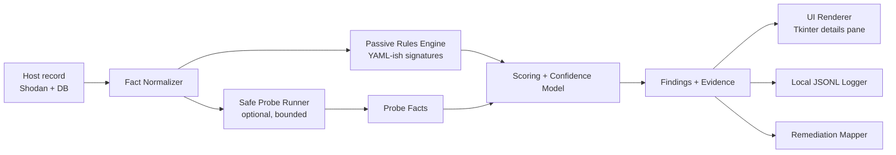
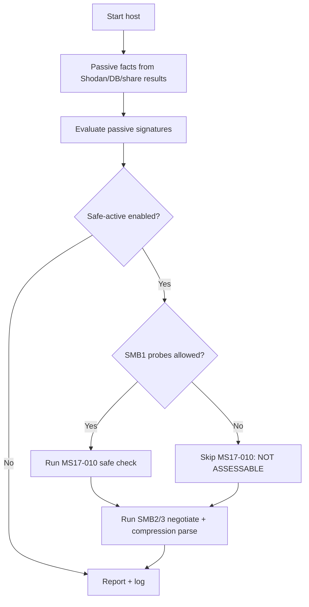

# SMBSeek Optional RCE-Detection Module Rebuild Workorder

## Executive summary

This rebuild should deliver an **optional**, **non-destructive-by-default**, **Internet-scale** RCE exposure module for smbseek that operates under **anonymous/guest/no-auth probing** constraints. Under those constraints, only a small subset of SMB RCEs can be **safely confirmed** on the wire (notably the MS17-010 family via a known safe status-code check); most others can only be classified as **“exposed / potentially vulnerable”** based on **SMB dialect/capability negotiation** and passive telemetry (banners, Shodan-derived product/version hints), or else must be labeled **NOT ASSESSABLE** without authenticated or intrusive proof. citeturn14search0turn14search1turn3view0

This report uses the required source-order as far as tooling permits. The CVE web UI requires JavaScript for record viewing, which blocks direct extraction in this environment; as a workaround, the **official CVE JSON v5 corpus** maintained on GitHub (CVEProject/cvelistV5) and the **NIST NVD** pages are used for structured CVE data. citeturn0search4turn11search0

### Information needs you must learn to answer well (the minimum set)

- How smbseek currently gates **SMB1 vs SMB2/3** (and how “cautious mode” and `--legacy` affect safety and coverage). citeturn3view0  
- Which SMB **facts** smbseek reliably captures today (Shodan banners, share access outcomes) and which must be added (dialect revision, signing required, compression capabilities). citeturn3view0turn20search2turn20search0  
- Which SMB-server RCE CVEs are both (a) high-impact/commonly exploited and (b) **detectable without crashing targets** or requiring credentials. citeturn22view0turn15search0turn23view1turn23view3  
- The **safe-active probe budget** per host for Internet-scale scanning (request count, timeouts, retry policy), to prevent self-DoS and reduce legal/ops risk. citeturn3view0turn14search0turn15search0  
- A lab matrix (patched/unpatched, Windows/Samba/ksmbd) for regression testing of “confirmed vs likely vs not-assessable” outcomes. citeturn14search0turn15search0turn16search4turn13search2  

## Scope and constraints

### Clarifying questions (asked, and answered by you)

- **What SMB probe product name and language/stack will this integrate with?**  
  smbseek; Python with a Tkinter front end (xsmbseek exists in-repo). citeturn3view0  
- **What risk tolerance for active probing should I assume?**  
  Non-destructive by default; safe-active probes only when they are demonstrably non-crashing. citeturn14search0turn15search0  
- **Which SMB dialects/OSes/versions are in your environment?**  
  Internet-scale diversity: modern Windows, Samba, legacy Windows-era hosts, and some embedded/Linux SMB implementations. citeturn22view0turn16search4turn13search2  
- **Constraints on network privileges or authentication?**  
  Anonymous/guest/no-auth only unless explicitly allowed later. citeturn14search1turn15search0turn16search1  
- **Regulatory/privacy constraints for telemetry?**  
  Local logging MVP; minimize collection of sensitive share/browse data. citeturn3view0  
- **Timeline/resources?**  
  Assume “no special constraint”; provide a phased roadmap with effort ranges.

### Key reality check (non-negotiable)

If a CVE “requires uploading a shared library,” “requires xattr write,” or “can crash the target during checking,” smbseek cannot honestly confirm it under your default constraints. Those checks must return a structured **NOT ASSESSABLE** (or at best **LIKELY**) state—not “safe.” citeturn16search4turn16search1turn24search0turn24search3  

## Prioritized SMB-server RCE CVE landscape

### Prioritization method (practical for smbseek)

Risk priority is a weighted combination of:

- **Impact & exploitability** (CVSS, wormability, KEV/known exploitation, framework modules) citeturn22view0turn23view0turn23view1turn23view3  
- **Prevalence** on Internet-facing SMB (SMB1 exposure still exists; SMB3 compression exists; Samba is common) citeturn22view0turn15search0turn16search4  
- **Detectability under constraints** (anon-only + non-destructive) citeturn14search0turn15search0turn24search0turn24search3  

### Prioritized CVE list (implementation-driving table)

| CVE ID | Affected products / versions (high level) | CVSS (base) | Exploit availability / PoC maturity | Detection approach (anon-only, non-destructive by default) | Risk priority |
|---|---|---:|---|---|---|
| CVE-2017-0144 (MS17-010 family) | Windows SMBv1 server across multiple Windows versions | 8.8 (v3.1) citeturn22view0 | Widely weaponized historically; exploit references and frameworks exist; safe-check modules exist citeturn22view0turn14search1 | **Safe-active confirm**: IPC$ connect → transaction on FID 0 → interpret status codes (no exploit payload) citeturn14search0turn14search1 | P0 |
| CVE-2020-0796 (SMBGhost) | Windows SMB 3.1.1 compression handling | 10.0 (v3.1) citeturn23view0 | Metasploit exploit module exists; third-party scanners warn about crashing some unpatched builds citeturn15search2turn2search5 | **Passive + safe-active exposure**: negotiate SMB 3.1.1; parse compression context & algorithms; do **not** send crash-prone “proof” packets citeturn15search0turn20search0turn20search2 | P0 |
| CVE-2017-7494 (SambaCry) | Samba 3.5.0+ before fixed releases (4.6.4 / 4.5.10 / 4.4.14) | 9.8 (v3.1) citeturn23view1 | Public exploit repos exist; Nmap marks its checker intrusive; Metasploit-based logic exists citeturn11search3turn16search0 | **Default: NOT ASSESSABLE** (needs writable-share upload/trigger). Passive flag only from banners/config hints; optional intrusive mode later (explicitly gated) citeturn16search4turn16search0 | P1 |
| CVE-2021-44142 | Samba vfs_fruit OOB read/write; requires vfs_fruit + xattr write | 8.8 (v3.1 NVD); Samba advisory base 9.9 citeturn23view2turn16search1 | Credible PoCs exist in the ecosystem; exploitability depends on xattr write policy citeturn16search1turn17search0 | **Default: NOT ASSESSABLE** without proving xattr write safely. Passive detection: Samba + version range + likely vfs_fruit; output “possible exposure” only citeturn16search1turn17search0 | P1 |
| CVE-2022-47939 | Linux kernel ksmbd SMB server (5.15–5.19 < 5.19.2) | 9.8 (v3.1) citeturn23view3 | IPS signatures exist; exploitation discussions exist; only relevant if ksmbd enabled citeturn13search4turn13search2 | **Passive-only**: identify ksmbd via banners (often Shodan-derived); do not attempt trigger-style checks (TREE_DISCONNECT crash risk) citeturn13search2turn13search4 | P1 |
| CVE-2024-43447 | Windows Server SMBv3 server RCE (Server 2022 build threshold per MSRC) | 8.1 (v3.1, CNA) citeturn23view6 | No standard safe-check known publicly; patch is vendor-supplied via MSRC citeturn21search0turn23view6 | **Passive-only**: if you can fingerprint Server 2022 family, report “patch verification required”; otherwise ignore to avoid false claims citeturn21search0turn23view6 | P2 |
| CVE-2010-2550 (MS10-054) | Legacy Windows SMB server pool overflow | CVSSv2 10.0 (no v3 score provided) citeturn23view4 | Nmap requires an explicit “unsafe” switch; warns target BSOD/crash risk citeturn24search3 | **Do not implement active check** for Internet-scale. Passive-only via OS fingerprint hints; treat as legacy informational citeturn24search3turn23view4 | P3 |
| CVE-2008-4250 (MS08-067) | Windows Server service RPC overflow reachable via SMB/RPC | CVSSv2 10.0 (no v3 score provided) citeturn23view5 | Nmap calls it dangerous; crash rate observed; Microsoft confirms unauth exploitation on older OSes citeturn24search0turn24search5 | **Do not implement active check**. Passive-only “legacy likely vulnerable” flag + remediation guidance citeturn24search0turn24search5 | P3 |
| CVE-2025-50169 | Windows SMB race condition; user interaction required | 7.5 (v3.1, CNA) citeturn23view7 | No standard safe-check; high complexity/UI:R limits wormability citeturn23view7turn21search2 | **Ignore or informational passive flag** only; too easy to produce false signals without auth/build info citeturn23view7 | P3 |

## Detection heuristics and safe probing framework

### SMB dialect targets and what they unlock

Your module should treat SMB dialect negotiation as the “root fact” for applicability checks:

- Dialect revision codes: 0x0202, 0x0210, 0x0300, 0x0302, 0x0311; 0x0311 is required for SMB 3.1.1 features (preauth integrity, negotiate contexts, compression). citeturn20search2turn20search3turn20search4  
- Signing: negotiate response exposes whether signing is enabled and/or required. citeturn20search2  
- Compression: SMB2_COMPRESSION_CAPABILITIES defines algorithm IDs and flags. citeturn20search0  

### Detection heuristics table (what to collect, how, and how to use it)

| Heuristic / signal | Safe collection method | Applies to | What it indicates | FP/FN risks and mitigations |
|---|---|---|---|---|
| Negotiated dialect revision (0x0202…0x0311) | SMB2 NEGOTIATE request listing supported dialects | All | Applicability gating; SMBGhost needs 0x0311 citeturn20search2turn15search0 | FN if SMB middleboxes downgrade/terminate; mitigate by recording “negotiated path” and Shodan banner separately |
| Signing required bit | SMB2 NEGOTIATE response SecurityMode | All | Limits some follow-on probes; indicates hardened config citeturn20search2turn3view0 | FN for share enumeration or IPC$ access; mitigate with “insufficient data” state rather than “safe” |
| SMB 3.1.1 compression algorithms list | SMB2_COMPRESSION_CAPABILITIES parsing | CVE-2020-0796 (plus SMBv3 hardening checks) | Compression enabled/available → exposure possible; NONE-only suggests mitigation | Compression capability ≠ vulnerable; mitigate by labeling “exposure possible” + recommend patch anyway citeturn15search0turn23view0 |
| MS17-010 status-code check | IPC$ connect + transaction on FID 0 | CVE-2017-0144 family | High-signal patch status without sending exploit payload citeturn14search0turn14search1 | FN if SMB1 disabled or IPC$ blocked; mitigate via explicit NOT ASSESSABLE and clear gating in UI citeturn3view0turn14search2 |
| SMB1 support presence | Explicit SMB1 negotiate attempt (only if user allows SMB1) | MS17-010, legacy SMB1 CVEs | Establishes whether MS17-010 check is even possible | SMB1 attempts increase operator risk footprint; mitigate by default-off SMB1 and requiring a flag (aligned to smbseek `--legacy`) citeturn3view0turn14search2 |
| Samba version/family hints | Passive: Shodan banner strings; SMBSeek already centers Shodan-based discovery | Samba CVEs | Enables “possible exposure” rules for Samba | Distro backports break naïve version checks; mitigate by lowering confidence unless corroborated by multiple signals (banner + release family + config hints) citeturn16search0turn16search4turn3view0 |
| ksmbd hints | Passive: banner/product strings (usually external telemetry), do not probe TREE_DISCONNECT | CVE-2022-47939 | Possible ksmbd exposure if service identified | Active checks risk crash; mitigate by passive-only classification and remediation guidance to disable/upgrade ksmbd citeturn13search2turn13search4 |
| “Malform-but-safe” negotiate conformance checks (optional) | Send SMB2 NEGOTIATE with duplicate contexts; spec says server must fail STATUS_INVALID_PARAMETER | Fingerprinting only (not CVE confirmation) | Protocol conformance signal; can help identify weird stacks | Still “odd” traffic for Internet scanning; keep off by default and isolate into a “fingerprinting” mode citeturn20search1 |

### Safe-active vs passive detection policy (what smbseek should do)

- **Passive mode (default):** only consume existing smbseek facts (Shodan metadata, share access outcomes, prior scan DB rows). Output should skew conservative: **LIKELY / POSSIBLE / NOT ASSESSABLE**. citeturn3view0turn16search4turn15search0  
- **Safe-active mode (opt-in):** adds **bounded** network probes that are documented as safe and non-crashing in mainstream tooling:
  - MS17-010 safe probe: Nmap labels the script category **safe** and describes the exact non-exploit transaction/status mechanism; Rapid7 scanner module matches that approach and notes it typically does not require creds. citeturn14search0turn14search1  
  - SMBGhost exposure probe: negotiate SMB 3.1.1 and parse compression context. Do not use third-party scanners that warn about target crashes on some unpatched builds. citeturn15search0turn2search5turn20search0  
- **Hard block “intrusive mode” for Internet-scale** unless you explicitly authorize it later:
  - Nmap explicitly calls MS08-067 checks dangerous with high crash rates, and MS10-054 a BSOD risk requiring an “unsafe” switch. citeturn24search0turn24search3turn24search4  

## smbseek integration specification (Python/Tkinter)

### Current smbseek behavior that should shape the design

- smbseek positions itself as a defensive auditing toolkit and is explicitly built around Shodan-driven discovery and rate limiting (`timeout`, `rate_limit_delay`, `share_access_delay`). citeturn3view0  
- It also states a “cautious mode” posture: SMB signing plus SMB2/SMB3 are enabled automatically, with SMB1/unsigned access gated behind `--legacy`. Your RCE module must align with that by making SMB1-required checks explicitly opt-in. citeturn3view0turn14search2  

### Module architecture (Mermaid)



### Scan flow (Mermaid)



### Plugin API spec (non-production pseudocode)

Design goal: adding a new CVE should be “add one plugin + one signature rule + remediation mapping,” not editing core orchestration.

```python
# Non-production pseudocode: for agent implementation guidance only.

from dataclasses import dataclass
from enum import Enum
from typing import Any, Dict, List, Optional

class Mode(str, Enum):
    PASSIVE = "passive"
    SAFE_ACTIVE = "safe_active"

class Verdict(str, Enum):
    CONFIRMED = "confirmed"               # only when safe evidence is strong
    LIKELY = "likely"                     # exposure supported but not provable safely
    NOT_VULNERABLE = "not_vulnerable"     # only when signal truly excludes
    NOT_ASSESSABLE = "not_assessable"     # needs auth or intrusive probe
    INSUFFICIENT_DATA = "insufficient_data"
    ERROR = "error"

@dataclass
class HostFacts:
    ip: str
    shodan_product: Optional[str] = None
    shodan_version: Optional[str] = None
    smb_dialect: Optional[int] = None          # 0x0202..0x0311
    signing_required: Optional[bool] = None
    compression_algos: Optional[List[int]] = None
    smb1_possible: Optional[bool] = None
    ms17_010_status: Optional[str] = None      # status code string, if probed
    share_access_summary: Optional[Dict[str, Any]] = None

@dataclass
class Finding:
    cve: str
    title: str
    verdict: Verdict
    confidence: float           # 0..1
    evidence: List[str]         # auditable strings, no secrets
    cvss: Optional[float] = None
    exploit_maturity: Optional[str] = None
    remediation: List[str] = None

class RcePlugin:
    id: str
    cve: str
    title: str
    min_mode: Mode              # PASSIVE or SAFE_ACTIVE
    needs_smb1: bool = False
    needs_auth: bool = False
    intrusive: bool = False     # must remain false for this rebuild

    def applicable(self, facts: HostFacts) -> bool:
        ...

    def run(self, facts: HostFacts, transport: Any, cfg: Dict[str, Any]) -> Finding:
        ...
```

### Orchestration, concurrency, and rate limiting

Requirements for Internet-scale stability:

- **Per-host probe budget:** treat safe-active mode as a strict budget (example: 1 SMB2 negotiate handshake + optional MS17-010 probe). The Nmap “safe” MS17-010 logic uses IPC$ + FID0 transaction and should be your maximum complexity for a default-safe probe. citeturn14search0turn14search1  
- **SMB1 gating:** default off; enable only if the operator opts into `--legacy`-like behavior for RCE probing (because MS17-010 is SMBv1-based). citeturn3view0turn14search2  
- **Timeouts and delays:** smbseek already emphasizes `timeout` and `rate_limit_delay`; reuse those knobs and add a separate `rce_probe_delay_jitter` to avoid synchronized bursts. citeturn3view0  
- **Worker pools:** keep passive evaluation CPU-only; run network probes in a constrained pool (e.g., max 25% of total concurrency) to avoid probe storms.

### Safe-check pseudocode (what agents should implement)

**MS17-010 safe check (confirmable)**  
This is directly aligned with Nmap and Rapid7’s documented approach: connect IPC$, transaction on FID 0, evaluate returned status code(s). citeturn14search0turn14search1  

```python
def safe_check_ms17_010(facts: HostFacts, smb1_transport) -> Dict[str, Any]:
    if not facts.smb1_possible:
        return {"verdict": "not_assessable", "evidence": ["SMB1 not enabled/allowed"]}

    # Conceptual steps; no exploit bytes included.
    # 1) Tree connect to IPC$
    # 2) Send transaction on FID 0
    # 3) Interpret status code
    status = smb1_transport.ipc_fid0_transaction_status()

    if status == "STATUS_INSUFF_SERVER_RESOURCES":
        return {"verdict": "confirmed", "evidence": [f"FID0 txn returned {status} (unpatched signal)"]}
    if status in {"STATUS_ACCESS_DENIED", "STATUS_INVALID_HANDLE"}:
        return {"verdict": "not_vulnerable", "evidence": [f"FID0 txn returned {status} (patched/blocked signal)"]}
    return {"verdict": "insufficient_data", "evidence": [f"Unexpected status: {status}"]}
```

**SMBGhost exposure check (not confirmable safely; classify exposure)**  
Use SMB 3.1.1 negotiate + compression capability parsing. Compression algorithms are defined in MS-SMB2. citeturn15search0turn20search0turn20search2  

```python
def exposure_check_smbghost(facts: HostFacts, smb2_transport) -> Dict[str, Any]:
    if facts.smb_dialect != 0x0311:
        return {"verdict": "not_applicable", "evidence": ["SMB 3.1.1 not negotiated"]}

    algos = facts.compression_algos or []
    compression_possible = any(a != 0x0000 for a in algos)  # 0x0000 == NONE in MS-SMB2

    if compression_possible:
        return {"verdict": "likely", "evidence": [f"Compression algorithms advertised: {algos}"]}
    return {"verdict": "not_vulnerable", "evidence": ["Compression not advertised (possible mitigation)"]}
```

### Logging/telemetry/privacy (local logging MVP)

- Emit one **JSONL** record per host scan containing only: host IP, timestamp, dialect, signing required, compression algos, CVE verdicts, and evidence strings.  
- Do not store full share listings or filenames by default; those are sensitive organizational breadcrumbs and unnecessary for RCE exposure reporting.  
- UI should display a “why not assessable” explanation (e.g., “requires authenticated xattr write”) to prevent operators from misreading “not assessed” as “safe.” citeturn16search1turn16search4turn24search3  

## Test plan and lab setup

### Lab-only safety rules

- Vulnerable systems must be isolated (host-only / NAT-only), snapshotted, never exposed to the public Internet.  
- The lab is for validating **classification logic**, not for developing exploitation; do not incorporate exploit payload generation in smbseek.

### Test plan table (cases + lab targets)

| Test case | Lab target | Setup notes (lab-only) | smbseek settings | Expected outcome |
|---|---|---|---|---|
| Dialect capture | Any SMB server | Ensure TCP/445 reachable | passive | `smb_dialect` set; signing/compression facts collected citeturn20search2turn20search0 |
| MS17-010 confirmed | Windows with SMBv1 enabled, unpatched MS17-010 | Snapshot “pre-patch” state | safe-active + SMB1 allowed | CVE-2017-0144 → CONFIRMED via FID0 status code evidence citeturn14search0turn22view0 |
| MS17-010 not vulnerable | Same Windows patched | Apply MS17-010 updates | safe-active + SMB1 allowed | CVE-2017-0144 → NOT_VULNERABLE (patched/blocked code) citeturn14search2turn14search0 |
| SMBGhost exposure | Windows 10/Server 1903/1909 in vulnerable window | Keep offline; do not run crash-prone community scanners | safe-active | CVE-2020-0796 → LIKELY if compression enabled; otherwise downgraded citeturn23view0turn15search0turn20search0 |
| SMBGhost mitigation mapping | Same target with compression disabled | Apply CERT workaround | safe-active | Still recommend patch; show “compression disabled” evidence citeturn15search0 |
| Samba 7494 passive | Samba in vulnerable version range | Use official advisory guidance; do not upload anything | passive | CVE-2017-7494 → NOT_ASSESSABLE or LIKELY (banner-based) but never CONFIRMED citeturn16search4turn23view1 |
| Samba 44142 passive | Samba with vfs_fruit enabled | Requires xattr write to exploit; you won’t test that in default mode | passive | CVE-2021-44142 → NOT_ASSESSABLE unless later auth allowed; remediation guidance included citeturn16search1turn23view2 |
| ksmbd passive | Linux kernel with ksmbd enabled (vulnerable kernel range) | Harder lab: custom kernel or distro snapshot; isolate strictly | passive | CVE-2022-47939 → LIKELY only if ksmbd identified; no trigger probes citeturn23view3turn13search4 |
| Guardrail: refuse crash-prone probes | Legacy Windows targets | Validate that “intrusive checks” do not exist in default build | any | No MS08-067 / MS10-054 active checks; output refuses/omits citeturn24search0turn24search3 |

### Sample payloads (lab-only, non-exploit)

For this rebuild, “payloads” should mean only:

- **SMB2 NEGOTIATE** messages containing dialects and negotiate contexts (compression capabilities) per MS-SMB2, not exploit buffers. citeturn20search0turn20search4  
- The MS17-010 **FID0 status check** transaction described by Nmap/Rapid7 (still non-exploit). citeturn14search0turn14search1  

## Remediation mapping and implementation roadmap

### Detection-to-mitigation mapping (minimum)

- **CVE-2017-0144 / MS17-010:** apply MS17-010 patches; disable SMBv1 where possible; block inbound TCP/445 at perimeter. citeturn14search2turn22view0  
- **CVE-2020-0796 / SMBGhost:** apply Microsoft updates; disable SMBv3 compression as a compensating control (server-side); note that disabling compression does not protect SMB clients. citeturn15search0turn23view0  
- **CVE-2017-7494 / SambaCry:** upgrade to fixed Samba releases; optionally use `nt pipe support = no` workaround (with functionality caveats). citeturn16search4turn23view1  
- **CVE-2021-44142:** upgrade Samba; workaround is removing `fruit` from `vfs objects` lines, with macOS metadata side effects called out by Samba. citeturn16search1turn23view2  
- **CVE-2022-47939 (ksmbd):** upgrade kernel to fixed versions or disable ksmbd; only relevant if ksmbd is enabled. citeturn13search2turn23view3  
- **MS08-067 / MS10-054 (legacy):** patch legacy systems; do not run crash-prone checks at Internet scale (module should only provide passive guidance). citeturn24search5turn24search3turn24search0  

### Roadmap with effort estimates (agent workorder)

**Phase A: Fact model + persistence (3–5 dev-days)**  
Add first-class SMB negotiate facts (dialect, signing required, compression algorithms) to the host record and local logs. Base definitions should follow MS-SMB2 structures (DialectRevision, SecurityMode, CompressionAlgorithms). citeturn20search2turn20search0  

**Phase B: Safe-probe runner + budgets (4–6 dev-days)**  
Implement a bounded probe runner with strict per-host request budgets, timeouts, and concurrency caps aligned to smbseek’s rate limit philosophy. citeturn3view0turn14search0  

**Phase C: MS17-010 safe check plugin (3–5 dev-days)**  
Implement MS17-010 detection via IPC$/FID0 transaction/status codes, matching Nmap/Rapid7 behavior, and return CONFIRMED/NOT_VULNERABLE/INSUFFICIENT_DATA honestly. citeturn14search0turn14search1turn22view0  

**Phase D: SMBGhost exposure plugin (3–5 dev-days)**  
Implement SMB 3.1.1 negotiate + compression context parsing; classify exposure conservatively; explicitly avoid third-party “proof” logic that is known to crash certain targets. citeturn15search0turn20search0turn2search5  

**Phase E: Passive-only Samba + ksmbd rules (3–6 dev-days)**  
Add banner-driven signatures for CVE-2017-7494, CVE-2021-44142, CVE-2022-47939 with default NOT_ASSESSABLE where exploitation requires upload/xattr writes or crash-prone triggers. citeturn16search4turn16search1turn23view3  

**Phase F: UI + local logging MVP (2–4 dev-days)**  
Tkinter: show top findings, evidence, and “not assessable because…” reason. Local JSONL logs + summary counters. citeturn3view0turn16search1  

**Phase G: Lab harness + regression suite (5–8 dev-days)**  
Build a deterministic test harness around recorded negotiate/probe transcripts; validate that crash-prone checks are absent and that verdict transitions are stable across versions. citeturn24search0turn24search3turn14search0  

Total MVP: ~**3–4 weeks** (single engineer + coding agent assistance) for Phases A–F; **5–6 weeks** with robust lab regression (Phase G), depending on how hard it is to source legacy Windows and ksmbd test targets safely. citeturn24search0turn13search2turn14search0
