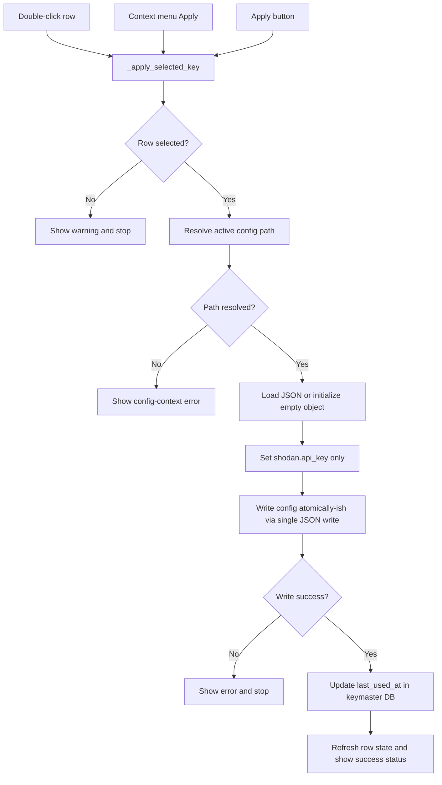
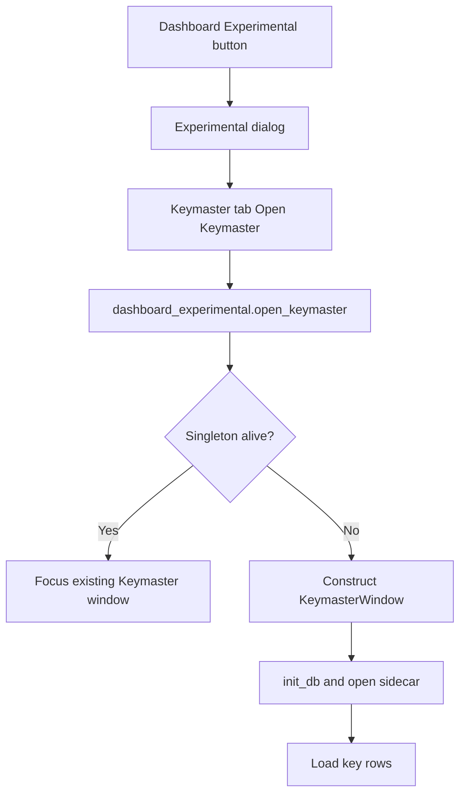
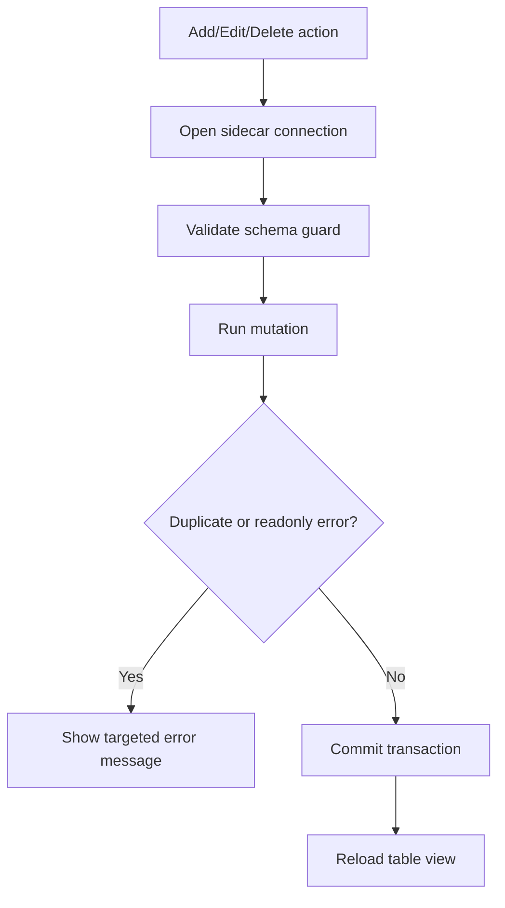

# Keymaster v1 Flow Charts

Date: 2026-04-25

## 1) Apply Path (Unified Logic)

Post-condition:

1. The newly applied key is used by future scans.
2. In-flight scans continue with the key value captured when their scan start was confirmed.

## 2) Window Launch Path

## 3) CRUD Persistence Path

